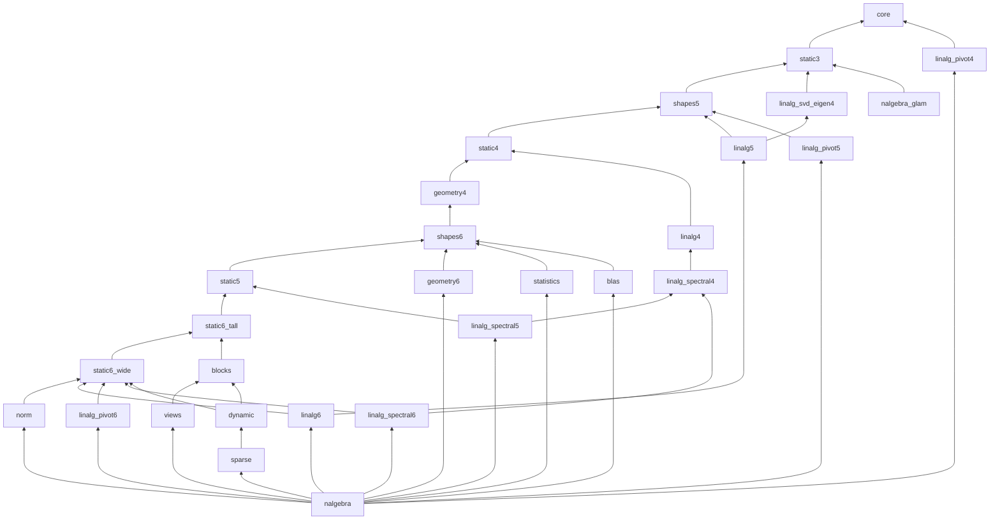

# Package split of nalgebra (WP 9-NS1: inventory and cut plan; WP 9-NS1b: final names)

> Research, no code moved. Status: plan approved by the programme session (§12); WP 9-NS1b gave
> the crates their final names, merged five small crates and measured every crate and declared
> closure on GitHub runners (§3.1, §6.5, §13): the list of §3.1 goes to the owner before NS3. Every number below was measured on throwaway builds (Scarb 2.19.4, this
> machine, 2026-09-28) with the helpers of `tools/split/` (§10). Rule: `docs/PLAN.md` M9 and
> `pm/decisions/2026-09-28-package-granularity-rule.md`; gate definitions as the programme session
> made them precise (§0).

## 0. Summary

- **The cut**: 27 sub-crates `nalgebra_*` of 3,700 to 35,500 physical library lines (largest:
  `nalgebra_shapes6`, 35,462), an acyclic dependency graph, and the facade `nalgebra` (11,700 lines:
  root functions, macros, re-exports). NS1 planned 32; NS1b merged five pairs (§6.5) and named
  them all (§3.1, §13). Upstream's module paths are kept INSIDE every sub-crate
  (`base/matrix3.cairo` stays `base::matrix3` in whichever crate hosts its items) and the facade
  rebuilds the 0.1.0 tree module by module.
- **Zero-break, proved**: a prototype of the whole cut compiles, and a consumer naming all 4,284
  public paths of 0.1.0 plus methods, operators, products, norms, solves, LU and the macros with
  0.1.0 imports compiles against the facade prototype (§3.4). No method changes trait: every
  inherent trait (`Matrix3Trait`…) moves whole. That is the glam-cairo pattern the programme
  session asked for (§1, point 2).
- **Gate 2 (marginal cost ≤ 5 s / 1 GB)**: every sub-crate passes on a GitHub runner (median of 9
  interleaved cold builds, §6.5): the largest marginals are `nalgebra_static3` and
  `nalgebra_blas` 2.9 s and `nalgebra_static6_wide` 2.7 s; memory is ≤ 0.67 GB for every crate.
- **Gate 3 (declared closures < 15 s / 3 GB)**, GitHub runner, median of 15 interleaved cold
  builds, highest median over four runs: `nalgebra_glam` (on `glam_core` + `glam_int`) **7.1 s /
  1.68 GB** (today 37 s / 5.5 GB); static 1–4 + geometry **12.0 s** / 2.38 GB; static 1–4 +
  LU / Cholesky / QR 10.2 s / 2.32 GB; static 1–3 + SVD / eigen 7.6 s / 1.60 GB; `core` + the
  pivoting decompositions 3.8 s / 0.95 GB. The two close calls of NS1 (§6.3) pass with 3 s of
  margin.
- **The facade fails gate 3 by construction** (it depends on every sub-crate): 58.8 s / 10.0 GB
  cold, against 96.7 s / 10.4 GB for 0.1.0 today. Scarb has no optional dependency, so
  `default-features = false` on the facade no longer saves anything (§4). A user who wants a
  cheap build depends on the sub-crates.
- **Zero steps**: the split moves code, it does not rewrite it, except for three kinds of small
  internal change listed in §3.3. Every move PR proves it with `tools/split/gas_compare.py`
  (§5).
- **Release**: a non-breaking patch release, nalgebra 0.1.1 and every sub-crate 0.1.1 in
  dependency order, then nalgebra_glam 0.1.1 on `nalgebra_core` + `nalgebra_static3` (§9).

## 1. Cairo coherence and impl placement (measured)

Throwaway workspace `tools/split/probes/` (six packages; its README lists every probe and its
expected outcome), Scarb 2.19.4 / Cairo 2.19.4.

| question | answer (probe) |
|---|---|
| Orphan rule? May crate C implement a trait of crate A for a type of crate B? | **No orphan rule**: it compiles (`pc`: `Tr<B>`, `Add<A>`, `MulM<B, A>`). |
| Where does a caller find an impl without importing it? | Only in the **module of the trait or of one of the trait's generic-argument types** (`m1`: `MulM<A, B>` in `B`'s module, another crate than `A`'s and the trait's, is found; `q2`: `Into<A, B>` in `B`'s module is found). **Nowhere else**: not in a third crate (`m2`, `m3`, `m6`, `m7`), and not even in another module of the type's own crate (`q1`: `Mul<A>` in `pa::shapes::inner`). |
| Core traits (`Add`, `Mul`, `Into`, `PartialEq`, `Serde`…) for a type of another crate | Allowed, same lookup rule: the impl must sit in the module of one of its argument types (for `Add<Matrix3>`, only `Matrix3`'s module). |
| `#[generate_trait]` outside the type's crate | Allowed (`m5`). Its methods need the trait in scope, as today. |
| Impl lookup through a facade | The rule above holds through re-exports (`e1`). An impl sitting in a third crate becomes callable only if imported, and a facade glob (`use facade::*`) imports it (`e2b`). Importing an **impl** also puts its trait's methods in scope, which can make method calls ambiguous: seen in the prototype (`Normed::dot` against `Vector3Trait::dot`). |
| What does `pub use sub::*` re-export? | Every public item and module of `sub`, including module paths (`e4`: `facade::shapes::A`). Two globs exporting the same name are **ambiguous at use** (`e10`: E2087); an explicit `pub use` (or an item of the facade's own, such as its `pub mod`) wins over the globs. |
| Macros across crates | A declarative macro of another crate can be called by path or imported (`m8`), re-exported (`e5`), and a macro body must reach its crate through `$defsite::` (`e6`). nalgebra's macros resolve `$defsite::super::Matrix3Trait`, i.e. the root of the crate that defines them, so they stay in the facade. |
| Supertraits | None in Cairo 2.19: moving a method to another trait changes what a caller must import. The plan moves no method (§3). |
| Features across crates | `dep/feature` forwarding works (`e11`: `extra = ["pa/extra"]`). Features **unify per compilation unit**: if any crate of the unit enables a dependency's default features, they are on for all (so the sub-crates depend on each other with default features off whenever they have features at all). |

The programme session's two points from glam-cairo's cut (`PK-G-glam-cut-plan.md` §9):
1. "A core-trait impl is found without import only in the type's own module": **confirmed and
   made precise**. It is the module of ANY type among the trait's generic arguments (`Into<A, B>`
   in `B`'s module works), and not another module of the same crate. Every core-trait impl with a
   single nalgebra type (`Add<Matrix3>`…) therefore stays with its struct, and the plan keeps
   struct and core-trait impls in the same crate and module (the solver checks it: §3.2).
2. "No supertraits; keep the types and the methods that return them together, move only the
   rest": **confirmed** (probes `e8`, `e9`). The plan goes further than glam's (no method changes
   trait at all): every inherent trait moves whole, into a crate ABOVE every type its methods
   build (§2.3). No public path changes (proved in §3.4).

## 2. Inventory

### 2.1 Library lines (0.1.0, `scripts/consumer_cost.py` rules, 499,786 in total)

| family | lines |
|---|---:|
| linalg | 184,400 |
| base: the 36 static shapes, max dimension 6 | 93,469 |
| base: shapes, max dimension 5 | 53,495 |
| geometry | 33,638 |
| base: shapes, max dimension 4 | 28,808 |
| base: shapes, max dimension 1–3 | 28,175 |
| base: statistics | 18,357 |
| base: dynamic | 18,136 |
| base: solve | 13,907 |
| base: blas | 12,103 |
| macros | 4,653 |
| sparse + io | 3,482 |
| base: cg, point swizzles, transpose, unit, points 2/3, views (declarations), errors, kernels | 6,065 |
| root + lib | 1,098 |

The 36 shape files (194k lines) split into: inherent traits (`MatrixRxCTrait`, `…AngleTrait`,
`…InternalTrait`, `…EditTrait`) 108.8k; views (`FixedView`, `FixedRows`, `FixedColumns`,
`PadTo6`, `CropFrom6`) 35.9k; products (`MatrixMul`, `MatrixTrMul`) 20.1k; `MatrixKronecker`
5.1k; indexing 3.7k; norms 3.2k; core-trait impls (`Add`, `Sub`, `Neg`, `Mul`, assignments,
`PartialOrd`, `Bounded`, `One`, `Sum`, `Product`, `IndexView`, array conversions) 13.5k; structs
0.5k.

Linalg per family and dimension band (lines):

| family | shared | 1–3 | 4 | 5 | 6 |
|---|---:|---:|---:|---:|---:|
| svd (+ svd2/svd3) | 5,507 | 3,956 | 4,074 | 7,221 | 11,570 |
| col_piv_qr | 78 | 2,663 | 3,653 | 7,525 | 14,389 |
| bidiagonal | 78 | 2,104 | 2,893 | 5,835 | 11,186 |
| full_piv_lu | 78 | 1,957 | 2,466 | 4,701 | 8,391 |
| schur | 19 | 1,277 | 2,104 | 4,323 | 8,148 |
| qr | 2,602 | 1,650 | 1,430 | 3,067 | 5,543 |
| permutation_sequence | 10,224 | | | | |
| lu (+ steps, inverse, `Perm1..6`) | 6,623 | 993 | 948 | | 2,281 |
| symmetric_eigen | | 918 | 1,000 | 1,821 | 2,940 |
| lblt | 22 | 1,087 | 846 | 1,262 | 1,847 |
| symmetric_tridiagonal / hessenberg / eigen | 67 | 1,468 | 1,165 | 2,337 | 3,994 |
| cholesky, ldlt, udu, cholesky_update | 4,817 | | | | |
| householder, givens, balancing, exp, pow | 6,946 | | | | |

### 2.2 Method

`tools/split/edges.py` cuts every library file into its top-level items (test-only code
excluded, `consumer_cost.py`'s rules) and records per item the names it references (types,
traits, constants, functions; resolved through the file's own `use` statements, homonyms
included), its method calls (`.m(`, resolved against the traits in scope: an
over-approximation), the generic arguments of every impl and its visibility. 6,600 items,
edges between items. `tools/split/plan.py` places the items: rule-based homes, lifting to a
fixpoint (every dependency ends in the same or a lower crate, hence an acyclic crate graph), and a
check of §1's lookup rule for every impl of a public trait with type arguments ("anchor").
`tools/split/prototype.py` then emits a real workspace of the plan and the compiler proves it (an
edge the analysis missed or over-approximated shows up as a build error).

### 2.3 Cross-family edges that decide the cut

| edge | what | consequence |
|---|---|---|
| inherent trait of dimension k → struct of dimension k + 1 | `insert_column` / `insert_row` (every shape), `push`, `to_homogeneous`, `from_homogeneous`, the `Vector2::xxx` swizzles | Within base the 36 shapes form ONE strongly connected component if inherent traits sit with their structs (120k lines). Resolved by placing inherent traits ABOVE the types of the next band (`nalgebra_dim4` above `nalgebra_types5`). |
| shape → geometry | `MatrixRxC::div_rotation` (12 shapes with 2 or 3 columns) names `Rotation2` / `Rotation3`; `Rotation3`'s own `Div` impl calls `Rotation3Trait`, which calls `Matrix3Trait` | The dimension 1–3 methods and the 2D/3D rotations, quaternions, isometries and similarities are one knot: they share `nalgebra_dim3`. |
| shape → geometry | `ApproxEqTrait` (crate-private helper of `relative_eq` / `ulps_eq`, in `geometry/quaternion.cairo`) used by every shape | Moves to `nalgebra_core` (not a public path). |
| base → linalg | `Matrix6Trait::is_invertible` / `is_special_orthogonal` run `Lu6` | `Lu6`, `Perm6` and their permutation impls sit with `Matrix6` in `nalgebra_dim6` (DESIGN D9 already notes it). |
| product → larger shape | `MatrixMul<A, B>` output ≤ the larger operand; `MatrixTrMul<Matrix6x2, Matrix6x3>` is `mul_mat` of the `Matrix2x6` literal | Products stay in the module of their LARGER operand (moved there when it is the right one). The dimension-6 types cannot be split: outer products (`Vector6 * RowVector6 → Matrix6`) and transposed products tie the 6×c and r×6 families together in both directions (brute force over the 2¹¹ partitions). |
| Kronecker | `Matrix2 ⊗ Matrix3 → Matrix6` (output larger than both operands) | `MatrixKronecker` and its 196 impls go to their own crate, in the trait's module. |
| views | `FixedView<Matrix6, Matrix3>`… 441 + 252 impls, used by no other item of the library | Own crates, impls in the trait's module (`nalgebra_views`, `nalgebra_edition`). |
| norms | `Norm<EuclideanNorm, Matrix3, T>` calls `Matrix3Trait::norm`, and `apply_norm` (inherent) is generic over `Norm` | Impls move to the module of the MARKER struct (`EuclideanNorm`…), which moves to `nalgebra_norm` above every inherent trait; the `Norm` trait stays in `core`. |
| solve | `MatrixSolve` is ONE blanket impl whose `impl K: SolveKernel<M, B>` is resolved at the caller | `SolveKernel` impls must stay anchored: in the shape modules of each type band. |
| permutations, Givens | public `PermuteRows<P, M>`, `GivensRotate<T, M>` | Declarations and `Perm1..5` in `core`, impls in the shape modules of each band; `Perm6` impls in `nalgebra_dim6`. |
| `nalgebra_glam` → 1- and 4-dimensional point / translation types | conversions of `Point4`, `Translation4` | These TYPES (and their core-trait impls) move to `nalgebra_core`; their methods stay above. |

## 3. The cut

### 3.1 Crates

The final list (WP 9-NS1b; names and placement live in `tools/split/crates.toml` only; approved
names are permanent on the registry). Ordered lowest first (a crate depends only on crates above it
in this table). "Lines": physical library lines of the prototype crate built from the map
(`files.py`, `consumer_cost.py`'s rules, imports included; the real crate will be a little smaller).
"Runner marginal": cold build of an empty consumer of the crate minus an empty consumer of its
direct dependencies together, median of 9 interleaved rounds on one GitHub runner (4 vCPU, 16 GB),
with the interquartile range of the per-round differences (run
[36454463677](https://github.com/bal7hazar/nalgebra-cairo/actions/runs/36454463677), §6.5).
Naming scheme (§13): `core`; `shapesN` = the TYPES of dimension N; `staticN` / `static_RxC` = the
METHODS of the static shapes of that dimension or shape family (`static6_tall`: 6 rows, `static6_wide`:
6 columns); `geometryN`; the families of upstream `base` (`blocks`, `views`, `norm`, `statistics`,
`blas`) and `linalg[_family]N` (family, then the largest dimension).

| crate | description (upstream module paths kept) | lines | direct deps (besides `simba`) | runner marginal s (IQR) / GB |
|---|---|---:|---|---:|
| `nalgebra_core` | the structs of the 36 static shapes and their core-trait impls; products, transposed products, indexing, solve kernels, permutations and Givens impls of the shapes up to 4x4; the declarations of every generic trait (`MatrixMul`, `MatrixTrMul`, `MatrixIndex`, `Norm`, views, `MatrixSolve`, `PermuteRows`, `GivensRotate`, `LuSteps`); `Point1..4`, `Translation1`, `Translation4`, `Unit`, `errors`, kernels | 20,571 | – | 1.5 (1.5–1.5) / 0.44 |
| `nalgebra_static3` | methods of the static shapes up to 3x3 (`Matrix1`, `Vector2`, `Vector3`, `Matrix2`, `Matrix2x3`...) and the 2D / 3D geometry: quaternions, unit complex numbers, rotations, translations 2 / 3, isometries, similarities, dual quaternions | 29,203 | core | 2.9 (2.8–2.9) / 0.64 |
| `nalgebra_shapes5` | the types of dimension 5 (structs, core-trait impls, products, indexing, solve / permutation / Givens impls, edit kernels); `Point4Trait`, `Translation4Trait` | 22,815 | core, static3 | 1.4 (1.2–1.4) / 0.40 |
| `nalgebra_static4` | methods of the dimension-4 shapes (`Matrix4`, `Vector4`, `Matrix2x4`...) | 16,312 | core, shapes5, static3 | 1.9 (1.6–1.9) / 0.32 |
| `nalgebra_geometry4` | projective / affine / general transforms, perspective and orthographic projections, scales and reflections of dimension 1 to 4, `Point1` / `Translation1` methods, `cg` (homogeneous coordinates) | 13,511 | core, shapes5, static3, static4 | 1.6 (1.6–1.7) / 0.32 |
| `nalgebra_shapes6` | the types of dimension 6 (as `shapes5`) | 35,462 | core, geometry4, shapes5, static3 | 2.4 (2.0–2.4) / 0.67 |
| `nalgebra_static5` | methods of every dimension-5 shape (`Matrix5`, `Matrix5xC`, `Vector5`, `Matrix2x5`..`Matrix4x5`, `RowVector5`) | 27,040 | core, shapes5, shapes6, static3, static4 | 2.4 (2.2–2.5) / 0.50 |
| `nalgebra_static6_tall` | methods of the shapes with 6 rows and fewer columns (`Matrix6x1`..`Matrix6x5`, `Vector6`); dimension-6 edit kernels | 24,652 | core, shapes5, shapes6, static3, static4, static5 | 1.7 (1.7–2.0) / 0.40 |
| `nalgebra_static6_wide` | methods of the shapes with 6 columns (`Matrix6`, `Matrix2x6`..`Matrix5x6`, `RowVector6`); `Lu6`, `Perm6` (`Matrix6::is_invertible` runs `Lu6`) | 32,568 | core, shapes5, shapes6, static6_tall | 2.7 (2.5–2.9) / 0.52 |
| `nalgebra_blocks` | row / column blocks, resize, pad / crop (`FixedRows`, `FixedColumns`, `FixedResize`, `PadTo6`, `CropFrom6`) and Kronecker products (`MatrixKronecker`), with their impls | 21,574 | core, shapes5, shapes6, static6_tall | 1.2 (1.0–1.4) / 0.31 |
| `nalgebra_views` | `FixedView` and its 441 impls | 23,485 | blocks, core, shapes5, shapes6 | 0.6 (0.6–1.0) / 0.31 |
| `nalgebra_norm` | the norm markers (`EuclideanNorm`, `LpNorm`, `OneNorm`, `UniformNorm`) and every `Norm` impl | 4,044 | core, shapes5, shapes6, static3, static4, static5, static6_tall, static6_wide | 0.9 (0.7–1.0) / 0.10 |
| `nalgebra_geometry6` | points, translations, scales and reflections of dimension 5 and 6 | 6,043 | core, shapes5, shapes6 | 1.1 (0.6–1.4) / 0.16 |
| `nalgebra_statistics` | `base::statistics` (sums, means, variances, min / max over rows and columns) | 18,576 | core, shapes5, shapes6 | 1.4 (0.9–1.7) / 0.22 |
| `nalgebra_blas` | `base::blas` (dot products, `gemv`, `gemm`, `axpy`, rank updates...) | 12,322 | core, shapes5, shapes6 | 2.9 (2.4–2.9) / 0.33 |
| `nalgebra_linalg4` | LU, Cholesky, LDLᵀ / UDU, Cholesky update, QR up to 4x4; Householder reflections, LU steps | 10,722 | core, static3, static4 | 0.9 (0.9–1.1) / 0.24 |
| `nalgebra_linalg_svd_eigen4` | symmetric eigendecomposition and SVD up to 4x4 | 11,152 | core, static3 | 0.8 (0.7–0.9) / 0.24 |
| `nalgebra_linalg_pivot4` | column-pivoting QR, full-pivoting LU, LBLᵀ up to 4x4 | 12,879 | core | 1.0 (1.0–1.0) / 0.25 |
| `nalgebra_linalg_spectral4` | bidiagonal, Schur, eigen, Hessenberg, symmetric tridiagonal, balancing, `exp` / `pow` up to 4x4 | 13,095 | core, linalg4, static3, static4 | 1.4 (1.1–1.5) / 0.33 |
| `nalgebra_linalg5` | LU / Cholesky / QR / symmetric eigen / SVD of dimension 5 | 15,075 | core, linalg_svd_eigen4, shapes5 | 1.0 (0.8–1.1) / 0.28 |
| `nalgebra_linalg_pivot5` | column-pivoting QR, full-pivoting LU, LBLᵀ of dimension 5 | 13,712 | core, shapes5 | 0.7 (0.6–0.8) / 0.23 |
| `nalgebra_linalg_spectral5` | bidiagonal, Schur, eigen, Hessenberg, tridiagonal of dimension 5 | 14,793 | core, linalg4, linalg_spectral4, shapes5, static3, static4, static5 | 0.6 (0.3–0.9) / 0.31 |
| `nalgebra_linalg6` | QR / Cholesky / symmetric eigen / SVD of dimension 6 (`Lu6` is in `static6_wide`) | 26,231 | core, linalg5, linalg_svd_eigen4, shapes5, shapes6, static6_wide | 2.1 (1.9–2.1) / 0.46 |
| `nalgebra_linalg_pivot6` | column-pivoting QR, full-pivoting LU, LBLᵀ of dimension 6 | 24,893 | core, shapes5, shapes6, static6_wide | 1.6 (1.0–1.9) / 0.41 |
| `nalgebra_linalg_spectral6` | bidiagonal, Schur, eigen, Hessenberg, tridiagonal of dimension 6 | 25,871 | core, linalg4, linalg_spectral4, shapes5, shapes6, static3, static4, static5, static6_wide | 1.9 (1.5–2.1) / 0.49 |
| `nalgebra_dynamic` | `DMatrix`, `DVector`, `RowDVector`, the dynamic forms of the static shapes | 18,360 | blocks, core, shapes5, shapes6, static3, static4, static5, static6_tall, static6_wide | 2.3 (2.3–2.6) / 0.49 |
| `nalgebra_sparse` | `sparse` (legacy `CsMatrix`, `CsCholesky`) and `io` (Matrix Market) | 3,654 | core, dynamic, shapes5, shapes6, static6_wide | 1.3 (0.2–2.1) / 0.10 |
| **`nalgebra`** (facade) | root functions (`nalgebra::distance`...), the macros (`matrix!`...), the 0.1.0 module tree re-exporting every sub-crate | 6,806 (prototype) | every sub-crate | gate 3 only |

Dependency graph (transitive edges omitted):

Scopes: the crates cannot follow upstream's module tree one to one (upstream's `base` is 272k
lines, one module per shape would give a knot, §2.3): they follow it "as far as the dimension
split allows". NS1's working names (`dim3v`, `types5`, `dim6b`...) map to these as
`tools/split/cratemap.py`'s `NS1_NAMES` says; §2 and §6.1–6.4 keep NS1's names (they record NS1's
measurements). The type / method separation is the price of zero-break (§2.3), and every file of
the upstream tree keeps its module path inside its crate.

### 3.2 How each impl is placed (coherence)

Machine-checked by `plan.py` (0 anchor violations in the final layout) and by the prototype build:

| impl | placement |
|---|---|
| core trait of ONE nalgebra type (`Add<Matrix3>`, `Serde`, `PartialOrd`, `Index`, array `Into`) | the struct's module, hence the struct's crate. |
| `MatrixMul<A, B>`, `MatrixTrMul<A, B>`, `MatrixIndex` | the module of the larger operand (1,374 impls change module in all, most to their trait's module: next rows); `Matrix5x3 * Matrix3x2` stays in `matrix5x3` (`nalgebra_shapes5`); `Matrix2x5 * Matrix5x6` moves to `matrix5x6` (`nalgebra_shapes6`). |
| `FixedView`, `FixedRows`, `FixedColumns`, `FixedResize`, `PadTo6`, `CropFrom6`, `MatrixKronecker` | the trait's module in the family crate (801 + 196 impls move out of the shape files). |
| `Norm<Marker, M, T>` | the marker's module (`nalgebra_norm`, 144 impls). |
| `MatrixInfSup` (root) | the trait's module in the facade (36 impls). |
| `SolveKernel` (crate-private, but a blanket impl resolves it at the caller), `PermuteRows`, `GivensRotate` | the shape modules of each type band; `Perm6`'s in `perm` of `nalgebra_static6_wide`. |
| impls of crate-private traits with no blanket caller (`LuInvert`, `BlasTranspose`, `LuSteps`) | the crate of their callers, imported there (not a public path). |
| cross-crate products (`Matrix5x3 * Matrix3x2`, `Matrix2x5 * Matrix5x6`) | as above: the operand of the higher band holds them, so every product is found with 0.1.0's imports. |

### 3.3 The only code changes (everything else moves verbatim)

1. Impls change MODULE (never body) as listed in §3.2. An impl is rarely named by users; the
   public ones keep their 0.1.0 path through an explicit re-export in the facade (the prototype
   does it for `Point2Index` & co.).
2. `SvdRightTrait` (crate-private, `right2`..`right6` in one generated trait) is split into one
   trait per band (`SvdRightImpl`, `SvdRightImpl5`, `SvdRightImpl6`): same bodies, callers renamed.
3. Three `Normed` impls (`Matrix1`, `Vector5`, `Vector6`) call the inherent `norm`; they get a
   type-level kernel, called by both, through an `#[inline(always)]` wrapper so no step changes.
   The prototype stubs their bodies (no cost difference).
4. `ApproxEqTrait` (crate-private) moves from `geometry::quaternion` to `nalgebra_core`.
5. Every `pub(crate)` item used across crates becomes `pub` (no new public path in the facade:
   the facade only re-exports what 0.1.0 exports; the sub-crates do expose these items, a
   deviation to document in their READMEs as "internal, no stability promise").

### 3.4 The facade keeps every 0.1.0 path (proof)

`tools/split/facade.py` writes the facade of the prototype: for every public module of 0.1.0,
`pub use nalgebra_<crate>::<same path>::*` from each sub-crate that hosts that module, the
module's own `pub use` lists verbatim (root re-exports, `base::{Matrix3, …}`), explicit
re-exports for the impls that changed module, and the facade's own `root` and `macros`. It
then writes `path_proof`, a consumer with one `use nalgebra::<path>;` for each of the **4,284
public paths** of 0.1.0 (every public item of every public module, every name of every `pub use`)
and a `usage` module exercising, with the imports a 0.1.0 user writes:
`m.transpose()`, `m * t + m`, `p.mul_mat(v)`, `m.tr_mul(m)`, `s.apply_norm(EuclideanNorm {})`,
`m.solve_lower_triangular(w)`, `m.lu()`, `m.determinant()`, `v.norm()`,
`Matrix5x3.mul_mat(Matrix3x5)` (a cross-crate product), `FixedView::fixed_view(Matrix6)`,
`Matrix6::trace`, `UnitQuaternion::transform_vector`, `Isometry3::transform_vector`, and the
macros `matrix!`, `vector!`, `point!`, `dmatrix!`. `scarb build -p path_proof` succeeds; a
deliberately wrong path or method in the same file fails (checked). Two facade details found
by the proof: the inline `errors` modules need one explicit re-export each (else ambiguous
globs), and an impl re-exported by 0.1.0 at `nalgebra::geometry::Point2Index` needs an explicit
re-export at its old module after it moves to `Point2`'s module.

## 4. Features

Scarb has no optional dependency (DESIGN D11), so the facade depends on every sub-crate
unconditionally, and a feature cannot remove a sub-crate from a facade user's build.

| 0.1.0 feature | after the split |
|---|---|
| `statistics`, `blas`, `dynamic`, `sparse`, `io`, `eigen`, `svd`, `qr`, `cholesky_update`, `full_piv_lu`, `col_piv_qr`, `lblt`, `hessenberg`, `bidiagonal`, `schur`, `exp` | become crates (§3.1). In the facade they stay DECLARED, all in `default`, as **no-ops** (a manifest that names them keeps building: no break). |
| `closures` | gates methods inside the inherent traits (`map`, `fold`, `zip_*`…). Recommended: drop the gating (compiled always: the measured marginals include them and pass) and keep the name as a no-op. Keeping it gated inside the `dim*` crates (forwarded by the facade, `closures = ["nalgebra_dim3/closures", …]`, measured to work) buys little once the crates are split. |
| `macros` | stays a real feature of the facade (the macros live there). |
| `default-features = false` on the facade | still valid, **saves nothing** apart from the macros: 58.8 s / 10.0 GB cold, against 28.7 s / 5.2 GB for `nalgebra` 0.1.0 with `default-features = false` today (NS0). This is a **cost regression for that configuration** (no API change). Those users should depend on the sub-crates they use, e.g. `nalgebra_core` + `nalgebra_dim3` + `nalgebra_linalg`. |

Plainly: **a facade user pays the whole library** (58.8 s / 10.0 GB cold, down from 96.7 s /
10.4 GB with 0.1.0's default features); the sub-crates are the way to pay less. Sub-crates depend
on each other with default features (none have features once `closures` is dropped); if some keep
features, they depend on each other with `default-features = false` (features unify per unit,
§1).

## 5. Tests and gas

- **Test packages** (`crates/tests_*`, `crates/shapes_tests_*`: 60 packages, already outside
  `src/`) keep their names, so their gas keys (`nalgebra_tests_linalg::…`) do not change. Each
  one depends on the sub-crates it tests instead of `nalgebra` with features; its
  `use nalgebra::X` lines are rewritten to `use nalgebra_<crate>::<module>::X` (the rewrite of
  `tools/split/glam_proto.py`, generalised). Depending on the facade instead would keep the test
  code byte-identical, but every test package would compile the whole library (10 GB).
- **In-crate tests and benches** (174 benches and 249 tests in 27 library files, testing
  crate-private items) move with their module; their keys change package prefix only
  (`nalgebra::base::matrix2::tests` → `nalgebra_core::base::matrix2::tests`). The alexandria
  model puts tests outside `src/`; these few test crate-private items and stay inline, as AGENTS
  allows today (a deviation to confirm).
- **Zero step change, proved per move**: `tools/split/gas_compare.py OLD_GAS_DIR NEW_GAS_DIR`
  drops the `nalgebra` / `nalgebra_<crate>` package segment of every module path, compares every
  benchmark, and fails if one changes value, disappears or appears (checked: identical
  directories and a renamed package prefix both give "3,758 benchmarks, 0 changed"). The gas
  snapshot FILES are per CI shard (`gas/<shard>.json`); `gas_report.py` names shards after the
  package, so the move PR regenerates the files of the moved modules and runs `gas_compare.py`
  against `main`.
- Why no step change is expected: the whole dependency graph is compiled as one unit and
  inlining crosses crates (R7 §4); the moved code is byte-identical except §3.3, whose three items
  keep the same function bodies.

## 6. Measurements

§6.1–6.4 are NS1's measurements on the orchestrator VM, with NS1's crate names (their final
names: `cratemap.py`'s `NS1_NAMES`); §6.5 is NS1b's GitHub-runner measurement of the final list.

### 6.1 Protocol

`tools/split/measure.py` builds a trivial consumer cold (`SCARB_INCREMENTAL=false`, fresh
`target/`, `scarb fetch` first), 2 or 3 times, median, under the shared build lock
(`flock ~/orchestrator/heavy-build.lock`, so lock waits are excluded): wall time, CPU time
(user + sys) and peak RSS. Marginal = consumer(crate) − consumer(its direct dependencies);
closure = consumer(crates) − consumer(no dependency). Baseline: 1.4–1.9 s wall, 0.54 GB. Machine:
shared 8-vCPU VM, `RAYON_NUM_THREADS=4`, other projects building at times.

### 6.2 Results (final layout)

Marginal costs: table of §3.1 (wall s / GB). CPU seconds of the same measurements, the steadier
figure: core 4.3, dim3v 3.1, dim3 6.7, types5 2.7, dim4 2.9, geometry 4.4, types6 4.8, dim5 3.3,
dim5a 1.3, dim6a 5.8, dim6 1.6, dim6b 7.3, edition 2.9, views 6.6, kronecker 6.2, norm 2.1,
geometry_nd 2.2, statistics 4.4, blas 5.6, linalg 2.4, linalg_svd 3.8, linalg_pivot 1.1,
linalg_spectral 2.2, linalg5 2.8, linalg5_pivot −0.3, linalg5_spectral 3.5, linalg6 7.2,
linalg6_pivot 5.2, linalg6_bidiagonal 3.0, linalg6_spectral 9.3, dynamic 10.7, sparse −0.2.

Declared closures (gate 3, over the no-dependency baseline):

| closure | crates (with their dependencies) | wall s | CPU s | GB | verdict |
|---|---|---:|---:|---:|---|
| `nalgebra_glam` | `nalgebra_glam` prototype → core, dim3v, dim3, glam 0.4.0, fixed | 10.0–10.5 | 25.2 | 1.85 | pass |
| static 1–3 + SVD / eigen | core, dim3v, dim3, linalg_svd | 8.6–9.6 | 22.3 | 1.59 | pass |
| `core` + pivoting decompositions ≤ 4 | core, linalg_pivot | 4.8 | 11.3 | 0.94 | pass |
| static 1–4 + geometry (3D game physics and rendering) | core, dim3v, dim3, types5, dim4, geometry | 12.4–14.6 | 32.6–35.4 | 2.39 | pass, **close** |
| static 1–4 + LU / Cholesky / QR | core, dim3v, dim3, types5, dim4, linalg | 12.3–15.0 | 31.8–36.4 | 2.31 | pass, **close** |
| the facade `nalgebra` | everything | 58.8 | 150.9 | 10.04 | **fails by construction** |
| (for reference) `glam` 0.4.0 alone | | 3.0 | 7.4 | 0.70 | |

`types5` is in every closure with `dim4`: `Matrix4Trait::insert_column` builds a `Matrix4x5`
(zero-break costs about 1–2.5 s there).

### 6.3 Close decisions (NS1; settled on GitHub runners in §6.5)

Noise on this VM: the same closure measured twice in one session gave 12.9 and 14.3 s; the
marginal of the former 27k-line `dim3` read 4.3, 4.6 and 5.6 s in three sessions (it was split
for that reason). Close calls, to be measured on a GitHub runner with interleaved cold builds
(glam used 15 per variant) before the moves start:
- the two "static 1–4" closures (12.3–15.0 s against 15 s);
- `nalgebra_dynamic` (4.6 s marginal), `nalgebra_dim6b` / `nalgebra_dim6a` / `nalgebra_types6`
  (2.5–3.6 s, but 5.8–7.3 s CPU);
- `nalgebra_types6` lines: 35,462 against 40,000 (the tightest line margin; it cannot be split
  without rewriting the transposed products, §2.3).
NS1b settled all three on GitHub runners (§6.5): the two closures cost 10–12 s (3 s of margin),
`nalgebra_dynamic` 2.3–3.3 s, the dimension-6 crates ≤ 2.7 s; `nalgebra_shapes6` keeps its 35,462
lines (11 % margin).

### 6.4 Rejected cuts (measured)

| layout | why rejected |
|---|---|
| one crate per dimension band, inherent traits with their structs | 120k-line strongly connected component (§2.3). |
| all 36 structs + all products at the bottom (`v3`) | static 1–4 + geometry closure 16.5 s / 2.86 GB (fail): the products of dimension 6 were in every closure. |
| one `base5` (26.5k lines of methods) | marginal 6.9 s (fail). |
| one `dim6` (Matrix6 + r×6 methods + LU6, 32k) | marginal 4.4–6.1 s. |
| one `linalg5_ext` / `linalg6_spectral` of 24–27k lines | marginals 6.1 s and 5.8 s. |
| one `linalg` ≤ 4 (19.5k) | static 1–4 + linalg closure 14.8–16.4 s. |

The VM's marginals were about twice the runner's and noisier: NS1b re-measured three of these
rows on GitHub runners as merges (`base5` = `nalgebra_static5` 2.4 s, `dim6` =
`nalgebra_static6_wide` 2.7 s, `linalg6_spectral` + bidiagonal = `nalgebra_linalg_spectral6` 1.9 s)
and kept them (§6.5).

### 6.5 GitHub-runner measurement of the final list (WP 9-NS1b)

**Protocol** (`.github/workflows/split-measure.yml`, `workflow_dispatch`): one job builds the
throwaway split workspace FROM THE CRATE MAP (`edges.py` → `mapplan.py` → `prototype.py` +
`glam_proto.py`; `mapplan.py --merge NEW=a+b` tries a merge without editing the map), then one
job per crate measures its marginal and one job per declared closure (`crates.toml`
`[closures]`) its cost, each with `measure.py --interleave`: every consumer of the job (the crate,
its direct dependencies together, the no-dependency baseline; or the closure and the baseline)
is built cold once per round, the order rotated each round, 9 rounds for the marginals and 15 for
the closures. Median of the rounds; spread = interquartile range of the per-round differences.
`runner_report.py` writes the tables (job summary and artifact `split-measure-report`). Runner:
`ubuntu-latest`, 4 vCPU, 16 GB; baseline 1.3 s / 0.54 GB. Within a job the rounds agree to
±0.2 s; between jobs (different machines) the same closure varies by up to 30 % (below), hence
the paired `compare=true` mode: with merges, every closure is also measured on the map without
them in the same job.

**Runs** (the workflow can only be dispatched once it is on `main`; these ran from throwaway refs
`split-measure/*`: this branch plus a `push` trigger and the inputs written in, nothing else):

| run | layout | purpose |
|---|---|---|
| [36450575479](https://github.com/bal7hazar/nalgebra-cairo/actions/runs/36450575479) | NS1's 32 crates, final names | every marginal, every closure |
| [36450579653](https://github.com/bal7hazar/nalgebra-cairo/actions/runs/36450579653) | merges M1–M4 | marginals of the merged crates, closures |
| [36452745134](https://github.com/bal7hazar/nalgebra-cairo/actions/runs/36452745134) | merges M1–M3, M5–M7, `compare=true` | every marginal; closures paired with the unmerged map |
| [36454463677](https://github.com/bal7hazar/nalgebra-cairo/actions/runs/36454463677) | **the final map** (27 crates, committed) | every marginal (§3.1), every closure |

**Declared closures** (gate 3: < 15 s / 3 GB; added over the no-dependency baseline; median of 15
rounds, IQR of the final run, and the range of the medians over the runs that measured the same
code):

| closure | crates (with their dependencies) | final run s (IQR) | CPU s | GB | medians over the runs | verdict |
|---|---|---:|---:|---:|---:|---|
| `nalgebra_glam` | `nalgebra_glam` → core, static3, `glam_core` 0.4.1, `glam_int` 0.4.1, `fixed` | 6.0 (5.8–6.0) | 14.2 | 1.68 | 4.9–7.1 | pass |
| static 1–3 + SVD / eigen | core, static3, linalg_svd_eigen4 | 7.6 (7.5–7.8) | 19.9 | 1.59 | 5.8–7.6 | pass |
| `core` + pivoting decompositions ≤ 4 | core, linalg_pivot4 | 3.8 (3.8–3.9) | 10.0 | 0.95 | 3.6–3.8 | pass |
| static 1–4 + geometry | core, static3, shapes5, static4, geometry4 | 11.0 (10.9–11.0) | 29.7 | 2.38 | 10.3–12.0 | pass |
| static 1–4 + LU / Cholesky / QR | core, static3, shapes5, static4, linalg4 | 10.1 (10.0–10.3) | 27.0 | 2.32 | 8.0–10.2 | pass |
| (reference) glam 0.4.1: `glam_core` + `glam_int` | | 2.1 (2.0–2.2) | 5.3 | 0.55 | 2.1–2.2 | |

Every declared closure passes on every run, the highest median being 12.0 s (static 1–4 +
geometry, on the slowest machine). `nalgebra_glam` needs `glam_core` only for its types
(`use glam::X` → `use glam_core::X` compiles); `glam_int` is in the closure as planned (§12.5)
and costs nothing measurable.

**Merges** (§12.2: the smallest crates with their natural neighbour when no declared closure
worsens and the merged crate passes gates 1 and 2 with margin):

| merge | lines | merged marginal s (IQR) | paired closures (merged / unmerged, same job) | decision |
|---|---:|---:|---|---|
| M1 `static3` = `vectors3` (5.5k, 0.4 s) + `static3` (24.0k, 2.9 s) | 29,203 | 2.9 (2.8–2.9); 2.5, 3.8 in the other runs | glam 7.0 / 7.1, static3_svd 7.0 / 7.0, static4_factor 10.1 / 10.2, static4_geometry 11.2 / 11.2 | **kept**: every closure contained both |
| M2 `dynamic` = `dynamic` (18.4k, 3.3 s) + `sparse` (3.7k, 0.4 s) | 21,791 | 4.3 (4.2–4.8), twice | no declared closure | **rejected**: 0.2–0.7 s from the 5 s gate, on the crate that grows with the dynamic forms |
| M3 `blocks` = `edition` (15.8k, 0.7 s) + `kronecker` (6.0k, 0.4 s) | 21,574 | 1.2 (1.0–1.4) | no declared closure | **kept** |
| M4 `linalg_pivot` = `linalg_pivot4` + `linalg_pivot5` | 26,348 | 1.9 (1.8–2.3) | core_pivot 9.3 s against 3.6 s (pulls `shapes5`) | **rejected**: a declared closure worsens |
| M5 `linalg_spectral6` = `linalg_bidiagonal6` (11.5k, 0.5 s) + `linalg_spectral6` (14.5k, 1.6 s) | 25,871 | 1.9 (1.5–2.1) | no declared closure | **kept** (band 6 now like bands 4 and 5, where bidiagonal sits with the spectral family) |
| M6 `static5` = `static_5xc` (16.5k, 1.2 s) + `static_rx5` (10.8k, 1.1 s) | 27,040 | 2.4 (2.2–2.5) | no declared closure | **kept** |
| M7 `static6_wide` = `static6` (15.5k, 0.7 s) + `static6_wide` (17.3k, 0.9 s) | 32,568 (19 % margin) | 2.7 (2.5–2.9) | no declared closure | **kept**; side effect: `linalg6` / `linalg_pivot6` now depend on it (+17k lines, about +1 s for their users, no declared closure) |

Not tried, by construction: `norm` (4.0k) has no natural neighbour (it sits above every method
crate: only `dynamic` or the facade could host it, making every `apply_norm` user pay them);
`geometry6` (6.0k) would push `shapes6` over 40,000 lines or pull `shapes6` into static 1–4 +
geometry; `linalg4` with `linalg_svd_eigen4` or `linalg_spectral4` worsens static 1–4 + LU or
static 1–3 + SVD; `linalg_pivot5` + `linalg_pivot6` = 38.6k lines (4 % margin).
| `solve` / `perm` as one crate over all dimensions | every small decomposition's closure pulled `types6` (19.6 s). |

## 7. Generators and tooling

Built in WP 9-NS2 (usage: `docs/ORCHESTRATOR.md`, "Repository tooling" and the move-PR checklist).

- **Crate map** `tools/split/crates.toml`, read by `tools/split/cratemap.py`: `[crates]` lists the
  planned crates (the final names of §3.1, NS1b; they live there only), lowest first, each with the
  Cairo package that hosts it TODAY; `facade` names the crate of what no rule places (root,
  macros); `[[rule]]`s place every top-level item, first match wins, by module file (globs), item
  class (`struct`, `inherent`, `impl`...), name, implemented trait, shape, band (of the file, of
  the impl's type arguments or of the item name), with a `lift` of every impl above its type
  arguments; the module of an impl follows §3.2 (the first anchor in its package). Committed in
  single-crate mode (every crate hosted by `nalgebra`). With every crate hosted by its own
  package (`cratemap.py --split-map`) it reproduces NS1's `final` plan item by item (5,706 /
  5,706 items, crate and module: `cratemap.py --compare-plan`).
- **Generators** `tools/shapegen`, `tools/linalggen`: their library outputs go through
  `cratemap.route_outputs`: each item into `crates/<package dir>/src/<same module file>`, a file
  whose items all go to one package moved whole, the facade keeping the module doc and
  `pub use nalgebra_<crate>::<path>::*` plus one explicit `pub use` per public impl moved to an
  anchor module (its 0.1.0 path), the sub-crates their `pub mod` roots. `use` / `pub mod` lines
  are added when missing (`scarb fmt` sorts them), moved impls sit in marked blocks per generator,
  so the two generators are idempotent after each other. Single-crate mode: byte-identical output.
  Split mode on a throwaway checkout: the same 356 files and 4,571 generated items as
  `prototype.py` (`cratemap.py --compare-tree`).
- `scripts/api_parity.py`: scans every package of the crate map plus `nalgebra_glam`; an item
  is reported at its facade path (a moved impl at the module of its explicit facade re-export), so
  the report is byte-identical in both modes.
- **Path proof** `tools/split/public_paths.py` (CI job `Path proof`): the public surface is every
  public module (`internal` excluded), every public item (impls included) and every `pub use`
  name, globs followed across the packages of the map. 0.1.0 has **9,289** public paths (the
  4,284 of §3.4, 4,622 public impls, the modules), frozen in `public_paths_0.1.0.txt`;
  `--check` proves the facade exports exactly that set plus `public_paths_added.txt` and builds a
  consumer naming every path with the `usage` checks of §3.4 (4 min, 11.3 GB on this machine).
- `tools/split/gas_compare.py --base <git ref or dir> --head gas/`: the zero-step proof of §5.
- `tools/split/rewrite_imports.py`: the test-package rewrite of §5 (dry run by default).
- `consumer_cost.toml`: gates on every `nalgebra_*` sub-crate (lines + MARGINAL cost, the
  column the orchestrator adds); `[closures]`: `nalgebra_glam`, `static3_svd`, `core_pivot`,
  `static4_geometry`, `static4_factor` (§6.2); the facade reported, not gated.
- CI: one test shard per test package as today; the `Path proof` job; the gas job unchanged plus
  `gas_compare.py` in move PRs (PR template checkbox).
- `tools/split/`: the helpers of this study (§11), reusable by rapier / glam.
- **Runner measurement** (NS1b): `crates.toml` `[closures]` (the declared closures by crate name),
  `mapplan.py` (the map, with trial merges, as a plan for `prototype.py`), `measure.py
  --interleave --json`, `runner_report.py`, `.github/workflows/split-measure.yml` (§6.5).

## 8. `nalgebra_glam`

Depends on `nalgebra_core`, `nalgebra_static3` (measured: the prototype rewritten from
`use nalgebra::X` to the defining sub-crates compiles against exactly these), plus glam 0.4.1's
`glam_core` (every glam type it names) and `glam_int` (§12.5), and `fixed`. Its closure on GitHub
runners: **4.9–7.1 s, 1.68 GB** (§6.5; target 15 s / 3 GB; today 37 s / 5.5 GB). Its
public API does not change: its conversion impls take the same types, which the facade
re-exports.

## 9. Order of the moves and of the releases

The moves go bottom-up, so every PR creates crates below what remains in `nalgebra`, and
`nalgebra` (the future facade) re-exports them at once: every PR keeps every public path and
proves zero step change (`gas_compare.py`) and unchanged paths (`path_proof`).

| WP | content | size |
|---|---|---|
| NS2 | tooling only: shapegen / linalggen emit into per-class output crates (byte-identical output while everything maps to `nalgebra`), `gas_compare.py`, import rewriter for test packages, `path_proof` generator, `api_parity.py` over several crates | tools |
| NS3 | `nalgebra_core` (types ≤ 4, trait declarations, `ApproxEqTrait`, points / translations 1–4, solve / perm / Givens declarations and ≤ 4 impls) | ~20k |
| NS4 | `nalgebra_static3` (with the 2D/3D geometry), then `nalgebra_glam` on it | ~29k |
| NS5 | `nalgebra_shapes5`, `nalgebra_static4`, `nalgebra_geometry4` | ~50k (generator-driven) |
| NS6 | `nalgebra_shapes6`, `nalgebra_geometry6` | ~41k (generator-driven) |
| NS7 | `nalgebra_static5`, `_static6_tall`, `_static6_wide` (with `Lu6`) | ~85k (generator-driven) |
| NS8 | `nalgebra_blocks` (with the Kronecker products), `_views`, `_norm`, `_statistics`, `_blas` | ~80k |
| NS9 | `nalgebra_linalg4`, `_linalg_svd_eigen4`, `_linalg_pivot4`, `_linalg_spectral4` (with the `SvdRightTrait` split) | ~48k |
| NS10 | `nalgebra_linalg5`, `_linalg_pivot5`, `_linalg_spectral5`, `nalgebra_linalg6`, `_linalg_pivot6`, `_linalg_spectral6` | ~110k (linalggen-driven) |
| NS11 | `nalgebra_dynamic`, `nalgebra_sparse`; `nalgebra` becomes the pure facade (root, macros, re-exports, features as no-ops); one README per package; release script; CI gates | ~27k |

Progress: **NS3 done** (PR #66): `nalgebra_core`, 21,568 library lines, marginal 0.47 GB and
~1.4 s locally (minimum of 5 cold builds under the shared build lock; NS1b runner: 1.5 s / 0.44 GB),
zero step change (every CI gas shard unchanged), path proof green; 0.1.0 crate-private items it
shares under `nalgebra_core::internal` (`crates.toml` `[internal]`). **NS4 done** (PR #67):
`nalgebra_static3`, 29,486 library lines, marginal 3.2 s / 0.63 GB (CI `Consumer cost`, GitHub
runner; NS1b: 2.9 s / 0.64 GB), zero step change, path proof green (transient set 524 → 502);
`nalgebra_glam` on `nalgebra_core` + `nalgebra_static3` + `glam_core` / `glam_int` 0.4.1: closure
7.3 s / 1.69 GB (was 37 s / 5.5 GB on `nalgebra` + `glam`). **NS5 done** (PR #68):
`nalgebra_shapes5` (23,176 lines, marginal 1.5 s / 0.39 GB), `nalgebra_static4` (16,114, 1.8 s /
0.35 GB), `nalgebra_geometry4` (13,560, 1.7 s / 0.30 GB) (CI `Consumer cost`, GitHub runner; NS1b:
1.4 / 1.9 / 1.6 s), zero step change, path proof green (transient set 502 → 752: the impls of the
dimension-5 files anchored in dimension-6 modules, until NS6); closure static 1–4 + geometry
(`static4_geometry`) **11.0 s / 2.42 GB** (NS1b: 11.0 s / 2.38 GB); `nalgebra_glam` without
`glam_int`: 6.9 s / 1.62 GB; `cratemap.py --anchors` (the step-7 checks). **NS6 done** (PR #69):
`nalgebra_shapes6` (36,214 lines, marginal 2.5 s / 0.69 GB), `nalgebra_geometry6` (5,912, 0.7 s /
0.18 GB) (CI `Consumer cost`, GitHub runner; NS1b: 2.4 / 1.1 s), zero step change, path proof green
(transient set 752 → 1,081: 106 dimension-≤5 impls left with the dimension-6 modules, 435 family
impls of the dimension-6 shapes now wait in their trait's module, `matrix_view`, `matrix_kronecker`,
`norm`, `root`, `lu`, until NS7 / NS8 / NS11); the dimension-6 edit kernels are `pub(crate)` in the
facade package until `static6_tall` moves (NS7). **NS7 done** (PR #71): `nalgebra_static5` (26,820 lines, marginal
2.8 s / 0.48 GB), `nalgebra_static6_tall` (24,452, 2.0 s / 0.40 GB), `nalgebra_static6_wide` (31,497,
2.5 s / 0.52 GB; with `Lu6` and `Perm6`) (CI `Consumer cost`, GitHub runner; NS1b: 2.4 / 1.7 /
2.7 s), zero step change, path proof green (transient set 1,081 → 1,069: the 12 `Perm6`
permutation impls left with `Perm6`); `closures` in each, forwarded by the facade; the dimension-6
edit kernels and `Lu6InternalTrait` under `internal`. **NS8 done** (PR #73): `nalgebra_blocks`
(21,328 lines, marginal 0.5 s / 0.32 GB), `nalgebra_views` (23,233, 0.7 s / 0.33 GB), `nalgebra_norm`
(3,744, 0.6 s / 0.10 GB), `nalgebra_statistics` (18,359, 0.9 s / 0.22 GB), `nalgebra_blas` (12,105,
2.4 s / 0.34 GB) (CI `Consumer cost`, GitHub runner; NS1b: 1.2 / 0.6 / 0.9 / 1.4 / 2.9 s), zero step
change, path proof green (transient set
1,069 → 36: only the `MatrixInfSup` impls of `root` remain, until NS11); `PadTo6` / `CropFrom6` /
`ShapeDims` under `nalgebra_blocks::internal`; the facade features `statistics` / `blas` now gate its
re-exports of the two crates only (their removal: NS11, §12.1).

Release (no publication without the programme session's written go): one shared version,
**0.1.1** (a non-breaking patch: paths, API and numeric results unchanged; the only visible
change is §4's cost of `default-features = false` on the facade), published in this dependency
order: `nalgebra_core`, `_static3`, `_shapes5`, `_static4`, `_geometry4`, `_shapes6`, `_static5`,
`_static6_tall`, `_static6_wide`, `_blocks`, `_views`, `_norm`, `_geometry6`, `_statistics`, `_blas`,
`_linalg4`, `_linalg_svd_eigen4`, `_linalg_pivot4`, `_linalg_spectral4`, `_linalg5`,
`_linalg_pivot5`, `_linalg_spectral5`, `_linalg6`, `_linalg_pivot6`, `_linalg_spectral6`,
`_dynamic`, `_sparse`, `nalgebra`, `nalgebra_glam` (29 packages per release).

## 10. Risks

- **Crate count**: 27 sub-crates + facade + `nalgebra_glam` per release. The release script
  must publish in order and verify each against the registry (rapier's does).
- **Technical scopes**: `shapes5` / `static6_tall` are not upstream module names (§13 explains the
  scheme). Upstream's paths survive inside each crate and through the facade, but a sub-crate
  user sees the dimension split.
- **Noise**: settled on GitHub runners (§6.5); runners differ by up to 30 % between jobs, so the
  `Consumer cost` gates keep 3 s of closure margin today.
- **Over-approximation**: the item graph over-approximates method calls (every trait in scope
  with a method of that name). The prototype build is the proof, and it compiles, but the
  generator changes of each move must reproduce the prototype's placement.
- **Facade cost for `default-features = false` users** (§4), to be announced in the CHANGELOG.
- **Sub-crates expose former `pub(crate)` items** (§3.3.5).
- **Growth**: `nalgebra_shapes6` has 11 % of line margin; a new family of dimension-6 impls goes
  to a family crate (in its trait's module), not to `shapes6`.

## 11. Helpers (`tools/split/`)

| file | role |
|---|---|
| `crates.toml`, `cratemap.py` | the crate map and its engine (placement, routing of the generators; `--show`, `--place`, `--split-map`, `--compare-plan`, `--compare-tree`) (NS2; final names and `[closures]` NS1b) |
| `mapplan.py` | the map (with `--merge NEW=a+b` trials) as a plan for `prototype.py` (NS1b) |
| `runner_report.py` | the tables of a runner measurement (NS1b, `.github/workflows/split-measure.yml`) |
| `public_paths.py`, `public_paths_0.1.0.txt` | the public surface and the path proof (NS2) |
| `rewrite_imports.py` | `use nalgebra::X` of test packages -> the sub-crates (NS2) |
| `gas_compare.py` | zero-step proof of a move (`--base REF --head gas/`) |
| `files.py` | library lines per file (`consumer_cost.py`'s rules) |
| `edges.py` | the item graph (JSON) |
| `plan.py`, `layouts.py` | placement solver; `layouts.py` keeps every candidate (`naive`, `z`, `v1`..`v6`, `final`) |
| `prototype.py` | emits the throwaway workspace of a plan |
| `facade.py` | facade prototype + `path_proof` (the 4,284 item paths) |
| `glam_proto.py` | `nalgebra_glam` rewritten on the sub-crates |
| `measure.py` | marginal and closure costs (cold, under the build lock locally; `--interleave` rounds and `--json` on the runner) |
| `probes/` | the coherence probes of §1 |

Reproduce NS1: `python3 tools/split/edges.py crates/nalgebra --json /tmp/e.json`;
`python3 tools/split/plan.py /tmp/e.json final --json /tmp/p.json`;
`python3 tools/split/prototype.py /tmp/e.json /tmp/p.json /tmp/proto`;
`python3 tools/split/facade.py /tmp/e.json /tmp/proto`;
`python3 tools/split/glam_proto.py /tmp/e.json /tmp/p.json /tmp/proto`; then in `/tmp/proto`
`scarb build -p path_proof`, and `flock ~/orchestrator/heavy-build.lock python3
tools/split/measure.py /tmp/proto --cache /tmp/m.json --crate core …`.

Reproduce NS2's check of the crate map: `python3 tools/split/cratemap.py --split-map /tmp/split.toml`;
`python3 tools/split/cratemap.py --map /tmp/split.toml --compare-plan /tmp/e.json /tmp/p.json`;
on a throwaway copy (`git archive HEAD | tar -x -C /tmp/co`), `NALGEBRA_CRATE_MAP=/tmp/split.toml`
`python3 tools/shapegen/shapegen.py` and `python3 tools/linalggen/generate.py` there, then
`python3 tools/split/cratemap.py --map /tmp/split.toml --compare-tree /tmp/co /tmp/proto`.

## 12. Decisions of the programme session (2026-09-28, plan approved)

1. **Cost regression of `default-features = false` on the facade** (28.7 s / 5.2 GB → 58.8 s /
   10.0 GB): accepted. The facade is for parity with nalgebra-rs paths; a light build depends on
   sub-crates. Conditions: a CHANGELOG note with the figures; the facade's README opens with a table
   "what you need → which crates to depend on → measured cost" for the declared closures; a
   facade feature that no longer does anything is **removed** in the release that ships the split
   (and the removal is announced), not kept as a no-op.
2. **Release load** (34 packages, one version 0.1.1, fixed order, each verified against the
   registry): accepted. The release script is **resumable** (a failure at package k restarts at
   k) and **refuses to start** unless the `Consumer cost` job is green at the release commit. The
   smallest crates merge with their natural neighbour when no declared closure worsens (fewer
   packages at equal cost; the orchestrator's call).
3. **Names and internals**: names are public and permanent; band names are acceptable only if they
   say what is inside (dimension and content, no bare `a` / `b` suffix). The final list (name,
   one-line description, lines, direct dependencies) is approved by the programme session and shown
   to the owner **before NS3**. Former `pub(crate)` items that become `pub` live under a module
   path that says it (`internal::`), are documented "internal, no stability promise", are never
   re-exported by the facade, and the path-proof tool proves that the public surface of 0.1.0 and
   of the facade are equal (nothing more, nothing less). Inline tests of crate-private items stay
   in `src/`.
4. **Gates**: the two close closures (static 1–4 + geometry, static 1–4 + LU / Cholesky / QR) must
   pass on a GitHub runner with interleaved repeats (median < 15 s) **before NS3**; if one fails,
   the closure's heaviest crate is cut further rather than the gate relaxed.
5. `nalgebra_glam` on `glam_core` + `glam_int` (glam 0.4.1): agreed, measured in NS4.

6. **Facade re-exports (orchestrator, after NS2)**: a public impl moved to an anchor module must not
   appear twice (1,208 extra paths with glob re-exports on NS1's layout). The facade uses **explicit
   name lists** (generated by the router) for the modules that receive moved impls, so the path
   proof holds with nothing more and nothing less; no `public_paths_added.txt` for moved impls.

Order: NS2 (tooling, crate names read from a configuration) → NS1b (final names, small-crate
merges, GitHub-runner measurement of the closures) → NS3..NS11.

## 13. Final names and merges (WP 9-NS1b)

Names say the dimension and the content, prefix `nalgebra_`, upstream vocabulary where it exists:

- `core`: what every user needs (the 36 structs, the trait declarations, shapes up to 4x4's
  products and kernels). `shapes5`, `shapes6`: the TYPES of dimension 5 / 6 (structs, core traits,
  products), without their methods (the type / method separation is the price of zero-break, §2.3).
- `static3`, `static4`, `static5`: the METHODS of the static shapes of that dimension (upstream's
  "statically sized" matrices), `static3` with the 2D / 3D geometry that is knotted to it (§2.3).
  Dimension 6 has two method crates named by the shape family: `static6_tall` (6 rows, fewer
  columns, `Vector6`) and `static6_wide` (6 columns: `Matrix6`, `Matrix2x6`..`Matrix5x6`,
  `RowVector6`, with `Lu6`).
- `geometry4` (transforms, projections, scales and reflections up to dimension 4, homogeneous
  coordinates), `geometry6` (points, translations, scales, reflections of dimension 5 and 6).
- upstream `base` families: `blocks` (row / column blocks, resize, pad / crop, Kronecker
  products), `views`, `norm`, `statistics`, `blas`, `dynamic`, `sparse`.
- `linalg[_family]N`: the decompositions of the family up to dimension N: `linalg4` (LU,
  Cholesky, LDLᵀ / UDU, QR), `linalg_svd_eigen4`, `linalg_pivot4` / `5` / `6` (column-pivoting QR,
  full-pivoting LU, LBLᵀ), `linalg_spectral4` / `5` / `6` (bidiagonal, Schur, eigen, Hessenberg,
  tridiagonal, balancing, `exp` / `pow`), `linalg5`, `linalg6` (the main decompositions of that
  dimension, SVD and symmetric eigen included).

Merges kept (§6.5): `vectors3` into `static3`, `edition` + `kronecker` = `blocks`, `static_5xc` +
`static_rx5` = `static5`, `static6` + `static6_wide` = `static6_wide`, `linalg_bidiagonal6` into
`linalg_spectral6`: 32 → 27 sub-crates, no declared closure changes (paired runner measurement),
every merged crate ≤ 32,568 lines and ≤ 2.9 s marginal. Rejected: `dynamic` + `sparse` (4.3 s,
too close to 5 s), `linalg_pivot4` + `linalg_pivot5` (core + pivoting closure 3.6 → 9.3 s).

## 14. Approval of the crate list (programme session, 2026-09-28)

The cut (27 sub-crates + facade + `nalgebra_glam`), the merges and the declared closures are
approved; the moves start (NS3). **Names stay provisional until the release go**: they live only
in `tools/split/crates.toml`, nothing is published before, so the owner may still rename (one change
in `crates.toml`, before the release PR).

- Renamed now: `static_6xc` → `nalgebra_static6_tall` (shapes with 6 rows: `Matrix6x1..6x5`,
  `Vector6`), `static_rx6` → `nalgebra_static6_wide` (shapes with 6 columns: `Matrix6`,
  `Matrix2x6..5x6`, `RowVector6`; `Lu6`, `Perm6`).
- `nalgebra_static3` keeps its name; its registry `description` and README **start with**
  "includes the 2D / 3D geometry: rotations, unit quaternions, isometries, similarities", and the
  facade README's table has the row "`UnitQuaternion` / `Rotation3` / `Isometry3` →
  `nalgebra_core` + `nalgebra_static3`".
- Every package's `description` (`Scarb.toml`, what scarbs.xyz shows) is the one-line content of
  §3.1's table; its `keywords` include the upstream module names it covers.
- Moves: bottom-up, one family band per PR, each with `gas_compare.py` (zero step change) and
  `Path proof` green; one executor at a time (14 GB cap, build lock). `Consumer cost` becomes
  enforcing in the PR that lands the last move. The release (0.1.1, 29 packages, resumable script)
  needs the programme session's written go.

## 15. Rules settled by the first move (NS3, orchestrator, 2026-09-28)

- **`[internal]` table** (`tools/split/crates.toml`): a former `pub(crate)` item that a higher
  package needs is relocated by the router to `internal/<its module file>` of its package and made
  `pub` ("internal, no stability promise"); impls of internal traits follow the anchor rule.
  `public_paths.py` and `api_parity.py` skip `internal` modules.
- **In-crate tests stay with what they need**: a `#[cfg(test)] mod` goes to the file's HIGHEST
  package (the one hosting the methods and test helpers it uses), not the lowest; a sub-crate
  cannot dev-depend on the facade package. Its gas keys therefore do not change while the facade
  package hosts the methods. (Replaces §5's "move with their module" for in-crate tests.)
- **Transient anchor paths in the path proof**: while the facade package still hosts crates other
  than the facade, a public impl moved to an anchor module of one of those crates is defined in a
  facade module and is public there as well as at its 0.1.0 path. `public_paths.py --check`
  accepts exactly these (printed), only in that state; they disappear as the anchors' crates move
  (§12.6's explicit lists). Nothing may be missing, nothing else extra.
- **`LuSteps` by band**: the `LuSteps` impls go to the type's module of each band
  (`{4 = core, 5 = shapes5, 6 = shapes6}`), so external callers of `gauss_step` / `try_invert_to`
  keep resolving them; `LuInvert` and `try_invert_to` stay together in `linalg4`. Every move PR
  runs the anchor check (each impl's placed module is its trait's or one of its argument types'
  module) and fixes what it flags (`ColumnMajor`, `Balancing`, `HouseholderAxis` at NS9 / NS10).
- **Router rules added by NS4**: in-crate test modules always stay in the facade package (the
  package that still hosts `matrix_test_utils`, the oracles and `testing::black_box`); test-only
  imports of `internal` items go through `#[cfg(test)]` shims; a hand-written explicit facade list
  suppresses the router's glob for that module.
- **`nalgebra_glam` depends on `nalgebra_core`, `nalgebra_static3` and `glam_core` only**
  (orchestrator, NS4: every type and impl it converts is in `glam_core`; `glam_int` is dropped from
  its dependencies and from the declared closure). User-visible note for the 0.1.1 CHANGELOG:
  `nalgebra_glam` 0.1.1 needs `glam` ≥ 0.4.1 (which re-exports `glam_core`); with the monolithic
  `glam` 0.4.0 the glam types differ and `.into()` fails to compile.
- The `Sym4` entry of `[internal]` also makes `linalg::symmetric_eigen4::Sym4` internal when
  `linalg_svd_eigen4` moves (NS9): intended (both are crate-private helpers).
- **Router rules added by NS5**: explicit facade name lists also for SUB-CRATE modules that received
  moved impls (not only facade modules); a trait used only through method calls keeps its import
  when the piece names its type; a name of a module only a lower package holds resolves to that
  package. `cratemap.py --anchors` is the anchor + placement check of every move PR.

## 16. Known exception: `nalgebra_geometry6` alone (programme session, 2026-09-29)

An empty consumer of `nalgebra_geometry6` alone costs **12.1 s / 3.10 GB** over the baseline
(measured at NS6), just above the 3 GB closure budget. Cause: `nalgebra_shapes6`'s 16 dimension-6
reflection impls (`Reflection2Columns` on `Matrix2x6`, …) need `nalgebra_geometry4`'s traits, so
`shapes6` depends on `geometry4`, and `geometry6` pulls both. Moving those impls to `geometry4`
would pull `shapes6` into the declared closure "static 1-4 + geometry" (11 s), the common case, so
the map stays as it is and **no `geometry6` closure is declared as a gate**. Conditions:
- the facade README's table has the row "`Point5` / `Point6`, scales and reflections of dimension
  5-6 → `nalgebra_geometry6` (pulls `shapes6` and `geometry4`: about 12 s / 3.1 GB)";
- at the end of the split (after NS11), measure a small `nalgebra_reflections6` crate (the 16
  impls, depending on `shapes6` and `geometry4`) and adopt it only if it makes the cut cheap
  without worsening a declared closure;
- `nalgebra_shapes6` has a 9.5 % line margin (36,214 / 40,000): the CI Workspace job enforces gate
  1 on every sub-crate, so a generator change that grows it past the gate fails.

### 16.1 Known exception: `nalgebra_static6_wide` alone (programme session, 2026-09-29)

An empty consumer of `nalgebra_static6_wide` alone costs **16.6 s / 4.15 GB** over the baseline
(measured at NS7). Cause: the methods of dimension 6 build on every dimension below (core, shapes5,
shapes6, static3..static6_tall), so the crate pulls everything from `core` up. Same treatment as
`geometry6`: a facade README row with the measured cost, no closure gate.

### 16.2 After NS11: the dimension 5-6 closures (programme session)

One table of the dimension-5 and dimension-6 closures a user would really take (types + methods of
one dimension, with and without one decomposition family), measured on the GitHub runner
(`split-measure.yml`), and for each one above 15 s / 3 GB either the cheapest cut seen or the
statement that none exists because dimension k builds on every dimension below it. The programme
session then decides between a documented "dimension 5-6" budget (e.g. 20 s / 4.5 GB) and a further
cut. Together with §16's `nalgebra_reflections6` measurement.
