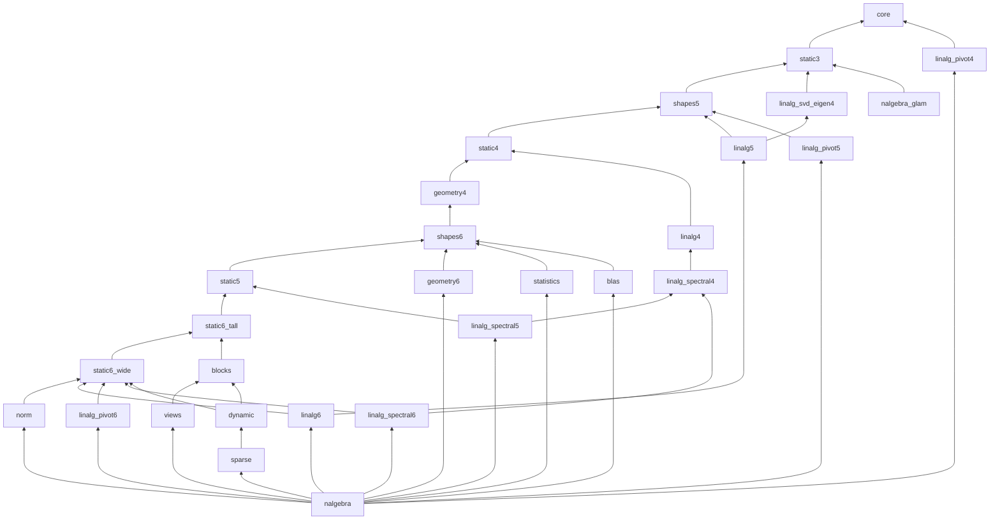

# Package split of nalgebra (WP 9-NS1: inventory and cut plan; WP 9-NS1b: final names)

> Research, no code moved. Status: plan approved by the programme session (§12); WP 9-NS1b gave
> the crates their final names, merged five small crates and measured every crate and declared
> closure on GitHub runners (§3.1, §6.5, §13): the list of §3.1 goes to the owner before NS3. Every number below was measured on throwaway builds (Scarb 2.19.4, this
> machine, 2026-09-28) with the helpers of `tools/split/` (§10). Rule: `docs/PLAN.md` M9 and
> `pm/decisions/2026-09-28-package-granularity-rule.md`; gate definitions as the programme session
> made them precise (§0).

## 0. Summary

- **The cut**: 27 sub-crates `nalgebra_*` of 3,700 to 35,500 physical library lines (largest:
  `nalgebra_shapes6`, 35,462), an acyclic dependency graph, and the facade `nalgebra` (11,700 lines:
  root functions, macros, re-exports). NS1 planned 32; NS1b merged five pairs (§6.5) and named
  them all (§3.1, §13). Upstream's module paths are kept INSIDE every sub-crate
  (`base/matrix3.cairo` stays `base::matrix3` in whichever crate hosts its items) and the facade
  rebuilds the 0.1.0 tree module by module.
- **Zero-break, proved**: a prototype of the whole cut compiles, and a consumer naming all 4,284
  public paths of 0.1.0 plus methods, operators, products, norms, solves, LU and the macros with
  0.1.0 imports compiles against the facade prototype (§3.4). No method changes trait: every
  inherent trait (`Matrix3Trait`…) moves whole. That is the glam-cairo pattern the programme
  session asked for (§1, point 2).
- **Gate 2 (marginal cost ≤ 5 s / 1 GB)**: every sub-crate passes on a GitHub runner (median of 9
  interleaved cold builds, §6.5): the largest marginals are `nalgebra_static3` and
  `nalgebra_blas` 2.9 s and `nalgebra_static6_wide` 2.7 s; memory is ≤ 0.67 GB for every crate.
- **Gate 3 (declared closures < 15 s / 3 GB)**, GitHub runner, median of 15 interleaved cold
  builds, highest median over four runs: `nalgebra_glam` (on `glam_core` + `glam_int`) **7.1 s /
  1.68 GB** (today 37 s / 5.5 GB); static 1–4 + geometry **12.0 s** / 2.38 GB; static 1–4 +
  LU / Cholesky / QR 10.2 s / 2.32 GB; static 1–3 + SVD / eigen 7.6 s / 1.60 GB; `core` + the
  pivoting decompositions 3.8 s / 0.95 GB. The two close calls of NS1 (§6.3) pass with 3 s of
  margin.
- **The facade fails gate 3 by construction** (it depends on every sub-crate): 58.8 s / 10.0 GB
  cold, against 96.7 s / 10.4 GB for 0.1.0 today. Scarb has no optional dependency, so
  `default-features = false` on the facade no longer saves anything (§4). A user who wants a
  cheap build depends on the sub-crates.
- **Zero steps**: the split moves code, it does not rewrite it, except for three kinds of small
  internal change listed in §3.3. Every move PR proves it with `tools/split/gas_compare.py`
  (§5).
- **Release**: a non-breaking patch release, nalgebra 0.1.1 and every sub-crate 0.1.1 in
  dependency order, then nalgebra_glam 0.1.1 on `nalgebra_core` + `nalgebra_static3` (§9).

## 1. Cairo coherence and impl placement (measured)

Throwaway workspace `tools/split/probes/` (six packages; its README lists every probe and its
expected outcome), Scarb 2.19.4 / Cairo 2.19.4.

| question | answer (probe) |
|---|---|
| Orphan rule? May crate C implement a trait of crate A for a type of crate B? | **No orphan rule**: it compiles (`pc`: `Tr<B>`, `Add<A>`, `MulM<B, A>`). |
| Where does a caller find an impl without importing it? | Only in the **module of the trait or of one of the trait's generic-argument types** (`m1`: `MulM<A, B>` in `B`'s module, another crate than `A`'s and the trait's, is found; `q2`: `Into<A, B>` in `B`'s module is found). **Nowhere else**: not in a third crate (`m2`, `m3`, `m6`, `m7`), and not even in another module of the type's own crate (`q1`: `Mul<A>` in `pa::shapes::inner`). |
| Core traits (`Add`, `Mul`, `Into`, `PartialEq`, `Serde`…) for a type of another crate | Allowed, same lookup rule: the impl must sit in the module of one of its argument types (for `Add<Matrix3>`, only `Matrix3`'s module). |
| `#[generate_trait]` outside the type's crate | Allowed (`m5`). Its methods need the trait in scope, as today. |
| Impl lookup through a facade | The rule above holds through re-exports (`e1`). An impl sitting in a third crate becomes callable only if imported, and a facade glob (`use facade::*`) imports it (`e2b`). Importing an **impl** also puts its trait's methods in scope, which can make method calls ambiguous: seen in the prototype (`Normed::dot` against `Vector3Trait::dot`). |
| What does `pub use sub::*` re-export? | Every public item and module of `sub`, including module paths (`e4`: `facade::shapes::A`). Two globs exporting the same name are **ambiguous at use** (`e10`: E2087); an explicit `pub use` (or an item of the facade's own, such as its `pub mod`) wins over the globs. |
| Macros across crates | A declarative macro of another crate can be called by path or imported (`m8`), re-exported (`e5`), and a macro body must reach its crate through `$defsite::` (`e6`). nalgebra's macros resolve `$defsite::super::Matrix3Trait`, i.e. the root of the crate that defines them, so they stay in the facade. |
| Supertraits | None in Cairo 2.19: moving a method to another trait changes what a caller must import. The plan moves no method (§3). |
| Features across crates | `dep/feature` forwarding works (`e11`: `extra = ["pa/extra"]`). Features **unify per compilation unit**: if any crate of the unit enables a dependency's default features, they are on for all (so the sub-crates depend on each other with default features off whenever they have features at all). |

The programme session's two points from glam-cairo's cut (`PK-G-glam-cut-plan.md` §9):
1. "A core-trait impl is found without import only in the type's own module": **confirmed and
   made precise**. It is the module of ANY type among the trait's generic arguments (`Into<A, B>`
   in `B`'s module works), and not another module of the same crate. Every core-trait impl with a
   single nalgebra type (`Add<Matrix3>`…) therefore stays with its struct, and the plan keeps
   struct and core-trait impls in the same crate and module (the solver checks it: §3.2).
2. "No supertraits; keep the types and the methods that return them together, move only the
   rest": **confirmed** (probes `e8`, `e9`). The plan goes further than glam's (no method changes
   trait at all): every inherent trait moves whole, into a crate ABOVE every type its methods
   build (§2.3). No public path changes (proved in §3.4).

## 2. Inventory

### 2.1 Library lines (0.1.0, `scripts/consumer_cost.py` rules, 499,786 in total)

| family | lines |
|---|---:|
| linalg | 184,400 |
| base: the 36 static shapes, max dimension 6 | 93,469 |
| base: shapes, max dimension 5 | 53,495 |
| geometry | 33,638 |
| base: shapes, max dimension 4 | 28,808 |
| base: shapes, max dimension 1–3 | 28,175 |
| base: statistics | 18,357 |
| base: dynamic | 18,136 |
| base: solve | 13,907 |
| base: blas | 12,103 |
| macros | 4,653 |
| sparse + io | 3,482 |
| base: cg, point swizzles, transpose, unit, points 2/3, views (declarations), errors, kernels | 6,065 |
| root + lib | 1,098 |

The 36 shape files (194k lines) split into: inherent traits (`MatrixRxCTrait`, `…AngleTrait`,
`…InternalTrait`, `…EditTrait`) 108.8k; views (`FixedView`, `FixedRows`, `FixedColumns`,
`PadTo6`, `CropFrom6`) 35.9k; products (`MatrixMul`, `MatrixTrMul`) 20.1k; `MatrixKronecker`
5.1k; indexing 3.7k; norms 3.2k; core-trait impls (`Add`, `Sub`, `Neg`, `Mul`, assignments,
`PartialOrd`, `Bounded`, `One`, `Sum`, `Product`, `IndexView`, array conversions) 13.5k; structs
0.5k.

Linalg per family and dimension band (lines):

| family | shared | 1–3 | 4 | 5 | 6 |
|---|---:|---:|---:|---:|---:|
| svd (+ svd2/svd3) | 5,507 | 3,956 | 4,074 | 7,221 | 11,570 |
| col_piv_qr | 78 | 2,663 | 3,653 | 7,525 | 14,389 |
| bidiagonal | 78 | 2,104 | 2,893 | 5,835 | 11,186 |
| full_piv_lu | 78 | 1,957 | 2,466 | 4,701 | 8,391 |
| schur | 19 | 1,277 | 2,104 | 4,323 | 8,148 |
| qr | 2,602 | 1,650 | 1,430 | 3,067 | 5,543 |
| permutation_sequence | 10,224 | | | | |
| lu (+ steps, inverse, `Perm1..6`) | 6,623 | 993 | 948 | | 2,281 |
| symmetric_eigen | | 918 | 1,000 | 1,821 | 2,940 |
| lblt | 22 | 1,087 | 846 | 1,262 | 1,847 |
| symmetric_tridiagonal / hessenberg / eigen | 67 | 1,468 | 1,165 | 2,337 | 3,994 |
| cholesky, ldlt, udu, cholesky_update | 4,817 | | | | |
| householder, givens, balancing, exp, pow | 6,946 | | | | |

### 2.2 Method

`tools/split/edges.py` cuts every library file into its top-level items (test-only code
excluded, `consumer_cost.py`'s rules) and records per item the names it references (types,
traits, constants, functions; resolved through the file's own `use` statements, homonyms
included), its method calls (`.m(`, resolved against the traits in scope: an
over-approximation), the generic arguments of every impl and its visibility. 6,600 items,
edges between items. `tools/split/plan.py` places the items: rule-based homes, lifting to a
fixpoint (every dependency ends in the same or a lower crate, hence an acyclic crate graph), and a
check of §1's lookup rule for every impl of a public trait with type arguments ("anchor").
`tools/split/prototype.py` then emits a real workspace of the plan and the compiler proves it (an
edge the analysis missed or over-approximated shows up as a build error).

### 2.3 Cross-family edges that decide the cut

| edge | what | consequence |
|---|---|---|
| inherent trait of dimension k → struct of dimension k + 1 | `insert_column` / `insert_row` (every shape), `push`, `to_homogeneous`, `from_homogeneous`, the `Vector2::xxx` swizzles | Within base the 36 shapes form ONE strongly connected component if inherent traits sit with their structs (120k lines). Resolved by placing inherent traits ABOVE the types of the next band (`nalgebra_dim4` above `nalgebra_types5`). |
| shape → geometry | `MatrixRxC::div_rotation` (12 shapes with 2 or 3 columns) names `Rotation2` / `Rotation3`; `Rotation3`'s own `Div` impl calls `Rotation3Trait`, which calls `Matrix3Trait` | The dimension 1–3 methods and the 2D/3D rotations, quaternions, isometries and similarities are one knot: they share `nalgebra_dim3`. |
| shape → geometry | `ApproxEqTrait` (crate-private helper of `relative_eq` / `ulps_eq`, in `geometry/quaternion.cairo`) used by every shape | Moves to `nalgebra_core` (not a public path). |
| base → linalg | `Matrix6Trait::is_invertible` / `is_special_orthogonal` run `Lu6` | `Lu6`, `Perm6` and their permutation impls sit with `Matrix6` in `nalgebra_dim6` (DESIGN D9 already notes it). |
| product → larger shape | `MatrixMul<A, B>` output ≤ the larger operand; `MatrixTrMul<Matrix6x2, Matrix6x3>` is `mul_mat` of the `Matrix2x6` literal | Products stay in the module of their LARGER operand (moved there when it is the right one). The dimension-6 types cannot be split: outer products (`Vector6 * RowVector6 → Matrix6`) and transposed products tie the 6×c and r×6 families together in both directions (brute force over the 2¹¹ partitions). |
| Kronecker | `Matrix2 ⊗ Matrix3 → Matrix6` (output larger than both operands) | `MatrixKronecker` and its 196 impls go to their own crate, in the trait's module. |
| views | `FixedView<Matrix6, Matrix3>`… 441 + 252 impls, used by no other item of the library | Own crates, impls in the trait's module (`nalgebra_views`, `nalgebra_edition`). |
| norms | `Norm<EuclideanNorm, Matrix3, T>` calls `Matrix3Trait::norm`, and `apply_norm` (inherent) is generic over `Norm` | Impls move to the module of the MARKER struct (`EuclideanNorm`…), which moves to `nalgebra_norm` above every inherent trait; the `Norm` trait stays in `core`. |
| solve | `MatrixSolve` is ONE blanket impl whose `impl K: SolveKernel<M, B>` is resolved at the caller | `SolveKernel` impls must stay anchored: in the shape modules of each type band. |
| permutations, Givens | public `PermuteRows<P, M>`, `GivensRotate<T, M>` | Declarations and `Perm1..5` in `core`, impls in the shape modules of each band; `Perm6` impls in `nalgebra_dim6`. |
| `nalgebra_glam` → 1- and 4-dimensional point / translation types | conversions of `Point4`, `Translation4` | These TYPES (and their core-trait impls) move to `nalgebra_core`; their methods stay above. |

## 3. The cut

### 3.1 Crates

The final list (WP 9-NS1b; names and placement live in `tools/split/crates.toml` only; approved
names are permanent on the registry). Ordered lowest first (a crate depends only on crates above it
in this table). "Lines": physical library lines of the prototype crate built from the map
(`files.py`, `consumer_cost.py`'s rules, imports included; the real crate will be a little smaller).
"Runner marginal": cold build of an empty consumer of the crate minus an empty consumer of its
direct dependencies together, median of 9 interleaved rounds on one GitHub runner (4 vCPU, 16 GB),
with the interquartile range of the per-round differences (run
[36454463677](https://github.com/bal7hazar/nalgebra-cairo/actions/runs/36454463677), §6.5).
Naming scheme (§13): `core`; `shapesN` = the TYPES of dimension N; `staticN` / `static_RxC` = the
METHODS of the static shapes of that dimension or shape family (`static6_tall`: 6 rows, `static6_wide`:
6 columns); `geometryN`; the families of upstream `base` (`blocks`, `views`, `norm`, `statistics`,
`blas`) and `linalg[_family]N` (family, then the largest dimension).

| crate | description (upstream module paths kept) | lines | direct deps (besides `simba`) | runner marginal s (IQR) / GB |
|---|---|---:|---|---:|
| `nalgebra_core` | the structs of the 36 static shapes and their core-trait impls; products, transposed products, indexing, solve kernels, permutations and Givens impls of the shapes up to 4x4; the declarations of every generic trait (`MatrixMul`, `MatrixTrMul`, `MatrixIndex`, `Norm`, views, `MatrixSolve`, `PermuteRows`, `GivensRotate`, `LuSteps`); `Point1..4`, `Translation1`, `Translation4`, `Unit`, `errors`, kernels | 20,571 | – | 1.5 (1.5–1.5) / 0.44 |
| `nalgebra_static3` | methods of the static shapes up to 3x3 (`Matrix1`, `Vector2`, `Vector3`, `Matrix2`, `Matrix2x3`...) and the 2D / 3D geometry: quaternions, unit complex numbers, rotations, translations 2 / 3, isometries, similarities, dual quaternions | 29,203 | core | 2.9 (2.8–2.9) / 0.64 |
| `nalgebra_shapes5` | the types of dimension 5 (structs, core-trait impls, products, indexing, solve / permutation / Givens impls, edit kernels); `Point4Trait`, `Translation4Trait` | 22,815 | core, static3 | 1.4 (1.2–1.4) / 0.40 |
| `nalgebra_static4` | methods of the dimension-4 shapes (`Matrix4`, `Vector4`, `Matrix2x4`...) | 16,312 | core, shapes5, static3 | 1.9 (1.6–1.9) / 0.32 |
| `nalgebra_geometry4` | projective / affine / general transforms, perspective and orthographic projections, scales and reflections of dimension 1 to 4, `Point1` / `Translation1` methods, `cg` (homogeneous coordinates) | 13,511 | core, shapes5, static3, static4 | 1.6 (1.6–1.7) / 0.32 |
| `nalgebra_shapes6` | the types of dimension 6 (as `shapes5`) | 35,462 | core, geometry4, shapes5, static3 | 2.4 (2.0–2.4) / 0.67 |
| `nalgebra_static5` | methods of every dimension-5 shape (`Matrix5`, `Matrix5xC`, `Vector5`, `Matrix2x5`..`Matrix4x5`, `RowVector5`) | 27,040 | core, shapes5, shapes6, static3, static4 | 2.4 (2.2–2.5) / 0.50 |
| `nalgebra_static6_tall` | methods of the shapes with 6 rows and fewer columns (`Matrix6x1`..`Matrix6x5`, `Vector6`); dimension-6 edit kernels | 24,652 | core, shapes5, shapes6, static3, static4, static5 | 1.7 (1.7–2.0) / 0.40 |
| `nalgebra_static6_wide` | methods of the shapes with 6 columns (`Matrix6`, `Matrix2x6`..`Matrix5x6`, `RowVector6`); `Lu6`, `Perm6` (`Matrix6::is_invertible` runs `Lu6`) | 32,568 | core, shapes5, shapes6, static6_tall | 2.7 (2.5–2.9) / 0.52 |
| `nalgebra_blocks` | row / column blocks, resize, pad / crop (`FixedRows`, `FixedColumns`, `FixedResize`, `PadTo6`, `CropFrom6`) and Kronecker products (`MatrixKronecker`), with their impls | 21,574 | core, shapes5, shapes6, static6_tall | 1.2 (1.0–1.4) / 0.31 |
| `nalgebra_views` | `FixedView` and its 441 impls | 23,485 | blocks, core, shapes5, shapes6 | 0.6 (0.6–1.0) / 0.31 |
| `nalgebra_norm` | the norm markers (`EuclideanNorm`, `LpNorm`, `OneNorm`, `UniformNorm`) and every `Norm` impl | 4,044 | core, shapes5, shapes6, static3, static4, static5, static6_tall, static6_wide | 0.9 (0.7–1.0) / 0.10 |
| `nalgebra_geometry6` | points, translations, scales and reflections of dimension 5 and 6 | 6,043 | core, shapes5, shapes6 | 1.1 (0.6–1.4) / 0.16 |
| `nalgebra_statistics` | `base::statistics` (sums, means, variances, min / max over rows and columns) | 18,576 | core, shapes5, shapes6 | 1.4 (0.9–1.7) / 0.22 |
| `nalgebra_blas` | `base::blas` (dot products, `gemv`, `gemm`, `axpy`, rank updates...) | 12,322 | core, shapes5, shapes6 | 2.9 (2.4–2.9) / 0.33 |
| `nalgebra_linalg4` | LU, Cholesky, LDLᵀ / UDU, Cholesky update, QR up to 4x4; Householder reflections, LU steps | 10,722 | core, static3, static4 | 0.9 (0.9–1.1) / 0.24 |
| `nalgebra_linalg_svd_eigen4` | symmetric eigendecomposition and SVD up to 4x4 | 11,152 | core, static3 | 0.8 (0.7–0.9) / 0.24 |
| `nalgebra_linalg_pivot4` | column-pivoting QR, full-pivoting LU, LBLᵀ up to 4x4 | 12,879 | core | 1.0 (1.0–1.0) / 0.25 |
| `nalgebra_linalg_spectral4` | bidiagonal, Schur, eigen, Hessenberg, symmetric tridiagonal, balancing, `exp` / `pow` up to 4x4 | 13,095 | core, linalg4, static3, static4 | 1.4 (1.1–1.5) / 0.33 |
| `nalgebra_linalg5` | LU / Cholesky / QR / symmetric eigen / SVD of dimension 5 | 15,075 | core, linalg_svd_eigen4, shapes5 | 1.0 (0.8–1.1) / 0.28 |
| `nalgebra_linalg_pivot5` | column-pivoting QR, full-pivoting LU, LBLᵀ of dimension 5 | 13,712 | core, shapes5 | 0.7 (0.6–0.8) / 0.23 |
| `nalgebra_linalg_spectral5` | bidiagonal, Schur, eigen, Hessenberg, tridiagonal of dimension 5 | 14,793 | core, linalg4, linalg_spectral4, shapes5, static3, static4, static5 | 0.6 (0.3–0.9) / 0.31 |
| `nalgebra_linalg6` | QR / Cholesky / symmetric eigen / SVD of dimension 6 (`Lu6` is in `static6_wide`) | 26,231 | core, linalg5, linalg_svd_eigen4, shapes5, shapes6, static6_wide | 2.1 (1.9–2.1) / 0.46 |
| `nalgebra_linalg_pivot6` | column-pivoting QR, full-pivoting LU, LBLᵀ of dimension 6 | 24,893 | core, shapes5, shapes6, static6_wide | 1.6 (1.0–1.9) / 0.41 |
| `nalgebra_linalg_spectral6` | bidiagonal, Schur, eigen, Hessenberg, tridiagonal of dimension 6 | 25,871 | core, linalg4, linalg_spectral4, shapes5, shapes6, static3, static4, static5, static6_wide | 1.9 (1.5–2.1) / 0.49 |
| `nalgebra_dynamic` | `DMatrix`, `DVector`, `RowDVector`, the dynamic forms of the static shapes | 18,360 | blocks, core, shapes5, shapes6, static3, static4, static5, static6_tall, static6_wide | 2.3 (2.3–2.6) / 0.49 |
| `nalgebra_sparse` | `sparse` (legacy `CsMatrix`, `CsCholesky`) and `io` (Matrix Market) | 3,654 | core, dynamic, shapes5, shapes6, static6_wide | 1.3 (0.2–2.1) / 0.10 |
| **`nalgebra`** (facade) | root functions (`nalgebra::distance`...), the macros (`matrix!`...), the 0.1.0 module tree re-exporting every sub-crate | 6,806 (prototype) | every sub-crate | gate 3 only |

Dependency graph (transitive edges omitted):

Scopes: the crates cannot follow upstream's module tree one to one (upstream's `base` is 272k
lines, one module per shape would give a knot, §2.3): they follow it "as far as the dimension
split allows". NS1's working names (`dim3v`, `types5`, `dim6b`...) map to these as
`tools/split/cratemap.py`'s `NS1_NAMES` says; §2 and §6.1–6.4 keep NS1's names (they record NS1's
measurements). The type / method separation is the price of zero-break (§2.3), and every file of
the upstream tree keeps its module path inside its crate.

### 3.2 How each impl is placed (coherence)

Machine-checked by `plan.py` (0 anchor violations in the final layout) and by the prototype build:

| impl | placement |
|---|---|
| core trait of ONE nalgebra type (`Add<Matrix3>`, `Serde`, `PartialOrd`, `Index`, array `Into`) | the struct's module, hence the struct's crate. |
| `MatrixMul<A, B>`, `MatrixTrMul<A, B>`, `MatrixIndex` | the module of the larger operand (1,374 impls change module in all, most to their trait's module: next rows); `Matrix5x3 * Matrix3x2` stays in `matrix5x3` (`nalgebra_shapes5`); `Matrix2x5 * Matrix5x6` moves to `matrix5x6` (`nalgebra_shapes6`). |
| `FixedView`, `FixedRows`, `FixedColumns`, `FixedResize`, `PadTo6`, `CropFrom6`, `MatrixKronecker` | the trait's module in the family crate (801 + 196 impls move out of the shape files). |
| `Norm<Marker, M, T>` | the marker's module (`nalgebra_norm`, 144 impls). |
| `MatrixInfSup` (root) | the trait's module in the facade (36 impls). |
| `SolveKernel` (crate-private, but a blanket impl resolves it at the caller), `PermuteRows`, `GivensRotate` | the shape modules of each type band; `Perm6`'s in `perm` of `nalgebra_static6_wide`. |
| impls of crate-private traits with no blanket caller (`LuInvert`, `BlasTranspose`, `LuSteps`) | the crate of their callers, imported there (not a public path). |
| cross-crate products (`Matrix5x3 * Matrix3x2`, `Matrix2x5 * Matrix5x6`) | as above: the operand of the higher band holds them, so every product is found with 0.1.0's imports. |

### 3.3 The only code changes (everything else moves verbatim)

1. Impls change MODULE (never body) as listed in §3.2. An impl is rarely named by users; the
   public ones keep their 0.1.0 path through an explicit re-export in the facade (the prototype
   does it for `Point2Index` & co.).
2. `SvdRightTrait` (crate-private, `right2`..`right6` in one generated trait) is split into one
   trait per band (`SvdRightImpl`, `SvdRightImpl5`, `SvdRightImpl6`): same bodies, callers renamed.
3. Three `Normed` impls (`Matrix1`, `Vector5`, `Vector6`) call the inherent `norm`; they get a
   type-level kernel, called by both, through an `#[inline(always)]` wrapper so no step changes.
   The prototype stubs their bodies (no cost difference).
4. `ApproxEqTrait` (crate-private) moves from `geometry::quaternion` to `nalgebra_core`.
5. Every `pub(crate)` item used across crates becomes `pub` (no new public path in the facade:
   the facade only re-exports what 0.1.0 exports; the sub-crates do expose these items, a
   deviation to document in their READMEs as "internal, no stability promise").

### 3.4 The facade keeps every 0.1.0 path (proof)

`tools/split/facade.py` writes the facade of the prototype: for every public module of 0.1.0,
`pub use nalgebra_<crate>::<same path>::*` from each sub-crate that hosts that module, the
module's own `pub use` lists verbatim (root re-exports, `base::{Matrix3, …}`), explicit
re-exports for the impls that changed module, and the facade's own `root` and `macros`. It
then writes `path_proof`, a consumer with one `use nalgebra::<path>;` for each of the **4,284
public paths** of 0.1.0 (every public item of every public module, every name of every `pub use`)
and a `usage` module exercising, with the imports a 0.1.0 user writes:
`m.transpose()`, `m * t + m`, `p.mul_mat(v)`, `m.tr_mul(m)`, `s.apply_norm(EuclideanNorm {})`,
`m.solve_lower_triangular(w)`, `m.lu()`, `m.determinant()`, `v.norm()`,
`Matrix5x3.mul_mat(Matrix3x5)` (a cross-crate product), `FixedView::fixed_view(Matrix6)`,
`Matrix6::trace`, `UnitQuaternion::transform_vector`, `Isometry3::transform_vector`, and the
macros `matrix!`, `vector!`, `point!`, `dmatrix!`. `scarb build -p path_proof` succeeds; a
deliberately wrong path or method in the same file fails (checked). Two facade details found
by the proof: the inline `errors` modules need one explicit re-export each (else ambiguous
globs), and an impl re-exported by 0.1.0 at `nalgebra::geometry::Point2Index` needs an explicit
re-export at its old module after it moves to `Point2`'s module.

## 4. Features

Scarb has no optional dependency (DESIGN D11), so the facade depends on every sub-crate
unconditionally, and a feature cannot remove a sub-crate from a facade user's build.

| 0.1.0 feature | after the split |
|---|---|
| `statistics`, `blas`, `dynamic`, `sparse`, `io`, `eigen`, `svd`, `qr`, `cholesky_update`, `full_piv_lu`, `col_piv_qr`, `lblt`, `hessenberg`, `bidiagonal`, `schur`, `exp` | become crates (§3.1). In the facade they stay DECLARED, all in `default`, as **no-ops** (a manifest that names them keeps building: no break). |
| `closures` | gates methods inside the inherent traits (`map`, `fold`, `zip_*`…). Recommended: drop the gating (compiled always: the measured marginals include them and pass) and keep the name as a no-op. Keeping it gated inside the `dim*` crates (forwarded by the facade, `closures = ["nalgebra_dim3/closures", …]`, measured to work) buys little once the crates are split. |
| `macros` | stays a real feature of the facade (the macros live there). |
| `default-features = false` on the facade | still valid, **saves nothing** apart from the macros: 58.8 s / 10.0 GB cold, against 28.7 s / 5.2 GB for `nalgebra` 0.1.0 with `default-features = false` today (NS0). This is a **cost regression for that configuration** (no API change). Those users should depend on the sub-crates they use, e.g. `nalgebra_core` + `nalgebra_dim3` + `nalgebra_linalg`. |

Plainly: **a facade user pays the whole library** (58.8 s / 10.0 GB cold, down from 96.7 s /
10.4 GB with 0.1.0's default features); the sub-crates are the way to pay less. Sub-crates depend
on each other with default features (none have features once `closures` is dropped); if some keep
features, they depend on each other with `default-features = false` (features unify per unit,
§1).

## 5. Tests and gas

- **Test packages** (`crates/tests_*`, `crates/shapes_tests_*`: 60 packages, already outside
  `src/`) keep their names, so their gas keys (`nalgebra_tests_linalg::…`) do not change. Each
  one depends on the sub-crates it tests instead of `nalgebra` with features; its
  `use nalgebra::X` lines are rewritten to `use nalgebra_<crate>::<module>::X` (the rewrite of
  `tools/split/glam_proto.py`, generalised). Depending on the facade instead would keep the test
  code byte-identical, but every test package would compile the whole library (10 GB).
- **In-crate tests and benches** (174 benches and 249 tests in 27 library files, testing
  crate-private items) move with their module; their keys change package prefix only
  (`nalgebra::base::matrix2::tests` → `nalgebra_core::base::matrix2::tests`). The alexandria
  model puts tests outside `src/`; these few test crate-private items and stay inline, as AGENTS
  allows today (a deviation to confirm).
- **Zero step change, proved per move**: `tools/split/gas_compare.py OLD_GAS_DIR NEW_GAS_DIR`
  drops the `nalgebra` / `nalgebra_<crate>` package segment of every module path, compares every
  benchmark, and fails if one changes value, disappears or appears (checked: identical
  directories and a renamed package prefix both give "3,758 benchmarks, 0 changed"). The gas
  snapshot FILES are per CI shard (`gas/<shard>.json`); `gas_report.py` names shards after the
  package, so the move PR regenerates the files of the moved modules and runs `gas_compare.py`
  against `main`.
- Why no step change is expected: the whole dependency graph is compiled as one unit and
  inlining crosses crates (R7 §4); the moved code is byte-identical except §3.3, whose three items
  keep the same function bodies.

## 6. Measurements

§6.1–6.4 are NS1's measurements on the orchestrator VM, with NS1's crate names (their final
names: `cratemap.py`'s `NS1_NAMES`); §6.5 is NS1b's GitHub-runner measurement of the final list.

### 6.1 Protocol

`tools/split/measure.py` builds a trivial consumer cold (`SCARB_INCREMENTAL=false`, fresh
`target/`, `scarb fetch` first), 2 or 3 times, median, under the shared build lock
(`flock ~/orchestrator/heavy-build.lock`, so lock waits are excluded): wall time, CPU time
(user + sys) and peak RSS. Marginal = consumer(crate) − consumer(its direct dependencies);
closure = consumer(crates) − consumer(no dependency). Baseline: 1.4–1.9 s wall, 0.54 GB. Machine:
shared 8-vCPU VM, `RAYON_NUM_THREADS=4`, other projects building at times.

### 6.2 Results (final layout)

Marginal costs: table of §3.1 (wall s / GB). CPU seconds of the same measurements, the steadier
figure: core 4.3, dim3v 3.1, dim3 6.7, types5 2.7, dim4 2.9, geometry 4.4, types6 4.8, dim5 3.3,
dim5a 1.3, dim6a 5.8, dim6 1.6, dim6b 7.3, edition 2.9, views 6.6, kronecker 6.2, norm 2.1,
geometry_nd 2.2, statistics 4.4, blas 5.6, linalg 2.4, linalg_svd 3.8, linalg_pivot 1.1,
linalg_spectral 2.2, linalg5 2.8, linalg5_pivot −0.3, linalg5_spectral 3.5, linalg6 7.2,
linalg6_pivot 5.2, linalg6_bidiagonal 3.0, linalg6_spectral 9.3, dynamic 10.7, sparse −0.2.

Declared closures (gate 3, over the no-dependency baseline):

| closure | crates (with their dependencies) | wall s | CPU s | GB | verdict |
|---|---|---:|---:|---:|---|
| `nalgebra_glam` | `nalgebra_glam` prototype → core, dim3v, dim3, glam 0.4.0, fixed | 10.0–10.5 | 25.2 | 1.85 | pass |
| static 1–3 + SVD / eigen | core, dim3v, dim3, linalg_svd | 8.6–9.6 | 22.3 | 1.59 | pass |
| `core` + pivoting decompositions ≤ 4 | core, linalg_pivot | 4.8 | 11.3 | 0.94 | pass |
| static 1–4 + geometry (3D game physics and rendering) | core, dim3v, dim3, types5, dim4, geometry | 12.4–14.6 | 32.6–35.4 | 2.39 | pass, **close** |
| static 1–4 + LU / Cholesky / QR | core, dim3v, dim3, types5, dim4, linalg | 12.3–15.0 | 31.8–36.4 | 2.31 | pass, **close** |
| the facade `nalgebra` | everything | 58.8 | 150.9 | 10.04 | **fails by construction** |
| (for reference) `glam` 0.4.0 alone | | 3.0 | 7.4 | 0.70 | |

`types5` is in every closure with `dim4`: `Matrix4Trait::insert_column` builds a `Matrix4x5`
(zero-break costs about 1–2.5 s there).

### 6.3 Close decisions (NS1; settled on GitHub runners in §6.5)

Noise on this VM: the same closure measured twice in one session gave 12.9 and 14.3 s; the
marginal of the former 27k-line `dim3` read 4.3, 4.6 and 5.6 s in three sessions (it was split
for that reason). Close calls, to be measured on a GitHub runner with interleaved cold builds
(glam used 15 per variant) before the moves start:
- the two "static 1–4" closures (12.3–15.0 s against 15 s);
- `nalgebra_dynamic` (4.6 s marginal), `nalgebra_dim6b` / `nalgebra_dim6a` / `nalgebra_types6`
  (2.5–3.6 s, but 5.8–7.3 s CPU);
- `nalgebra_types6` lines: 35,462 against 40,000 (the tightest line margin; it cannot be split
  without rewriting the transposed products, §2.3).
NS1b settled all three on GitHub runners (§6.5): the two closures cost 10–12 s (3 s of margin),
`nalgebra_dynamic` 2.3–3.3 s, the dimension-6 crates ≤ 2.7 s; `nalgebra_shapes6` keeps its 35,462
lines (11 % margin).

### 6.4 Rejected cuts (measured)

| layout | why rejected |
|---|---|
| one crate per dimension band, inherent traits with their structs | 120k-line strongly connected component (§2.3). |
| all 36 structs + all products at the bottom (`v3`) | static 1–4 + geometry closure 16.5 s / 2.86 GB (fail): the products of dimension 6 were in every closure. |
| one `base5` (26.5k lines of methods) | marginal 6.9 s (fail). |
| one `dim6` (Matrix6 + r×6 methods + LU6, 32k) | marginal 4.4–6.1 s. |
| one `linalg5_ext` / `linalg6_spectral` of 24–27k lines | marginals 6.1 s and 5.8 s. |
| one `linalg` ≤ 4 (19.5k) | static 1–4 + linalg closure 14.8–16.4 s. |

The VM's marginals were about twice the runner's and noisier: NS1b re-measured three of these
rows on GitHub runners as merges (`base5` = `nalgebra_static5` 2.4 s, `dim6` =
`nalgebra_static6_wide` 2.7 s, `linalg6_spectral` + bidiagonal = `nalgebra_linalg_spectral6` 1.9 s)
and kept them (§6.5).

### 6.5 GitHub-runner measurement of the final list (WP 9-NS1b)

**Protocol** (`.github/workflows/split-measure.yml`, `workflow_dispatch`): one job builds the
throwaway split workspace FROM THE CRATE MAP (`edges.py` → `mapplan.py` → `prototype.py` +
`glam_proto.py`; `mapplan.py --merge NEW=a+b` tries a merge without editing the map), then one
job per crate measures its marginal and one job per declared closure (`crates.toml`
`[closures]`) its cost, each with `measure.py --interleave`: every consumer of the job (the crate,
its direct dependencies together, the no-dependency baseline; or the closure and the baseline)
is built cold once per round, the order rotated each round, 9 rounds for the marginals and 15 for
the closures. Median of the rounds; spread = interquartile range of the per-round differences.
`runner_report.py` writes the tables (job summary and artifact `split-measure-report`). Runner:
`ubuntu-latest`, 4 vCPU, 16 GB; baseline 1.3 s / 0.54 GB. Within a job the rounds agree to
±0.2 s; between jobs (different machines) the same closure varies by up to 30 % (below), hence
the paired `compare=true` mode: with merges, every closure is also measured on the map without
them in the same job.

**Runs** (the workflow can only be dispatched once it is on `main`; these ran from throwaway refs
`split-measure/*`: this branch plus a `push` trigger and the inputs written in, nothing else):

| run | layout | purpose |
|---|---|---|
| [36450575479](https://github.com/bal7hazar/nalgebra-cairo/actions/runs/36450575479) | NS1's 32 crates, final names | every marginal, every closure |
| [36450579653](https://github.com/bal7hazar/nalgebra-cairo/actions/runs/36450579653) | merges M1–M4 | marginals of the merged crates, closures |
| [36452745134](https://github.com/bal7hazar/nalgebra-cairo/actions/runs/36452745134) | merges M1–M3, M5–M7, `compare=true` | every marginal; closures paired with the unmerged map |
| [36454463677](https://github.com/bal7hazar/nalgebra-cairo/actions/runs/36454463677) | **the final map** (27 crates, committed) | every marginal (§3.1), every closure |

**Declared closures** (gate 3: < 15 s / 3 GB; added over the no-dependency baseline; median of 15
rounds, IQR of the final run, and the range of the medians over the runs that measured the same
code):

| closure | crates (with their dependencies) | final run s (IQR) | CPU s | GB | medians over the runs | verdict |
|---|---|---:|---:|---:|---:|---|
| `nalgebra_glam` | `nalgebra_glam` → core, static3, `glam_core` 0.4.1, `glam_int` 0.4.1, `fixed` | 6.0 (5.8–6.0) | 14.2 | 1.68 | 4.9–7.1 | pass |
| static 1–3 + SVD / eigen | core, static3, linalg_svd_eigen4 | 7.6 (7.5–7.8) | 19.9 | 1.59 | 5.8–7.6 | pass |
| `core` + pivoting decompositions ≤ 4 | core, linalg_pivot4 | 3.8 (3.8–3.9) | 10.0 | 0.95 | 3.6–3.8 | pass |
| static 1–4 + geometry | core, static3, shapes5, static4, geometry4 | 11.0 (10.9–11.0) | 29.7 | 2.38 | 10.3–12.0 | pass |
| static 1–4 + LU / Cholesky / QR | core, static3, shapes5, static4, linalg4 | 10.1 (10.0–10.3) | 27.0 | 2.32 | 8.0–10.2 | pass |
| (reference) glam 0.4.1: `glam_core` + `glam_int` | | 2.1 (2.0–2.2) | 5.3 | 0.55 | 2.1–2.2 | |

Every declared closure passes on every run, the highest median being 12.0 s (static 1–4 +
geometry, on the slowest machine). `nalgebra_glam` needs `glam_core` only for its types
(`use glam::X` → `use glam_core::X` compiles); `glam_int` is in the closure as planned (§12.5)
and costs nothing measurable.

**Merges** (§12.2: the smallest crates with their natural neighbour when no declared closure
worsens and the merged crate passes gates 1 and 2 with margin):

| merge | lines | merged marginal s (IQR) | paired closures (merged / unmerged, same job) | decision |
|---|---:|---:|---|---|
| M1 `static3` = `vectors3` (5.5k, 0.4 s) + `static3` (24.0k, 2.9 s) | 29,203 | 2.9 (2.8–2.9); 2.5, 3.8 in the other runs | glam 7.0 / 7.1, static3_svd 7.0 / 7.0, static4_factor 10.1 / 10.2, static4_geometry 11.2 / 11.2 | **kept**: every closure contained both |
| M2 `dynamic` = `dynamic` (18.4k, 3.3 s) + `sparse` (3.7k, 0.4 s) | 21,791 | 4.3 (4.2–4.8), twice | no declared closure | **rejected**: 0.2–0.7 s from the 5 s gate, on the crate that grows with the dynamic forms |
| M3 `blocks` = `edition` (15.8k, 0.7 s) + `kronecker` (6.0k, 0.4 s) | 21,574 | 1.2 (1.0–1.4) | no declared closure | **kept** |
| M4 `linalg_pivot` = `linalg_pivot4` + `linalg_pivot5` | 26,348 | 1.9 (1.8–2.3) | core_pivot 9.3 s against 3.6 s (pulls `shapes5`) | **rejected**: a declared closure worsens |
| M5 `linalg_spectral6` = `linalg_bidiagonal6` (11.5k, 0.5 s) + `linalg_spectral6` (14.5k, 1.6 s) | 25,871 | 1.9 (1.5–2.1) | no declared closure | **kept** (band 6 now like bands 4 and 5, where bidiagonal sits with the spectral family) |
| M6 `static5` = `static_5xc` (16.5k, 1.2 s) + `static_rx5` (10.8k, 1.1 s) | 27,040 | 2.4 (2.2–2.5) | no declared closure | **kept** |
| M7 `static6_wide` = `static6` (15.5k, 0.7 s) + `static6_wide` (17.3k, 0.9 s) | 32,568 (19 % margin) | 2.7 (2.5–2.9) | no declared closure | **kept**; side effect: `linalg6` / `linalg_pivot6` now depend on it (+17k lines, about +1 s for their users, no declared closure) |

Not tried, by construction: `norm` (4.0k) has no natural neighbour (it sits above every method
crate: only `dynamic` or the facade could host it, making every `apply_norm` user pay them);
`geometry6` (6.0k) would push `shapes6` over 40,000 lines or pull `shapes6` into static 1–4 +
geometry; `linalg4` with `linalg_svd_eigen4` or `linalg_spectral4` worsens static 1–4 + LU or
static 1–3 + SVD; `linalg_pivot5` + `linalg_pivot6` = 38.6k lines (4 % margin).
| `solve` / `perm` as one crate over all dimensions | every small decomposition's closure pulled `types6` (19.6 s). |

## 7. Generators and tooling

Built in WP 9-NS2 (usage: `docs/ORCHESTRATOR.md`, "Repository tooling" and the move-PR checklist).

- **Crate map** `tools/split/crates.toml`, read by `tools/split/cratemap.py`: `[crates]` lists the
  planned crates (the final names of §3.1, NS1b; they live there only), lowest first, each with the
  Cairo package that hosts it TODAY; `facade` names the crate of what no rule places (root,
  macros); `[[rule]]`s place every top-level item, first match wins, by module file (globs), item
  class (`struct`, `inherent`, `impl`...), name, implemented trait, shape, band (of the file, of
  the impl's type arguments or of the item name), with a `lift` of every impl above its type
  arguments; the module of an impl follows §3.2 (the first anchor in its package). Committed in
  single-crate mode (every crate hosted by `nalgebra`). With every crate hosted by its own
  package (`cratemap.py --split-map`) it reproduces NS1's `final` plan item by item (5,706 /
  5,706 items, crate and module: `cratemap.py --compare-plan`).
- **Generators** `tools/shapegen`, `tools/linalggen`: their library outputs go through
  `cratemap.route_outputs`: each item into `crates/<package dir>/src/<same module file>`, a file
  whose items all go to one package moved whole, the facade keeping the module doc and
  `pub use nalgebra_<crate>::<path>::*` plus one explicit `pub use` per public impl moved to an
  anchor module (its 0.1.0 path), the sub-crates their `pub mod` roots. `use` / `pub mod` lines
  are added when missing (`scarb fmt` sorts them), moved impls sit in marked blocks per generator,
  so the two generators are idempotent after each other. Single-crate mode: byte-identical output.
  Split mode on a throwaway checkout: the same 356 files and 4,571 generated items as
  `prototype.py` (`cratemap.py --compare-tree`).
- `scripts/api_parity.py`: scans every package of the crate map plus `nalgebra_glam`; an item
  is reported at its facade path (a moved impl at the module of its explicit facade re-export), so
  the report is byte-identical in both modes.
- **Path proof** `tools/split/public_paths.py` (CI job `Path proof`): the public surface is every
  public module (`internal` excluded), every public item (impls included) and every `pub use`
  name, globs followed across the packages of the map. 0.1.0 has **9,289** public paths (the
  4,284 of §3.4, 4,622 public impls, the modules), frozen in `public_paths_0.1.0.txt`;
  `--check` proves the facade exports exactly that set plus `public_paths_added.txt` and builds a
  consumer naming every path with the `usage` checks of §3.4 (4 min, 11.3 GB on this machine).
- `tools/split/gas_compare.py --base <git ref or dir> --head gas/`: the zero-step proof of §5.
- `tools/split/rewrite_imports.py`: the test-package rewrite of §5 (dry run by default).
- `consumer_cost.toml`: gates on every `nalgebra_*` sub-crate (lines + MARGINAL cost, the
  column the orchestrator adds); `[closures]`: `nalgebra_glam`, `static3_svd`, `core_pivot`,
  `static4_geometry`, `static4_factor` (§6.2); the facade reported, not gated.
- CI: one test shard per test package as today; the `Path proof` job; the gas job unchanged plus
  `gas_compare.py` in move PRs (PR template checkbox).
- `tools/split/`: the helpers of this study (§11), reusable by rapier / glam.
- **Runner measurement** (NS1b): `crates.toml` `[closures]` (the declared closures by crate name),
  `mapplan.py` (the map, with trial merges, as a plan for `prototype.py`), `measure.py
  --interleave --json`, `runner_report.py`, `.github/workflows/split-measure.yml` (§6.5).

## 8. `nalgebra_glam`

Depends on `nalgebra_core`, `nalgebra_static3` (measured: the prototype rewritten from
`use nalgebra::X` to the defining sub-crates compiles against exactly these), plus glam 0.4.1's
`glam_core` (every glam type it names) and `glam_int` (§12.5), and `fixed`. Its closure on GitHub
runners: **4.9–7.1 s, 1.68 GB** (§6.5; target 15 s / 3 GB; today 37 s / 5.5 GB). Its
public API does not change: its conversion impls take the same types, which the facade
re-exports.

## 9. Order of the moves and of the releases

The moves go bottom-up, so every PR creates crates below what remains in `nalgebra`, and
`nalgebra` (the future facade) re-exports them at once: every PR keeps every public path and
proves zero step change (`gas_compare.py`) and unchanged paths (`path_proof`).

| WP | content | size |
|---|---|---|
| NS2 | tooling only: shapegen / linalggen emit into per-class output crates (byte-identical output while everything maps to `nalgebra`), `gas_compare.py`, import rewriter for test packages, `path_proof` generator, `api_parity.py` over several crates | tools |
| NS3 | `nalgebra_core` (types ≤ 4, trait declarations, `ApproxEqTrait`, points / translations 1–4, solve / perm / Givens declarations and ≤ 4 impls) | ~20k |
| NS4 | `nalgebra_static3` (with the 2D/3D geometry), then `nalgebra_glam` on it | ~29k |
| NS5 | `nalgebra_shapes5`, `nalgebra_static4`, `nalgebra_geometry4` | ~50k (generator-driven) |
| NS6 | `nalgebra_shapes6`, `nalgebra_geometry6` | ~41k (generator-driven) |
| NS7 | `nalgebra_static5`, `_static6_tall`, `_static6_wide` (with `Lu6`) | ~85k (generator-driven) |
| NS8 | `nalgebra_blocks` (with the Kronecker products), `_views`, `_norm`, `_statistics`, `_blas` | ~80k |
| NS9 | `nalgebra_linalg4`, `_linalg_svd_eigen4`, `_linalg_pivot4`, `_linalg_spectral4` (with the `SvdRightTrait` split) | ~48k |
| NS10 | `nalgebra_linalg5`, `_linalg_pivot5`, `_linalg_spectral5`, `nalgebra_linalg6`, `_linalg_pivot6`, `_linalg_spectral6` | ~110k (linalggen-driven) |
| NS11 | `nalgebra_dynamic`, `nalgebra_sparse`; `nalgebra` becomes the pure facade (root, macros, re-exports, features as no-ops); one README per package; release script; CI gates | ~27k |

Progress: **NS3 done** (PR #66): `nalgebra_core`, 21,568 library lines, marginal 0.47 GB and
~1.4 s locally (minimum of 5 cold builds under the shared build lock; NS1b runner: 1.5 s / 0.44 GB),
zero step change (every CI gas shard unchanged), path proof green; 0.1.0 crate-private items it
shares under `nalgebra_core::internal` (`crates.toml` `[internal]`). **NS4 done** (PR #67):
`nalgebra_static3`, 29,486 library lines, marginal 3.2 s / 0.63 GB (CI `Consumer cost`, GitHub
runner; NS1b: 2.9 s / 0.64 GB), zero step change, path proof green (transient set 524 → 502);
`nalgebra_glam` on `nalgebra_core` + `nalgebra_static3` + `glam_core` / `glam_int` 0.4.1: closure
7.3 s / 1.69 GB (was 37 s / 5.5 GB on `nalgebra` + `glam`). **NS5 done** (PR #68):
`nalgebra_shapes5` (23,176 lines, marginal 1.5 s / 0.39 GB), `nalgebra_static4` (16,114, 1.8 s /
0.35 GB), `nalgebra_geometry4` (13,560, 1.7 s / 0.30 GB) (CI `Consumer cost`, GitHub runner; NS1b:
1.4 / 1.9 / 1.6 s), zero step change, path proof green (transient set 502 → 752: the impls of the
dimension-5 files anchored in dimension-6 modules, until NS6); closure static 1–4 + geometry
(`static4_geometry`) **11.0 s / 2.42 GB** (NS1b: 11.0 s / 2.38 GB); `nalgebra_glam` without
`glam_int`: 6.9 s / 1.62 GB; `cratemap.py --anchors` (the step-7 checks). **NS6 done** (PR #69):
`nalgebra_shapes6` (36,214 lines, marginal 2.5 s / 0.69 GB), `nalgebra_geometry6` (5,912, 0.7 s /
0.18 GB) (CI `Consumer cost`, GitHub runner; NS1b: 2.4 / 1.1 s), zero step change, path proof green
(transient set 752 → 1,081: 106 dimension-≤5 impls left with the dimension-6 modules, 435 family
impls of the dimension-6 shapes now wait in their trait's module, `matrix_view`, `matrix_kronecker`,
`norm`, `root`, `lu`, until NS7 / NS8 / NS11); the dimension-6 edit kernels are `pub(crate)` in the
facade package until `static6_tall` moves (NS7). **NS7 done** (PR #71): `nalgebra_static5` (26,820 lines, marginal
2.8 s / 0.48 GB), `nalgebra_static6_tall` (24,452, 2.0 s / 0.40 GB), `nalgebra_static6_wide` (31,497,
2.5 s / 0.52 GB; with `Lu6` and `Perm6`) (CI `Consumer cost`, GitHub runner; NS1b: 2.4 / 1.7 /
2.7 s), zero step change, path proof green (transient set 1,081 → 1,069: the 12 `Perm6`
permutation impls left with `Perm6`); `closures` in each, forwarded by the facade; the dimension-6
edit kernels and `Lu6InternalTrait` under `internal`. **NS8 done** (PR #73): `nalgebra_blocks`
(21,328 lines, marginal 0.5 s / 0.32 GB), `nalgebra_views` (23,233, 0.7 s / 0.33 GB), `nalgebra_norm`
(3,744, 0.6 s / 0.10 GB), `nalgebra_statistics` (18,359, 0.9 s / 0.22 GB), `nalgebra_blas` (12,105,
2.4 s / 0.34 GB) (CI `Consumer cost`, GitHub runner; NS1b: 1.2 / 0.6 / 0.9 / 1.4 / 2.9 s), zero step
change, path proof green (transient set
1,069 → 36: only the `MatrixInfSup` impls of `root` remain, until NS11); `PadTo6` / `CropFrom6` /
`ShapeDims` under `nalgebra_blocks::internal`; the facade features `statistics` / `blas` now gate its
re-exports of the two crates only (their removal: NS11, §12.1). **NS9 done** (PR #74):
`nalgebra_linalg4` (9,488 lines, marginal 0.9 s / 0.21 GB), `nalgebra_linalg_svd_eigen4` (11,154,
1.1 s / 0.25 GB), `nalgebra_linalg_pivot4` (12,726, 1.2 s / 0.26 GB), `nalgebra_linalg_spectral4`
(12,101, 1.6 s / 0.30 GB) (CI `Consumer cost`, GitHub runner; NS1b: 0.9 / 0.8 / 1.0 / 1.4 s), zero
step change, path proof green (transient set 36, unchanged); closures `static3_svd` **7.6 s /
1.58 GB**, `core_pivot` **3.9 s / 0.94 GB**, `static4_factor` **10.8 s / 2.36 GB**; the linalg
features forwarded to the sub-crates (none a no-op yet); `SvdRightTrait` split per band; anchor
fixes: `ColumnMajor` / `Balancing` / `HouseholderAxis` declared in `nalgebra_shapes5::internal`
with their impls on their type's band (`shapes5` 25,438 lines, `shapes6` 37,645), `LuInvert` /
`try_invert_to` held by the facade (`Matrix6LuInvert` runs `Lu6`: in `linalg4` it would pull
dimension 6 into `static4_factor`; replaces §15's "stay together in `linalg4`"). **NS10 done** (PR #75):
`nalgebra_linalg5` (14,457 lines, marginal 2.3 s / 0.52 GB), `nalgebra_linalg_pivot5` (13,527, 0.8 s /
0.25 GB), `nalgebra_linalg_spectral5` (13,291, 0.9 s / 0.30 GB), `nalgebra_linalg6` (26,099, 4.1 s /
0.96 GB), `nalgebra_linalg_pivot6` (24,672, 1.6 s / 0.37 GB), `nalgebra_linalg_spectral6` (23,841,
1.9 s / 0.54 GB) (CI `Consumer cost`, GitHub runner, one round; NS1b: 1.0 / 0.7 / 0.6 / 2.1 / 1.6 /
1.9 s), zero step change, path proof green (transient set 36, unchanged), 0 anchor findings (the
dimension-5 / 6 Householder / balancing impls already sat in `shapes5` / `shapes6`); the hand-written
`Cholesky6`, `Udu6`, `Ldlt6`, `Matrix6InverseTrait` moved to `linalg6`, `Ldlt6` and `Sym5` under
`internal`; every linalg feature of the facade now only gates its re-exports and forwards to the
sub-crates (NS11 decides, §12.1); the facade package is down to 34,322 lines (`dynamic`, `sparse` /
`io`, root, macros, re-exports). **NS11a done** (PR #76): `nalgebra_dynamic` (18,189 lines;
`closures` forwarded by the facade) and `nalgebra_sparse` (3,485, `sparse` + `io`), zero step change,
0 anchor findings; `nalgebra` is the pure facade (12,942 lines: root, macros, re-exports,
`LuInvert` / `try_invert_to`), its features `dynamic` / `sparse` / `io` gate its re-exports only
(§17); `MatrixInfSup` and its 36 impls in the crate-visible `root::matrix_inf_sup` (trait
re-exported at `root`), so the transient set is 0 and `public_paths.py --check` is strict: 9,289
paths, nothing more, nothing less; `DMatrix` / `DVector` fields `pub` for `nalgebra_sparse`
(internal, no stability promise).

Release (no publication without the programme session's written go): one shared version,
**0.1.1** (a non-breaking patch: paths, API and numeric results unchanged; the only visible
change is §4's cost of `default-features = false` on the facade), published in this dependency
order: `nalgebra_core`, `_static3`, `_shapes5`, `_static4`, `_geometry4`, `_shapes6`, `_static5`,
`_static6_tall`, `_static6_wide`, `_blocks`, `_views`, `_norm`, `_geometry6`, `_statistics`, `_blas`,
`_linalg4`, `_linalg_svd_eigen4`, `_linalg_pivot4`, `_linalg_spectral4`, `_linalg5`,
`_linalg_pivot5`, `_linalg_spectral5`, `_linalg6`, `_linalg_pivot6`, `_linalg_spectral6`,
`_dynamic`, `_sparse`, `nalgebra`, `nalgebra_glam` (29 packages per release).

## 10. Risks

- **Crate count**: 27 sub-crates + facade + `nalgebra_glam` per release. The release script
  must publish in order and verify each against the registry (rapier's does).
- **Technical scopes**: `shapes5` / `static6_tall` are not upstream module names (§13 explains the
  scheme). Upstream's paths survive inside each crate and through the facade, but a sub-crate
  user sees the dimension split.
- **Noise**: settled on GitHub runners (§6.5); runners differ by up to 30 % between jobs, so the
  `Consumer cost` gates keep 3 s of closure margin today.
- **Over-approximation**: the item graph over-approximates method calls (every trait in scope
  with a method of that name). The prototype build is the proof, and it compiles, but the
  generator changes of each move must reproduce the prototype's placement.
- **Facade cost for `default-features = false` users** (§4), to be announced in the CHANGELOG.
- **Sub-crates expose former `pub(crate)` items** (§3.3.5).
- **Growth**: `nalgebra_shapes6` has 11 % of line margin; a new family of dimension-6 impls goes
  to a family crate (in its trait's module), not to `shapes6`.

## 11. Helpers (`tools/split/`)

| file | role |
|---|---|
| `crates.toml`, `cratemap.py` | the crate map and its engine (placement, routing of the generators; `--show`, `--place`, `--split-map`, `--compare-plan`, `--compare-tree`) (NS2; final names and `[closures]` NS1b) |
| `mapplan.py` | the map (with `--merge NEW=a+b` trials) as a plan for `prototype.py` (NS1b) |
| `runner_report.py` | the tables of a runner measurement (NS1b, `.github/workflows/split-measure.yml`) |
| `public_paths.py`, `public_paths_0.1.0.txt` | the public surface and the path proof (NS2) |
| `rewrite_imports.py` | `use nalgebra::X` of test packages -> the sub-crates (NS2) |
| `gas_compare.py` | zero-step proof of a move (`--base REF --head gas/`) |
| `files.py` | library lines per file (`consumer_cost.py`'s rules) |
| `edges.py` | the item graph (JSON) |
| `plan.py`, `layouts.py` | placement solver; `layouts.py` keeps every candidate (`naive`, `z`, `v1`..`v6`, `final`) |
| `prototype.py` | emits the throwaway workspace of a plan |
| `facade.py` | facade prototype + `path_proof` (the 4,284 item paths) |
| `glam_proto.py` | `nalgebra_glam` rewritten on the sub-crates |
| `measure.py` | marginal and closure costs (cold, under the build lock locally; `--interleave` rounds and `--json` on the runner) |
| `probes/` | the coherence probes of §1 |

Reproduce NS1: `python3 tools/split/edges.py crates/nalgebra --json /tmp/e.json`;
`python3 tools/split/plan.py /tmp/e.json final --json /tmp/p.json`;
`python3 tools/split/prototype.py /tmp/e.json /tmp/p.json /tmp/proto`;
`python3 tools/split/facade.py /tmp/e.json /tmp/proto`;
`python3 tools/split/glam_proto.py /tmp/e.json /tmp/p.json /tmp/proto`; then in `/tmp/proto`
`scarb build -p path_proof`, and `flock ~/orchestrator/heavy-build.lock python3
tools/split/measure.py /tmp/proto --cache /tmp/m.json --crate core …`.

Reproduce NS2's check of the crate map: `python3 tools/split/cratemap.py --split-map /tmp/split.toml`;
`python3 tools/split/cratemap.py --map /tmp/split.toml --compare-plan /tmp/e.json /tmp/p.json`;
on a throwaway copy (`git archive HEAD | tar -x -C /tmp/co`), `NALGEBRA_CRATE_MAP=/tmp/split.toml`
`python3 tools/shapegen/shapegen.py` and `python3 tools/linalggen/generate.py` there, then
`python3 tools/split/cratemap.py --map /tmp/split.toml --compare-tree /tmp/co /tmp/proto`.

## 12. Decisions of the programme session (2026-09-28, plan approved)

1. **Cost regression of `default-features = false` on the facade** (28.7 s / 5.2 GB → 58.8 s /
   10.0 GB): accepted. The facade is for parity with nalgebra-rs paths; a light build depends on
   sub-crates. Conditions: a CHANGELOG note with the figures; the facade's README opens with a table
   "what you need → which crates to depend on → measured cost" for the declared closures; a
   facade feature that no longer does anything is **removed** in the release that ships the split
   (and the removal is announced), not kept as a no-op.
2. **Release load** (34 packages, one version 0.1.1, fixed order, each verified against the
   registry): accepted. The release script is **resumable** (a failure at package k restarts at
   k) and **refuses to start** unless the `Consumer cost` job is green at the release commit. The
   smallest crates merge with their natural neighbour when no declared closure worsens (fewer
   packages at equal cost; the orchestrator's call).
3. **Names and internals**: names are public and permanent; band names are acceptable only if they
   say what is inside (dimension and content, no bare `a` / `b` suffix). The final list (name,
   one-line description, lines, direct dependencies) is approved by the programme session and shown
   to the owner **before NS3**. Former `pub(crate)` items that become `pub` live under a module
   path that says it (`internal::`), are documented "internal, no stability promise", are never
   re-exported by the facade, and the path-proof tool proves that the public surface of 0.1.0 and
   of the facade are equal (nothing more, nothing less). Inline tests of crate-private items stay
   in `src/`.
4. **Gates**: the two close closures (static 1–4 + geometry, static 1–4 + LU / Cholesky / QR) must
   pass on a GitHub runner with interleaved repeats (median < 15 s) **before NS3**; if one fails,
   the closure's heaviest crate is cut further rather than the gate relaxed.
5. `nalgebra_glam` on `glam_core` + `glam_int` (glam 0.4.1): agreed, measured in NS4.

6. **Facade re-exports (orchestrator, after NS2)**: a public impl moved to an anchor module must not
   appear twice (1,208 extra paths with glob re-exports on NS1's layout). The facade uses **explicit
   name lists** (generated by the router) for the modules that receive moved impls, so the path
   proof holds with nothing more and nothing less; no `public_paths_added.txt` for moved impls.

Order: NS2 (tooling, crate names read from a configuration) → NS1b (final names, small-crate
merges, GitHub-runner measurement of the closures) → NS3..NS11.

## 13. Final names and merges (WP 9-NS1b)

Names say the dimension and the content, prefix `nalgebra_`, upstream vocabulary where it exists:

- `core`: what every user needs (the 36 structs, the trait declarations, shapes up to 4x4's
  products and kernels). `shapes5`, `shapes6`: the TYPES of dimension 5 / 6 (structs, core traits,
  products), without their methods (the type / method separation is the price of zero-break, §2.3).
- `static3`, `static4`, `static5`: the METHODS of the static shapes of that dimension (upstream's
  "statically sized" matrices), `static3` with the 2D / 3D geometry that is knotted to it (§2.3).
  Dimension 6 has two method crates named by the shape family: `static6_tall` (6 rows, fewer
  columns, `Vector6`) and `static6_wide` (6 columns: `Matrix6`, `Matrix2x6`..`Matrix5x6`,
  `RowVector6`, with `Lu6`).
- `geometry4` (transforms, projections, scales and reflections up to dimension 4, homogeneous
  coordinates), `geometry6` (points, translations, scales, reflections of dimension 5 and 6).
- upstream `base` families: `blocks` (row / column blocks, resize, pad / crop, Kronecker
  products), `views`, `norm`, `statistics`, `blas`, `dynamic`, `sparse`.
- `linalg[_family]N`: the decompositions of the family up to dimension N: `linalg4` (LU,
  Cholesky, LDLᵀ / UDU, QR), `linalg_svd_eigen4`, `linalg_pivot4` / `5` / `6` (column-pivoting QR,
  full-pivoting LU, LBLᵀ), `linalg_spectral4` / `5` / `6` (bidiagonal, Schur, eigen, Hessenberg,
  tridiagonal, balancing, `exp` / `pow`), `linalg5`, `linalg6` (the main decompositions of that
  dimension, SVD and symmetric eigen included).

Merges kept (§6.5): `vectors3` into `static3`, `edition` + `kronecker` = `blocks`, `static_5xc` +
`static_rx5` = `static5`, `static6` + `static6_wide` = `static6_wide`, `linalg_bidiagonal6` into
`linalg_spectral6`: 32 → 27 sub-crates, no declared closure changes (paired runner measurement),
every merged crate ≤ 32,568 lines and ≤ 2.9 s marginal. Rejected: `dynamic` + `sparse` (4.3 s,
too close to 5 s), `linalg_pivot4` + `linalg_pivot5` (core + pivoting closure 3.6 → 9.3 s).

## 14. Approval of the crate list (programme session, 2026-09-28)

The cut (27 sub-crates + facade + `nalgebra_glam`), the merges and the declared closures are
approved; the moves start (NS3). **Names stay provisional until the release go**: they live only
in `tools/split/crates.toml`, nothing is published before, so the owner may still rename (one change
in `crates.toml`, before the release PR).

- Renamed now: `static_6xc` → `nalgebra_static6_tall` (shapes with 6 rows: `Matrix6x1..6x5`,
  `Vector6`), `static_rx6` → `nalgebra_static6_wide` (shapes with 6 columns: `Matrix6`,
  `Matrix2x6..5x6`, `RowVector6`; `Lu6`, `Perm6`).
- `nalgebra_static3` keeps its name; its registry `description` and README **start with**
  "includes the 2D / 3D geometry: rotations, unit quaternions, isometries, similarities", and the
  facade README's table has the row "`UnitQuaternion` / `Rotation3` / `Isometry3` →
  `nalgebra_core` + `nalgebra_static3`".
- Every package's `description` (`Scarb.toml`, what scarbs.xyz shows) is the one-line content of
  §3.1's table; its `keywords` include the upstream module names it covers.
- Moves: bottom-up, one family band per PR, each with `gas_compare.py` (zero step change) and
  `Path proof` green; one executor at a time (14 GB cap, build lock). `Consumer cost` becomes
  enforcing in the PR that lands the last move. The release (0.1.1, 29 packages, resumable script)
  needs the programme session's written go.

## 15. Rules settled by the first move (NS3, orchestrator, 2026-09-28)

- **`[internal]` table** (`tools/split/crates.toml`): a former `pub(crate)` item that a higher
  package needs is relocated by the router to `internal/<its module file>` of its package and made
  `pub` ("internal, no stability promise"); impls of internal traits follow the anchor rule.
  `public_paths.py` and `api_parity.py` skip `internal` modules.
- **In-crate tests stay with what they need**: a `#[cfg(test)] mod` goes to the file's HIGHEST
  package (the one hosting the methods and test helpers it uses), not the lowest; a sub-crate
  cannot dev-depend on the facade package. Its gas keys therefore do not change while the facade
  package hosts the methods. (Replaces §5's "move with their module" for in-crate tests.)
- **Transient anchor paths in the path proof**: while the facade package still hosts crates other
  than the facade, a public impl moved to an anchor module of one of those crates is defined in a
  facade module and is public there as well as at its 0.1.0 path. `public_paths.py --check`
  accepts exactly these (printed), only in that state; they disappear as the anchors' crates move
  (§12.6's explicit lists). Nothing may be missing, nothing else extra.
- **`LuSteps` by band**: the `LuSteps` impls go to the type's module of each band
  (`{4 = core, 5 = shapes5, 6 = shapes6}`), so external callers of `gauss_step` / `try_invert_to`
  keep resolving them; `LuInvert` and `try_invert_to` stay together **in the facade** (NS9: the anchor
  rule plus `Matrix6LuInvert → Lu6` would otherwise pull dimension 6 into `static4_factor`; a user of
  `linalg4` alone has `LuN::try_inverse_to`). The Householder / balancing traits live in
  `nalgebra_shapes5::internal::linalg`, their dimension-6 impls in `nalgebra_shapes6` (NS9). Every move PR
  runs the anchor check (each impl's placed module is its trait's or one of its argument types'
  module) and fixes what it flags (`ColumnMajor`, `Balancing`, `HouseholderAxis` at NS9 / NS10).
- **Router rules added by NS4**: in-crate test modules always stay in the facade package (the
  package that still hosts `matrix_test_utils`, the oracles and `testing::black_box`); test-only
  imports of `internal` items go through `#[cfg(test)]` shims; a hand-written explicit facade list
  suppresses the router's glob for that module.
- **`nalgebra_glam` depends on `nalgebra_core`, `nalgebra_static3` and `glam_core` only**
  (orchestrator, NS4: every type and impl it converts is in `glam_core`; `glam_int` is dropped from
  its dependencies and from the declared closure). User-visible note for the 0.1.1 CHANGELOG:
  `nalgebra_glam` 0.1.1 needs `glam` ≥ 0.4.1 (which re-exports `glam_core`); with the monolithic
  `glam` 0.4.0 the glam types differ and `.into()` fails to compile.
- The `Sym4` entry of `[internal]` also makes `linalg::symmetric_eigen4::Sym4` internal when
  `linalg_svd_eigen4` moves (NS9): intended (both are crate-private helpers).
- **Router rules added by NS5**: explicit facade name lists also for SUB-CRATE modules that received
  moved impls (not only facade modules); a trait used only through method calls keeps its import
  when the piece names its type; a name of a module only a lower package holds resolves to that
  package. `cratemap.py --anchors` is the anchor + placement check of every move PR.

## 16. Known exception: `nalgebra_geometry6` alone (programme session, 2026-09-29)

An empty consumer of `nalgebra_geometry6` alone costs **12.1 s / 3.10 GB** over the baseline
(measured at NS6), just above the 3 GB closure budget. Cause: `nalgebra_shapes6`'s 16 dimension-6
reflection impls (`Reflection2Columns` on `Matrix2x6`, …) need `nalgebra_geometry4`'s traits, so
`shapes6` depends on `geometry4`, and `geometry6` pulls both. Moving those impls to `geometry4`
would pull `shapes6` into the declared closure "static 1-4 + geometry" (11 s), the common case, so
the map stays as it is and **no `geometry6` closure is declared as a gate**. Conditions:
- the facade README's table has the row "`Point5` / `Point6`, scales and reflections of dimension
  5-6 → `nalgebra_geometry6` (pulls `shapes6` and `geometry4`: about 12 s / 3.1 GB)";
- at the end of the split (after NS11), measure a small `nalgebra_reflections6` crate (the 16
  impls, depending on `shapes6` and `geometry4`) and adopt it only if it makes the cut cheap
  without worsening a declared closure;
- `nalgebra_shapes6` has a 9.5 % line margin (36,214 / 40,000): the CI Workspace job enforces gate
  1 on every sub-crate, so a generator change that grows it past the gate fails.

### 16.1 Known exception: `nalgebra_static6_wide` alone (programme session, 2026-09-29)

An empty consumer of `nalgebra_static6_wide` alone costs **16.6 s / 4.15 GB** over the baseline
(measured at NS7). Cause: the methods of dimension 6 build on every dimension below (core, shapes5,
shapes6, static3..static6_tall), so the crate pulls everything from `core` up. Same treatment as
`geometry6`: a facade README row with the measured cost, no closure gate.

### 16.2 After NS11: the dimension 5-6 closures (programme session)

One table of the dimension-5 and dimension-6 closures a user would really take (types + methods of
one dimension, with and without one decomposition family), measured on the GitHub runner
(`split-measure.yml`), and for each one above 15 s / 3 GB either the cheapest cut seen or the
statement that none exists because dimension k builds on every dimension below it. The programme
session then decides between a documented "dimension 5-6" budget (e.g. 20 s / 4.5 GB) and a further
cut. Together with §16's `nalgebra_reflections6` measurement.

Also in that table (programme session, after NS8): `blocks`, `views`, `norm`, `statistics` and
`blas` each cost 12-15 s / 3.2-4.3 GB alone because they pull `shapes5` and `shapes6`. For each of
the five families, measure the closure "static 1-4 + the family" and the cheapest cut that keeps
dimensions 5-6 out of it (a band `<family>4` + `<family>6`, or the dimension 5-6 impls moved to the
existing `shapes5` / `shapes6` or `static5` / `static6_*` crates, which adds no package); and list
which everyday methods of dimensions ≤ 4 (`norm()`, `normalize()`, `dot`, `transpose`,
`fixed_rows`, …) live in `core` / `static3` / `static4` and therefore do not need those five
crates. If the common methods are already in the light closures, the five families are advanced
use and a documented cost is enough; the programme session decides with the table after NS11.

## 17. Facade features in 0.1.1 and the release prerequisites (programme session, 2026-09-29)

Supersedes §12.1's removal rule for the patch release: **not breaking a consumer manifest wins**.
- `statistics`, `blas`, `dynamic`, `sparse`, `io` save nothing once their code is in sub-crates
  the facade always depends on; they stay in 0.1.1 as **documented no-ops** and are removed in
  0.2.0. Conditions: the facade's `Scarb.toml` comments each of the five ("kept for manifest
  compatibility; saves nothing since the split; removed in 0.2.0"); the README's feature table
  separates the features that still save compile work (`closures` and the linalg families, which
  still gate code inside the sub-crates, with the measured saving of `default-features = false` on
  the facade) from the five no-ops; CHANGELOG 0.1.1 has a **Deprecated** section naming them and
  pointing to the sub-crates; a **CI test resolves a manifest that names each of the five**.
- `nalgebra_linalg6`'s marginal (4.1 s / 0.96 GB in one CI round after NS10): decided on the median
  of several runner rounds; above the gate, cut it (SVD / eigen versus QR / Cholesky / UDU) before
  the release. The gate is not relaxed.
- Needed for the release go: the end-of-split table of §16 / §16.2 (dimension 5-6 closures, the
  five base families with static 1-4, cheapest cuts, everyday methods already in the light crates,
  `nalgebra_reflections6`), the final name list for the owner, and the note that `nalgebra_glam`
  0.1.1 needs `glam` ≥ 0.4.1.

Remaining lots: NS11a (dynamic, sparse, pure facade, strict path proof) → NS11b (READMEs incl. the
facade tables, no-op features with the CI compatibility test, CHANGELOG 0.1.1, resumable release
script, `Consumer cost` enforcing on medians, `linalg6` decision) → NS12 (the end-of-split
measurement table on the GitHub runner) → release go.

## 18. Re-cut: a number in a crate name means exactly that dimension (owner, 2026-09-29)

Owner decision, relayed by the programme session: the 27-crate map is replaced; nothing is
published, so the names can still change. The rule, the gates, zero break and zero step change are
unchanged. Target naming (prefix `nalgebra_`):
- shared: `core` (generic trait declarations, errors, dimension 1 folded in: no crate for 1x1),
  `static_core`, `linalg_core` (shared kernels and traits: Householder, Givens, LU steps,
  balancing, …);
- types: `types2` .. `types6` (dimension of a rectangular shape = max(rows, columns));
- methods: `static2` .. `static5`, `static6_tall`, `static6_wide` (the two suffixes are the one
  documented exception: the dimension-6 methods exceed the 40,000-line gate in one crate);
- geometry: `geometry2` .. `geometry6`;
- decompositions: `linalg2` .. `linalg6`, `linalg_pivot2` .. `6`, `linalg_spectral2` .. `6`,
  `linalg_svd_eigen2` .. `6` (removes the asymmetry where `linalg5` / `linalg6` held SVD / eigen,
  and cuts the borderline `linalg6`);
- unchanged: `blocks`, `views`, `norm`, `statistics`, `blas`, `dynamic`, `sparse`, the facade
  `nalgebra`, `nalgebra_glam`.

Lots: **NS13** (plan first, no code moved): the new map, lines / dependencies / marginals per crate,
acyclicity, the declared closures re-measured; settle the knot between the methods of dimensions
2 / 3 and the 2D / 3D geometry (`div_rotation` names `Rotation2` / `Rotation3`): break it (rotation
types in `typesN`, methods in `geometryN`, or the offending methods moved) or, if impossible without
a path change, keep them together under a name that says so (`static2_geometry`,
`static3_geometry`); say where the dimension 5-6 impls of the base families could live so that
"static 2-4 + family" does not pull dimensions 5-6 (§16.2). The programme session shows the map to
the owner, then approves. **Moves** in two or three large PRs (the tooling proves placement), each
with `gas_compare` (0 changes), strict path proof (9,289 / 0 / 0), the anchor check and gate 1.
NS11b keeps only what does not depend on names (no-op features and their CI test, the resumable
release script, `Consumer cost` enforcing on medians, a CHANGELOG skeleton); the READMEs, facade
tables and NS12's table follow the new map. Release stays 0.1.1, non-breaking, on the programme
session's written go.

### 18.1 The proposed map (WP 9-NS13, plan only, no code moved)

The proposal is `tools/split/crates.recut.toml` (the live `crates.toml` is unchanged until the moves):
**52 sub-crates** + the facade `nalgebra` + `nalgebra_glam` (today 27 + 2). Every number in a
name is exactly one dimension: the dimension of a rectangular shape is max(rows, columns);
dimension 1 is folded into the shared crates (types in `core`, methods in `static_core`) and into
the crates of dimension 2 (1D geometry in `geometry2`, the 1x1 / 1xN decompositions in
`linalg*2`); `geometryN` / `transformN` are the N-dimensional geometry (upstream's numbering:
`Rotation3`, `Isometry3`, `Point5`), whose homogeneous matrices are (N+1)x(N+1).

"Lines": physical library lines of the prototype crate (`files.py`, `consumer_cost.py`'s rules).
"Runner marginal": cold build of an empty consumer of the crate minus an empty consumer of its
direct dependencies together, median of 9 interleaved rounds on one GitHub runner, IQR of the
per-round differences (run [36549381566](https://github.com/bal7hazar/nalgebra-cairo/actions/runs/36549381566)). Ordered lowest first (a crate depends only on crates above it).

| crate | content (upstream module paths kept) | lines | direct deps (besides `simba`) | runner marginal s (IQR) / GB |
|---|---|---:|---|---:|
| `nalgebra_core` | generic trait declarations (`MatrixMul`, `MatrixTrMul`, `MatrixIndex`, `Norm`, `Normed` / `Unit`, `MatrixSolve`, `PermuteRows`, `GivensRotate`, `LuSteps`, Householder / balancing, `TransformMul`), errors, fused kernels; the dimension-1 types (`Matrix1`, `Vector1`, `Point1`, `Translation1`, `Perm1`, `Reflection1`) | 2,392 | – | 0.5 (0.4–0.6) / 0.03 |
| `nalgebra_types2` | the types of dimension 2 (shapes with max(rows, cols) = 2, their core-trait impls, products, indexing, solve / permutation / Givens / LU-step / Householder impls); `Point2`, `Translation2`, `Perm2`, `Rotation2`, `Reflection2` | 3,079 | core | 0.3 (0.3–0.4) / 0.07 |
| `nalgebra_types3` | the types of dimension 3 (as `types2`); `Point3`, `Translation3`, `Perm3`, `Rotation3`, `Reflection3` | 6,382 | core, types2 | 0.5 (0.5–0.5) / 0.15 |
| `nalgebra_types4` | the types of dimension 4 (as `types2`); `Point4`, `Translation4`, `Perm4`, `Reflection4` | 12,312 | core, types2, types3 | 0.7 (0.7–0.8) / 0.26 |
| `nalgebra_types5` | the types of dimension 5 (as `types2`); `Point5`, `Translation5`, `Perm5` | 24,948 | core, types2, types3, types4 | 1.6 (1.6–1.7) / 0.46 |
| `nalgebra_types6` | the types of dimension 6 (as `types2`, without the edit kernels); `Point6`, `Translation6` | 37,463 | core, types2, types3, types4, types5 | 2.7 (2.7–2.8) / 0.68 |
| `nalgebra_static_core` | the methods of the dimension-1 shapes (`Matrix1`, `Vector1`, `RowVector1`, `UnitVector1`) | 1,669 | core, types2, types3 | 0.3 (0.2–0.3) / 0.04 |
| `nalgebra_static2` | the methods of the dimension-2 shapes (`Matrix2`, `Vector2`, `RowVector2`, `Matrix1x2`...) | 4,747 | core, types2, types3 | 0.6 (0.5–0.7) / 0.09 |
| `nalgebra_static3` | the methods of the dimension-3 shapes (`Matrix3`, `Vector3`, `Matrix2x3`, `Matrix3x2`...) | 9,435 | core, static2, types2, types3, types4 | 1.2 (1.0–1.2) / 0.20 |
| `nalgebra_static4` | the methods of the dimension-4 shapes | 16,350 | core, static2, static3, types2, types3, types4, types5 | 1.8 (1.5–2.0) / 0.32 |
| `nalgebra_static5` | the methods of the dimension-5 shapes | 27,040 | core, static2, static3, static4, types2, types3, types4, types5, types6 | 2.0 (1.9–2.1) / 0.51 |
| `nalgebra_static6_tall` | the methods of the shapes with 6 rows and fewer columns (`Matrix6x1`..`Matrix6x5`, `Vector6`); dimension-6 edit kernels | 24,652 | core, static2, static3, static4, static5, types2, types3, types4, types5, types6 | 1.8 (1.9–2.0) / 0.39 |
| `nalgebra_static6_wide` | the methods of the shapes with 6 columns (`Matrix6`, `Matrix2x6`..`Matrix5x6`, `RowVector6`); `Lu6`, `Perm6` | 31,643 | core, static6_tall, types2, types3, types4, types5, types6 | 1.8 (1.5–1.9) / 0.49 |
| `nalgebra_geometry2` | the 1D / 2D geometry: `UnitComplex`, `Rotation2` methods, isometries, similarities, points / translations / scales / reflections 1-2 methods, swizzles, `Matrix2` / `Matrix3` homogeneous (`cg`) | 6,425 | core, types2, types3 | 0.6 (0.6–0.8) / 0.14 |
| `nalgebra_geometry3` | the 3D geometry: quaternions, unit quaternions, `Rotation3` methods, isometries, similarities, dual quaternions, `AbstractRotation`, point / translation / scale / reflection 3 methods, `Matrix4` homogeneous | 10,361 | core, geometry2, static3, types2, types3, types4 | 0.8 (0.8–0.9) / 0.23 |
| `nalgebra_geometry4` | point / translation / scale / reflection 4 methods, `Matrix5` homogeneous | 1,675 | core, types2, types3, types4, types5 | 0.3 (0.2–0.5) / 0.03 |
| `nalgebra_geometry5` | points, translations, scales, reflections of dimension 5 (`Reflection5` whole), `Matrix6` homogeneous | 3,395 | core, types2, types3, types4, types5, types6 | 0.5 (0.3–0.6) / 0.08 |
| `nalgebra_geometry6` | points, translations, scales, reflections of dimension 6 (`Reflection6` whole) | 2,918 | core, types2, types3, types4, types5, types6 | 0.4 (0.3–0.5) / 0.08 |
| `nalgebra_transform2` | `Transform2`, `Projective2`, `Affine2` and their products (upstream `geometry::transform`) | 3,687 | core, geometry2, static2, static3, types2, types3, types4 | 0.4 (0.4–0.5) / 0.08 |
| `nalgebra_transform3` | `Transform3`, `Projective3`, `Affine3`, `Perspective3`, `Orthographic3` and their products | 4,097 | core, geometry2, geometry3, static2, static3, static4, transform2, types3, types4 | 0.6 (0.5–0.9) / 0.11 |
| `nalgebra_blocks` | unchanged: row / column blocks, resize, pad / crop, Kronecker products | 21,574 | core, static6_tall, types2, types3, types4, types5, types6 | 0.9 (0.7–1.2) / 0.32 |
| `nalgebra_views` | unchanged: `FixedView` and its 441 impls | 23,485 | blocks, core, types2, types3, types4, types5, types6 | 0.5 (0.4–0.6) / 0.31 |
| `nalgebra_norm` | unchanged: the norm markers and every `Norm` impl | 4,042 | core, static2, static3, static4, static5, static6_tall, static6_wide, static_core, types2, types3, types4, types5, types6 | 0.7 (0.4–1.1) / 0.10 |
| `nalgebra_statistics2` | `base::statistics` of the dimension-2 shapes (one inherent trait per shape) | 822 | core, types2 | 0.2 (-0.0–0.2) / 0.00 |
| `nalgebra_statistics3` | `base::statistics` of dimension 3 | 1,356 | core, types2, types3 | 0.2 (0.2–0.3) / 0.02 |
| `nalgebra_statistics4` | `base::statistics` of dimension 4 | 2,445 | core, types2, types3, types4 | -0.1 (-0.2–0.2) / 0.04 |
| `nalgebra_statistics5` | `base::statistics` of dimension 5 | 5,487 | core, types2, types3, types4, types5 | 0.2 (0.2–0.3) / 0.07 |
| `nalgebra_statistics6` | `base::statistics` of dimension 6 | 9,418 | core, types2, types3, types4, types5, types6 | 0.2 (0.1–0.4) / 0.10 |
| `nalgebra_blas` | unchanged: `base::blas` (`MatrixGemm` and its 216 impls, the per-shape BLAS traits) | 12,322 | core, types2, types3, types4, types5, types6 | 2.3 (2.3–2.5) / 0.36 |
| `nalgebra_linalg_core` | shared linalg kernels: Householder kernels and steps (`clear_column_unchecked`, `assemble_q`), `reflection_axis_mut`, balancing, Givens methods, the SVD right-vector kernel trait | 1,141 | core, types2 | 0.3 (0.2–0.4) / 0.02 |
| `nalgebra_linalg2` | LU, Cholesky, LDLᵀ / UDU, QR, inverse of dimension 2 (and 1) | 2,020 | core, static2, types2 | 0.2 (-0.1–0.3) / 0.04 |
| `nalgebra_linalg_svd_eigen2` | SVD and symmetric eigen of dimension 2 (and 1) | 2,328 | core, linalg_core, static2, types2 | 0.3 (0.3–0.4) / 0.05 |
| `nalgebra_linalg_pivot2` | column-pivoting QR, full-pivoting LU, LBLᵀ of dimension 2 (and 1) | 2,456 | core, types2 | 0.5 (0.4–0.5) / 0.06 |
| `nalgebra_linalg_spectral2` | bidiagonal, Schur, eigen, Hessenberg, tridiagonal, `exp` / `pow` of dimension 2 (and 1) | 2,406 | core, linalg2, linalg_core, static2, static_core, types2 | 0.1 (-0.0–0.3) / 0.06 |
| `nalgebra_linalg3` | LU, Cholesky (+ the column updates of dimension 2), LDLᵀ / UDU, QR, inverse of dimension 3 | 2,920 | core, linalg2, static3, types2, types3 | 0.3 (0.2–0.4) / 0.07 |
| `nalgebra_linalg_svd_eigen3` | SVD and symmetric eigen of dimension 3 | 3,417 | core, linalg_core, linalg_svd_eigen2, static3, types2, types3 | 0.5 (0.5–0.6) / 0.08 |
| `nalgebra_linalg_pivot3` | column-pivoting QR, full-pivoting LU, LBLᵀ of dimension 3 | 3,716 | core, types2, types3 | 0.3 (0.2–0.3) / 0.08 |
| `nalgebra_linalg_spectral3` | bidiagonal, Schur, eigen, Hessenberg, tridiagonal, `exp` / `pow` of dimension 3 | 3,578 | core, linalg2, linalg3, linalg_core, static2, static3, types2, types3 | 0.4 (0.3–0.4) / 0.08 |
| `nalgebra_linalg4` | LU, Cholesky (+ the column updates of dimension 3), LDLᵀ / UDU, QR, inverse of dimension 4 | 4,587 | core, linalg2, linalg3, static4, types2, types3, types4 | 0.4 (0.2–0.4) / 0.10 |
| `nalgebra_linalg_svd_eigen4` | SVD and symmetric eigen of dimension 4 | 5,903 | core, linalg_core, linalg_svd_eigen2, linalg_svd_eigen3, types2, types3, types4 | 0.6 (0.4–0.7) / 0.12 |
| `nalgebra_linalg_pivot4` | column-pivoting QR, full-pivoting LU, LBLᵀ of dimension 4 | 7,193 | core, types2, types3, types4 | 0.2 (0.2–0.3) / 0.13 |
| `nalgebra_linalg_spectral4` | bidiagonal, Schur, eigen, Hessenberg, tridiagonal, `exp` / `pow` of dimension 4 | 6,749 | core, linalg2, linalg3, linalg4, linalg_core, static2, static3, static4, types2, types3, types4 | 0.6 (0.5–0.7) / 0.15 |
| `nalgebra_linalg5` | LU, Cholesky (+ the column updates of dimension 4), LDLᵀ / UDU, QR, inverse of dimension 5 | 4,133 | core, types2, types3, types4, types5 | 0.5 (0.4–0.5) / 0.08 |
| `nalgebra_linalg_svd_eigen5` | SVD and symmetric eigen of dimension 5 | 10,829 | core, linalg_core, linalg_svd_eigen2, linalg_svd_eigen3, linalg_svd_eigen4, types2, types3, types4, types5 | 0.8 (0.7–0.8) / 0.19 |
| `nalgebra_linalg_pivot5` | column-pivoting QR, full-pivoting LU, LBLᵀ of dimension 5 | 13,712 | core, types2, types3, types4, types5 | 0.9 (0.8–0.9) / 0.22 |
| `nalgebra_linalg_spectral5` | bidiagonal, Schur, eigen, Hessenberg, tridiagonal, `exp` / `pow` of dimension 5 | 13,481 | core, linalg_core, static2, static3, static4, static5, types2, types3, types4, types5 | 1.0 (0.9–1.2) / 0.28 |
| `nalgebra_linalg6` | Cholesky, LDLᵀ / UDU, QR, inverse of dimension 6 (`Lu6` is in `static6_wide`) | 8,827 | core, static6_wide, types2, types3, types4, types5, types6 | 0.7 (0.3–0.8) / 0.18 |
| `nalgebra_linalg_svd_eigen6` | SVD and symmetric eigen of dimension 6 | 17,545 | core, linalg_core, linalg_svd_eigen2, linalg_svd_eigen3, linalg_svd_eigen4, linalg_svd_eigen5, types2, types3, types4, types5, types6 | 1.2 (1.1–1.2) / 0.30 |
| `nalgebra_linalg_pivot6` | column-pivoting QR, full-pivoting LU, LBLᵀ of dimension 6 | 24,847 | core, static6_wide, types2, types3, types4, types5, types6 | 1.2 (1.0–1.6) / 0.37 |
| `nalgebra_linalg_spectral6` | bidiagonal, Schur, eigen, Hessenberg, tridiagonal, `exp` / `pow` of dimension 6 | 24,030 | core, linalg2, linalg3, linalg4, linalg_core, static2, static3, static4, static5, static6_wide, types2, types3, types4, types5, types6 | 1.4 (1.2–1.5) / 0.48 |
| `nalgebra_dynamic` | unchanged: `DMatrix`, `DVector`, the dynamic forms | 18,348 | blocks, core, static2, static3, static4, static5, static6_tall, static6_wide, static_core, types2, types3, types4, types5, types6 | 3.0 (2.9–3.2) / 0.47 |
| `nalgebra_sparse` | unchanged: `sparse`, `io` | 3,638 | core, dynamic, types2, types3, types4, types5, types6 | 0.6 (0.4–0.8) / 0.10 |
| **`nalgebra`** (facade) | unchanged: root functions, macros, `LuInvert`, `MatrixInfSup`, the 0.1.0 module tree | 12,942 (today) | every sub-crate | gate 3 only |
| `nalgebra_glam` | unchanged API | 1,315 | glam_core, core, geometry2, geometry3, static2, static3, types2, types3, types4 | 0.1 (0.0–0.1) / 0.03 |

Two new names beyond §18's list: **`nalgebra_transform2` / `nalgebra_transform3`** (upstream
`geometry::transform`: `Transform`, `Projective`, `Affine`, plus `Perspective3` / `Orthographic3`).
The general homogeneous transforms run the methods of dimension N + 1 (`Transform3::try_inverse`,
`Projective3::inverse` run `Matrix4Trait`); inside `geometry3` they would pull `static4` and
`types5` into every 3D-geometry user, `nalgebra_glam` included (measured below: glam's closure
stays at today's cost because `geometry3` does not depend on `static4`). The number still means
the dimension (the 3D transforms), and the crates follow upstream's module name.

**The three shared crates.** `core` holds what every crate needs and nothing that needs a
shape above dimension 1: the generic trait declarations (their impls sit with the types of each
dimension, Cairo's lookup), errors, fused kernels, `Unit` / `Normed`, and the dimension-1 TYPES.
The dimension-1 METHODS cannot be in `core` (`Matrix1::insert_row` builds a `Vector2`, `Matrix1`'s
methods reach `Vector3`): they are `static_core`, which no other static crate needs (a
`static2` user does not pay it; `norm`, `dynamic` and `linalg_spectral2` do). `linalg_core` holds
the shared linalg kernels that are not declarations (Householder kernels and steps, balancing,
Givens methods, the SVD right-vector kernel trait split per dimension); the declarations it would
need below the types (`LuSteps`, `HouseholderAxis`, `ColumnMajor`, `Balancing`, `GivensRotate`,
`PermuteRows`) are in `core`, as a generic declaration must sit below every type whose module
holds an impl of it.

**Acyclicity** (`mapplan.py --map tools/split/crates.recut.toml`, 0 upward dependencies; the
prototype: `upward references (not imported): 0`). **Anchors**: `cratemap.py --map
tools/split/crates.recut.toml --anchors --no-placement` gives **0 findings** on the pre-split tree
and, with `--source-map tools/split/crates.toml`, **0 findings on today's split tree**; the proposal
places the 5,757 item labels of today's tree exactly as it places those of the pre-split tree (the
3 extra labels of today, `SvdRightTrait5` / `6` and `GivensRotationInternalTrait`, go to
`linalg_svd_eigen5` / `6` and `linalg_core`). **Zero break**: the prototype of the map (pre-split
tree `a35e55b`, `prototype.py`, `facade.py --explicit`, `glam_proto.py`) compiles, and
`public_paths.py`'s consumer of **all 9,289 0.1.0 paths** plus the `usage` module (methods,
operators, products, norms, solves, LU, cross-crate products, views, geometry, macros) **builds
against the prototype facade** (68 s, 10.6 GB on the orchestrator machine). Surface of the
prototype facade: 9,289 expected, **0 missing**, 42 extra: all 42 are the facade's OWN items that
the prototype generator makes `pub` (`LuInvert` and its 4 impls, the 36 `MatrixInfSup` impls under
`root`, the `dimension_mismatch` macro); the committed facade keeps them crate-visible since NS11a
(strict 9,289 / 0 / 0 in CI) and the re-cut does not change the facade's content. Every move PR
runs the strict proof on the real tree.

Tooling added by NS13 (`tools/split/`): `mapplan.py` reads a map's `[band_split]`,
`strict_calls` / `[label_bands]` (a method-call edge towards a LARGER dimension that the item does
not name is the analysis's over-approximation) and `kernel_wrappers` (impls that get a type-level
kernel, stubbed in the prototype); `edges.py` no longer counts a method defined or called under a
free function's name as a reference to it (`HouseholderAxis::reflection_axis_mut`: the live map's
prototype failed on it since NS9); `plan.py` no longer resolves corelib method names (`unwrap`,
`into`...) to a trait of another top-level module; `facade.py --explicit` (0.1.0 names by name);
`cratemap.py --anchors --no-placement`, `--source-map`; `split-measure.yml` inputs `map` and
`source` (the tree is split since NS11a, so a measurement takes the library from the pre-split
commit: `-f source=a35e55b2d2d43176dc6b23fca585caaa92754bb0`).

### 18.2 Declared closures on the runner (re-expressed on the new names)

Added over the no-dependency baseline, median of 15 interleaved rounds, IQR, one runner per
closure (run [36549381566](https://github.com/bal7hazar/nalgebra-cairo/actions/runs/36549381566)); the live map's closures measured the same day on the same pre-split source
(run [36549419555](https://github.com/bal7hazar/nalgebra-cairo/actions/runs/36549419555); the dimension-6 decomposition closures re-measured in run [36553869948](https://github.com/bal7hazar/nalgebra-cairo/actions/runs/36553869948)). Budget: 15 s / 3 GB for dimensions ≤ 4, 20 s / 4.5 GB for a closure with
dimension 5 or 6 (§19).

| closure | content | re-cut s (IQR) / GB | re-measured | live map same day s / GB | budget | verdict |
|---|---|---:|---:|---:|---|---|
| `nalgebra_glam` | `nalgebra_glam` (glam_core 0.4.1) | 7.4 (7.4–7.5) / 1.77 | – | 6.5 / 1.68 | 15 s / 3 GB | pass |
| `static3_svd` | static 2-3 + SVD / eigen 2-3 | 5.8 (5.7–5.9) / 1.23 | – | – | 15 s / 3 GB | pass |
| `static4_svd` | static 2-4 + SVD / eigen 2-4 (the content of the old `static3_svd` + static4) | 6.9 (6.7–7.0) / 2.11 | – | 6.9 / 1.59 | 15 s / 3 GB | pass |
| `core_pivot` | pivoting decompositions 2-4 (types 2-4 only) | 3.5 (3.4–3.6) / 1.04 | – | 2.8 / 0.94 | 15 s / 3 GB | pass |
| `static4_geometry` | static 2-4 + geometry 2-4 + transforms 2-3 | 11.2 (11.0–11.5) / 2.44 | – | 10.0 / 2.46 | 15 s / 3 GB | pass |
| `static4_factor` | static 2-4 + LU / Cholesky / QR 2-4 | 8.9 (8.7–9.0) / 2.06 | – | 8.7 / 2.35 | 15 s / 3 GB | pass |
| `static3_geometry` | static 2-3 + geometry 2-3 (new: the knot broken) | 6.3 (6.2–6.3) / 1.43 | – | – | 15 s / 3 GB | pass |
| `static5` | types + methods of dimension 5 | 12.9 (12.9–13.0) / 3.05 | – | – | 20 s / 4.5 GB | pass |
| `static5_factor` | static 5 + LU / Cholesky / QR 5 | 10.9 (10.9–11.0) / 3.13 | – | – | 20 s / 4.5 GB | pass |
| `static5_svd` | static 5 + SVD / eigen 5 | 10.4 (10.2–10.7) / 3.53 | – | – | 20 s / 4.5 GB | pass |
| `static5_pivot` | static 5 + pivoting 5 | 9.4 (9.3–9.7) / 3.26 | – | – | 20 s / 4.5 GB | pass |
| `static5_spectral` | static 5 + spectral 5 | 14.8 (14.7–14.9) / 3.35 | – | – | 20 s / 4.5 GB | pass |
| `static5_geometry` | static 5 + geometry 5 | 13.3 (13.2–13.4) / 3.14 | – | – | 20 s / 4.5 GB | pass |
| `static6` | types + methods of dimension 6 (`static6_wide` pulls `static6_tall`) | 17.3 (17.2–17.7) / 3.93 | 17.2 / 3.92 | – | 20 s / 4.5 GB | pass |
| `static6_factor` | static 6 + Cholesky / QR 6 | 17.7 (17.6–17.9) / 4.11 | – | – | 20 s / 4.5 GB | pass |
| `static6_svd` | static 6 + SVD / eigen 6 | 21.5 (21.2–21.7) / 4.70 | 21.7 / 4.71 | – | 20 s / 4.5 GB | **over** |
| `static6_pivot` | static 6 + pivoting 6 | 18.5 (18.4–18.5) / 4.30 | – | – | 20 s / 4.5 GB | pass |
| `static6_spectral` | static 6 + spectral 6 | 21.5 (21.1–21.7) / 4.64 | 20.7 / 4.64 | – | 20 s / 4.5 GB | **over** |
| `static6_geometry` | static 6 + geometry 6 | 18.0 (17.9–18.3) / 4.01 | – | – | 20 s / 4.5 GB | pass |
| `svd_eigen6` | SVD / eigen 6 alone (types 2-6, no method crate) | – | 12.1 / 3.00 | – | 20 s / 4.5 GB | pass |
| `pivot6` | pivoting 6 alone (pulls `static6_wide` for `Perm6`) | – | 12.8 / 4.30 | – | 20 s / 4.5 GB | pass |
| `static4_statistics` | static 2-4 + statistics 2-4 | 8.6 (8.6–8.7) / 1.91 | – | – | 15 s / 3 GB | pass |
| `static4_statistics_all` | static 2-4 + statistics 2-6 (the family whole) | 11.9 (11.7–12.0) / 2.79 | – | – | 15 s / 3 GB | pass |
| `static4_blas` | static 2-4 + blas | 12.4 (12.3–12.5) / 2.88 | – | – | 15 s / 3 GB | pass |
| `static4_blocks` | static 2-4 + blocks | 16.3 (16.2–16.4) / 3.74 | – | – | 15 s / 3 GB | **over** |
| `static4_views` | static 2-4 + views | 16.7 (16.5–16.9) / 4.06 | – | – | 15 s / 3 GB | **over** |
| `static4_norm` | static 2-4 + norm | 18.7 (18.5–19.0) / 4.04 | – | – | 15 s / 3 GB | **over** |
| `glam_0_4_1_alone` | (reference) glam 0.4.1 alone | 1.3 (1.2–1.3) / 0.56 | – | 2.2 / 0.56 |  |  |

Every crate passes gates 1 and 2 (largest: `types6` 37,463 lines; `nalgebra_dynamic` 3.0 s,
`types6` 2.7 s / 0.68 GB). **The five declared closures cost about the same as today**, as
expected since dimension k builds on every dimension below it: `static4_factor` 8.9 s against
8.7 s, `static4_svd` (today's `static3_svd` content) 6.9 s against 6.9 s, `static4_geometry`
11.2 s against 10.0 s (it now also holds the 3D transforms' own crate boundary), `core_pivot`
3.5 s against 2.8 s, `nalgebra_glam` 7.4 s against 6.5 s; the reference (glam alone) differs by
0.9 s between the two runs, the size of these differences (between-job noise, §6.5). Smaller
closures appear: static 2-3 + SVD 5.8 s, static 2-3 + 2D / 3D geometry 6.3 s. **Dimension 5**:
every closure within 20 s / 4.5 GB (9.4-14.8 s, ≤ 3.53 GB). **Dimension 6**: `static6` 17.2 s,
factor / pivoting / geometry 17.7-18.5 s, ≤ 4.30 GB, pass; **static 6 + SVD / eigen (21.5-21.7 s,
4.71 GB) and static 6 + spectral (20.7-21.5 s, 4.64 GB) exceed the 20 s / 4.5 GB budget** on two
runners each. The decomposition itself does not need the dimension-6 methods: SVD / eigen 6 alone
(types 2-6) costs 12.1 s / 3.00 GB; the overrun is `static6_tall` + `static6_wide` (the methods of
every dimension-6 shape, 56k lines) on top. Open point for the programme session (§18.6).

### 18.3 The dimension 2 / 3 ↔ 2D / 3D geometry knot: broken

The knot (§2.3) was: the methods of the 2- / 3-column shapes name `Rotation2` / `Rotation3`
(`div_rotation`), `Rotation3`'s `Div` runs `Matrix3Trait::transpose` and `Rotation3Trait` runs
`Matrix3Trait`. It is broken **without a path change**:

- `div_rotation` only reads the rotation's field (`r.matrix.m11`...): the shape methods need the
  rotation TYPE, not its methods. The structs `Rotation2` / `Rotation3` (and `Reflection1..4`
  with their `ReflectionNColumns` / `ReflectionNRows` traits, whose impls on the shapes of every
  dimension sit in the shapes' modules) move to `types2` / `types3` (`types1..4`), with their
  core-trait impls that read fields only (`Mul`, `Default`, `One`, `Index`); their methods
  (`Rotation3Trait`, `Rotation3AngleTrait`) and every conversion that runs a geometry method
  (`Into<UnitQuaternion, Rotation3>`...) go to `geometry2` / `geometry3`, in the module of their
  geometry type (their 0.1.0 path re-exported by the facade, as every moved impl).
- Three impls must stay with the types and run a method: `Rotation3Div` (`Matrix3Trait::transpose`),
  `Matrix3FromRotation2` / `Matrix4FromRotation3` (`to_homogeneous`); likewise the five
  `Matrix{N+1}FromTranslationN` (the translation types join `typesN` so that `nalgebra_glam`
  converts `Translation4` without `geometry4` → `types5`). Each gets a **type-level kernel** in its
  types crate that the method and the impl both call through `#[inline(always)]` wrappers: same
  bodies, **zero step change** (§3.3.3's pattern, proved by `gas_compare.py` in the move PR). The
  map lists them as `kernel_wrappers` (8 impls).
- No method changes trait, no supertrait, no public path changes. Consequence: `geometry2`
  depends on `types2` / `types3` only (no method crate at all), `geometry3` on `static3` and
  `types4`, `static2` / `static3` on no geometry crate. `static2_geometry` / `static3_geometry`
  are not needed.

### 18.4 Base families and dimensions 5-6 (§16.2)

A family impl must sit in its trait's module or in one of its type arguments' modules (§1). The
five families split into two kinds:

- **`statistics` is per shape** (`Matrix3StatisticsTrait`, one inherent trait per shape, no generic
  trait): it bands like the methods, at no cost. Proposal: **`statistics2` .. `statistics6`**
  (822, 1,356, 2,445, 5,487, 9,418 lines; marginals ≤ 0.2 s). "static 2-4 + statistics 2-4" then leaves dimensions 5-6 out
  (static 2-4 + statistics 2-4: **8.6 s / 1.91 GB**, against 11.9 s / 2.79 GB with the family whole).
- **`blocks`, `views`, `norm`, `blas` are generic traits** (`FixedRows`, `FixedView`,
  `Norm<Marker, M, T>` anchored on its marker, `MatrixGemm` with 216 impls): their dimension 5-6
  impls can only sit in the trait's crate or in `types5` / `types6`. `types6` has 6 % of line margin
  (37,463 lines), so they cannot move there; a `blas4`-style band is impossible without breaking
  the anchor rule. The families stay whole: "static 2-4 + family" costs **`blas` 12.4 s / 2.88 GB**
  (passes the ≤ 4 budget), **`blocks` 16.3 s / 3.74 GB, `views` 16.7 s / 4.06 GB, `norm` 18.7 s /
  4.04 GB** (`blocks` pulls `static6_tall` for the dimension-6 edit kernels, `norm` every method
  crate): they are dimension 5-6 closures and fit that budget (20 s / 4.5 GB, §19). No cheaper cut
  exists without moving generic impls into `types6`.
- **Everyday methods do not need them**: `norm()`, `normalize()`, `dot`, `cross`, `transpose`,
  `fixed_rows` / `fixed_columns` / `fixed_view` (as methods), `insert_*` / `remove_*`, `kronecker`,
  `apply_norm`, `lp_norm` are methods of the inherent traits (`Vector3Trait`...), in
  `static2..static6_*`. The families are the generic forms (`FixedView::fixed_view(m, i, j)` over
  any shape, the `Norm` markers, `MatrixGemm`) and the per-shape statistics / BLAS: advanced use,
  documented with their cost.

### 18.5 The move plan

Three PRs, bottom-up, each switching the live map to the proposal for its crates
(`crates.toml` ← `crates.recut.toml` rows), re-running the generators (router), moving the
hand-written items with the same placement, and proving: `gas_compare.py` 0 changes, strict path
proof 9,289 / 0 / 0, `cratemap.py --anchors` 0 findings, gate 1 per crate, `Consumer cost` green.

| PR | content | replaces | size |
|---|---|---|---|
| R1 | `core` (declarations + dimension 1), `types2..6`, `static_core`, `static2..5`, `static6_tall` / `_wide`, `geometry2..6`, `transform2` / `3`, `statistics2..6`; the 8 type-level kernels | `core`, `shapes5`, `shapes6`, `static3..5`, `static6_*`, `geometry4`, `geometry6`, `statistics` | ~300k lines (generator-driven: the shape files, `cg`, statistics) |
| R2 | `linalg_core`, `linalg2..6`, `linalg_svd_eigen2..6`, `linalg_pivot2..6`, `linalg_spectral2..6`; `SvdRightTrait` split per dimension (2..6, today ≤4 / 5 / 6); `Cholesky2/3UpdateTrait` in `linalg3` / `linalg4` | the 10 `linalg*` crates | ~185k (linalggen-driven) |
| R3 | release plumbing on the new names: `consumer_cost.toml` (packages, closures of §18.2 with their budgets), `scripts/release.py` order (the map's order: 54 packages), one README per package (description = the one-line content above), facade README tables, `docs/PACKAGES.md`, CHANGELOG 0.1.1 | – | docs / scripts |

`blocks`, `views`, `norm`, `blas`, `dynamic`, `sparse` keep their content; R1 rewrites their
manifests (new dependency names). R1 may be cut in two (types + methods, then geometry /
transforms / statistics) if a single PR exceeds the reviewers' or CI's patience; R2 alone is one
generator switch. NS11b's name-independent parts (no-op features and their CI test, the resumable
release script, `Consumer cost` enforcing on medians) are unaffected; its READMEs and tables wait
for R3.

**Progress.** R1 done in one PR (WP 9-R1): the live map is the re-cut for every crate but the
decompositions (29 re-cut sub-crates, the 10 decomposition crates unchanged, no `linalg_core` yet);
`gas_compare` 0 / 0 / 0, strict path proof 9,289 / 0 / 0, anchors 0; R1 decisions carried into the
proposal for R2: `GivensRotation` with its methods and traits in `types2`, the `Reflection1..4`
methods with their structs, `geometry::point::errors` in `core` (`[modules]`), `TransformKernels`
internal. Next: R2 (decompositions), R3 (closures, release order, READMEs).
R2 done in one PR (WP 9-R2): the live map is the approved re-cut for every crate (the two maps
differ by their header only); the 10 decomposition crates became 21 (`linalg_core`, `linalg2..6`,
`linalg_svd_eigen2..6`, `linalg_pivot2..6`, `linalg_spectral2..6`; the 10 directories continue with
their dimension's content, 11 are new); `SvdRightTrait` split per dimension (`SvdRightTrait2..6` in
`linalg_svd_eigen2..6`, the shared filters in `linalg_core`), `Perm1Trait`..`Perm5Trait` in
`linalg2..5` (`Perm1Trait` by a new rule, dimension 1 folded into 2), `Cholesky2/3UpdateTrait` in
`linalg3` / `linalg4`; `gas_compare` 0 / 0 / 0, strict path proof 9,289 / 0 / 0, anchors 0. Next:
R3.
NS12b done in one PR (WP 9-NS12b): `nalgebra_dynamic` cut under gate 2 with no new package (54 as
above): the fixed-size edition of the static shapes (`InsertFixedColumns` / `InsertFixedRows` /
`RemoveFixedColumns` / `RemoveFixedRows`, their 360 impls, the private `Canvas6Edit` kernels; the
module `base::dynamic::shapes` split over two packages) moved to `blocks`, whose `Matrix6` canvas it
runs on, and `dynamic` no longer depends on `blocks`; `dynamic`'s `closures` no longer forwards to
the static method crates (decision D1: the forwarding charged their closure methods, about 3.5 s, to
its marginal); `--report-only-marginals` dropped from `ci.yml`, gate 2 enforced; `gas_compare`
0 / 0 / 0, strict path proof 9,289 / 0 / 0, anchors 0.

### 18.7 Owner decisions on the re-cut (2026-09-29, validated in the orchestrator session)

The owner validated the orchestrator's four recommendations:
1. **Dimension-6 decompositions**: the declared closures of the dimension-6 decomposition families
   are the decomposition crate with its types, **without the dimension-6 method crates**
   (`Matrix6::svd()` and the products live in `types6` / `linalg_*6`: SVD / eigen 6 alone 12.1 s /
   3.00 GB). The combined "static 6 + SVD / eigen 6" (~21.5 s / 4.71 GB) and "static 6 + spectral 6"
   (~21.5 s / 4.64 GB) are documented in the facade README, not gated; the 20 s / 4.5 GB budget
   stays.
2. **Names approved**: `nalgebra_transform2`, `nalgebra_transform3` (general homogeneous transforms,
   projections) and the per-dimension `nalgebra_statistics2` .. `nalgebra_statistics6`, with the
   rest of §18.1.
3. **`blocks`, `views`, `norm`** stay whole (generic traits whose dimension 5-6 impls can only sit
   in their own crate or in `types6`): "static 2-4 + blocks / views / norm" (16.3 / 16.7 / 18.7 s)
   is documented as advanced use, not a declared closure; the everyday methods (`norm()`,
   `normalize()`, `dot`, `transpose`, products) are in the types / static crates. `blas` with static
   2-4 passes (12.4 s).
4. The `nalgebra_glam` closure at 7.4 s (6.5 s on the live map the same day) is accepted as runner
   noise (the glam-alone reference moved 0.9 s between the same runs).

The moves start: R1 (types, methods, geometry, transforms, statistics, the 8 kernels) alone, then
R2 (linalg) and R3 (closures and budgets, release order, READMEs, PACKAGES.md, CHANGELOG) in
parallel.

### 18.6 Risks and open points

- **Package count**: 52 sub-crates + facade + glam = 54 packages per release (29 today); the
  release script is resumable (§12.2), each package verified against the registry.
- **Small crates**: 13 sub-crates under 3,000 lines (`statistics2` 822, `geometry4` 1,675, `static_core` 1,669, `linalg_core` 1,141...), each with a marginal ≤ 0.6 s. Accepted by the owner (§18: Cairo generates per dimension).
- **The 8 kernel wrappers** are the only code changes besides moves; zero step change is proved by
  `gas_compare.py` in R1, not by the prototype (which stubs them).
- **`types6` line margin**: 37,463 / 40,000 (6 %), as `shapes6` today.
- **Dimension-6 decompositions with the dimension-6 methods** (§18.2): static 6 + SVD / eigen
  21.5-21.7 s / 4.71 GB and static 6 + spectral 20.7-21.5 s / 4.64 GB exceed §19's 20 s / 4.5 GB;
  the decompositions alone pass (SVD / eigen 6: 12.1 s / 3.00 GB). The programme session decides
  between (a) declaring the decomposition closures without the method crates (`linalg_svd_eigen6`,
  `linalg_spectral6` pulls `static6_wide` anyway: 20.7 s), (b) a dimension-6 budget of 22 s / 5 GB,
  or (c) a further cut of `static6_tall` / `static6_wide` (no natural seam: the methods of the
  dimension-6 shapes are one generator's output per shape).
- **Prototype vs real tree**: the measurements use the pre-split source (`a35e55b`) through the
  prototype generator, as NS1b did; the proposal places today's items identically (above).

## 19. Dimension 5-6 closures: a documented budget (owner, 2026-09-29)

The cost of the dimension 5-6 closures is accepted as documented; no further cut for it.
- **Budgets on the GitHub runner**: a declared closure that includes dimension 5 or 6: **20 s /
  4.5 GB**; closures of dimensions ≤ 4: 15 s / 3 GB; gate 1 (40,000 lines) and gate 2 (marginal
  5 s / 1 GB) apply to every crate, dimension 5-6 included. `geometry6` and `static6_wide` (§16,
  §16.1) are then covered by a declared budget instead of being exceptions.
- **Declared and enforced**: the dimension 5-6 closures a user would take (types + methods of one
  dimension, with and without one decomposition family) go into `consumer_cost.toml` with that
  budget (the script needs per-closure budgets: a generic change of the shared script, relayed to
  glam / rapier). Done on the new per-dimension map (§18).
- **Documented**: the facade README gets a section "Dimensions 5 and 6" (why: dimension k builds on
  every dimension below it; the measured cost per closure; the comparison with 0.1.0: 97 s /
  10.4 GB); the CHANGELOG 0.1.1 mentions it.
- **Package table (owner)**: when the split is finished, `docs/PACKAGES.md`, generated by a script
  from `consumer_cost.py`'s JSON: per package its lines (gate 40,000), marginal time and memory
  (gate 5 s / 1 GB), margins in %, and per declared closure its time and memory against its budget
  (NS12, on the new map).
- **simba-cairo** (programme session): with NS12, `scripts/consumer_cost.py` is copied unchanged
  into simba-cairo with its `consumer_cost.toml` (closure `simba` + `fixed@0.4.0`) and an enforcing
  `Consumer cost` CI job; simba's line joins the figures (no simba release needed).

## 20. Resume point (2026-09-29, orchestrator session stopped on the weekly quota)

The state at the stop, for a fresh session. Nothing runs in the background after this commit.

**Merged and published.**
- Published: `nalgebra` 0.1.0 and `nalgebra_glam` 0.1.0 (2026-09-26, M8 done, parity 99.9 %);
  `simba` 0.2.0 on `fixed` 0.4.0; `glam_core` 0.4.1 upstream. Nothing of M9 is published.
- On main (M9): the 27-crate split behind the facade (NS3-NS11a, #66-#76), strict path proof
  9,289, zero step change; NS11b (#77): no-op facade features and their CI test,
  `scripts/release.py`, `Consumer cost` enforcing on medians (lines and closures; marginals
  report-only until the re-cut, `--report-only-marginals` in `ci.yml`); NS12a (#78): per-closure
  budgets, `scripts/packages_table.py`, the PACKAGES.md artifact; NS13 (#79): the re-cut plan (§18,
  `tools/split/crates.recut.toml`, 54 packages). simba-cairo#3: its `Consumer cost` gate.
- Codex review: none — the owner's review rule (2026-09-29) had not yet reached this session, for
  #69-#79 and simba-cairo#3 (all merged on 2026-09-29).

**R1 (WP 9-R1): in flight.** PR #80, branch `feat/wp-9-r1`, worktree
`~/orchestrator/nalgebra-cairo/wt/wp-9-r1`, unit `nalgebra-wp-9-r1` (Opus 5.5), brief
`~/orchestrator/nalgebra-cairo/briefs/wp-9-r1.md`. **State at the stop:** the agent finished (unit
ended with success at 20:20 UTC); PR #80 is green on head `d03e3a8` (78 / 78 checks, CI run
36623801109), mergeable, **not merged: it waits for its Codex review**, which the quota stop did not
allow to start. Its report is archived at `~/orchestrator/nalgebra-cairo/reports/wp-9-r1.md`.
Content: the live map is the re-cut for every crate but the decompositions (29 re-cut sub-crates, the
10 decomposition crates unchanged, no `linalg_core` yet); the agent reports `gas_compare` 0 / 0 / 0,
strict path proof 9,289 / 0 / 0, anchors 0; its decisions for R2 are in its §18.5 "Progress"
paragraph (`GivensRotation` in `types2`, `Reflection1..4` methods with their structs,
`geometry::point::errors` in `core`, `TransformKernels` internal). To finish it:
1. Unit ended without `REPORT.md`, or work left: resume it, never start it again
   (`scripts/agent.sh <wt> claude claude-opus-5-5 <brief> <log> --resume "<what to do>"`, the
   systemd recipe of ORCHESTRATOR.md, capacity rule below).
2. Before any merge, archive `REPORT.md` to `~/orchestrator/nalgebra-cairo/reports/wp-9-r1.md`
   (`gh pr merge --delete-branch` deletes the worktree).
3. With every check green, the Codex review:
   `nexus review --project nalgebra-cairo --task 9-R1 --repository nalgebra-cairo --branch feat/wp-9-r1`
   then `nexus wait <printed handle> --timeout 1800` and `nexus report <handle>` (verdict rules in
   the `nexus-agents` skill; a confirmed `blocker` / `major` goes back to the R1 agent by
   `--resume`, then a new review on the new head).
4. Check the proofs in the CI logs yourself (Gas snapshot 0 changes, Path proof 9,289 / 0 / 0,
   anchors 0), then `gh pr merge 80 --squash --delete-branch` with the verdict in the merge body.

R1's report also leaves (reports/wp-9-r1.md, "Deviations" and "Escalations"):
- `scripts/api_parity.py`: `TransformMul`, `TransformDiv`, `TransformSetCategory` added to
  `CROSS_FILE_TRAITS` (outside its allowlist; needed because the traits are declared in `core` and
  implemented in `transform2` / `transform3`). Confirmed by the orchestrator: keep.
- `nalgebra_dynamic` still fails gate 2 on the medians (marginal 6.4 s / 0.89 GB): it must be cut
  (the gate is not relaxed, §17) before `--report-only-marginals` is dropped; one small lot after R2.
- `Perm1Trait` .. `Perm5Trait` stay with their types until R2 moves them to `linalg2..5`.
- The READMEs of `dynamic`, `sparse` and the `linalg*` crates still name `shapes5` / `shapes6`, and a
  module split over several packages carries its lowest part's doc: both for R3. `ci.yml`'s comment
  on `nalgebra_shapes6`'s 9.5 % margin is stale (now `nalgebra_types6`, about 6 %).
- Facade build 43.8 s / 9.92 GB over the baseline (36.9 s / 10.03 GB on main the same day; report
  only): measure again after R2. Declared closures all pass (`static4_geometry` 10.8 s,
  `static4_factor` 8.1 s, `nalgebra_glam` 7.8 s); every new crate's marginal ≤ 2.7 s / 0.68 GB.

**Next lots (briefs to write, modelled on `briefs/wp-9-r1.md` + `_move_common.md` + `_env.md`).**
- **R2** (WP 9-R2, `~/orchestrator/nalgebra-cairo/briefs/wp-9-r2.md`, Opus 5.5): the decompositions
  of §18.5: `linalg_core`, `linalg2..6`, `linalg_svd_eigen2..6`, `linalg_pivot2..6`,
  `linalg_spectral2..6` from `crates.recut.toml` (with R1's decisions carried in); `SvdRightTrait`
  split per dimension (2..6; today ≤ 4 / 5 / 6); `Cholesky2/3UpdateTrait` in `linalg3` / `linalg4`;
  the `tools/linalggen` switch. Same proofs as R1, plus every re-cut crate's marginal ≤ 5 s / 1 GB
  on the medians (supersedes §17's `linalg6` decision: over the gate, cut; the gate is not relaxed).
- **R3** (WP 9-R3, `~/orchestrator/nalgebra-cairo/briefs/wp-9-r3.md`, Sonnet 5.5): the release
  plumbing of §18.5 on the 54 names: `consumer_cost.toml` (packages; the closures of §18.2 with
  their budgets, 15 s / 3 GB up to dimension 4 and 20 s / 4.5 GB with dimension 5 or 6; the
  dimension-6 decomposition closures without the dimension-6 method crates, §18.7.1;
  `facades = ["nalgebra"]`); `scripts/release.py` order checked on 54 packages; one README per
  package; the facade README tables (feature table of §17, "Dimensions 5 and 6" section of §19 with
  the combined static 6 + SVD / eigen 6 and static 6 + spectral 6 figures, `blocks` / `views` /
  `norm` as advanced use of §18.7.3); `docs/PACKAGES.md` from `packages_table.py`; CHANGELOG 0.1.1
  (crate list, figures, glam ≥ 0.4.1). R3 branches from main after R1, writes the non-linalg parts
  first, rebases on R2 for the linalg rows and merges after R2.
- **Then** (NS12 on the final map): cut `nalgebra_dynamic` under gate 2 (above), then drop
  `--report-only-marginals` from the `Consumer cost` job;
  repoint `.github/workflows/split-measure.yml` to the 54 names; the end-of-split table of §17
  (dimension 5-6 closures, base families, cheapest cuts, everyday methods) for the owner.
- **Release** only on the PM's written go: 0.1.1 non-breaking, 54 packages,
  `python3 scripts/release.py` (dry run) then `--publish` (refuses unless main's CI is green,
  resumable, verifies each package against the index; the registry token is in the environment,
  never printed).

**Agent plan.** R1 alone (above); then R2 and R3 in parallel. Implementers are launched with
`scripts/agent.sh` as systemd user units (recipe in ORCHESTRATOR.md), on Opus 5.5 or Sonnet 5.5,
never Fable; reviews and audits go through `nexus`.

**Rules a fresh session must know.**
- Capacity (owner): before every launch read `~/orchestrator/capacity.json`: less than 5 minutes
  old, `can_launch` true, `free_slots` ≥ 1, `oom_kills_30min` = 0; at most 4 nalgebra agents, each
  unit `MemoryMax=14G`; back to 2 after any OOM; heavy builds through
  `~/orchestrator/heavy-build.lock`; read `nexus resources` too (the launcher and `nexus` do not
  count each other's agents).
- Codex review of every PR before its merge (owner, 2026-09-29), started when the checks are
  green; a merge without it says `Codex review: none — <reason>` (Codex unavailable, or a doc-only
  or trivial own change covered by the checks).
- Never merge on red CI. Every move keeps: zero step change (`gas_compare.py`), strict path proof
  9,289 / 0 / 0, `cratemap.py --anchors` 0 findings, 40,000 lines per sub-crate, closures within
  their budgets.
- Cross-repository decisions and releases go through the PM session ("Angry Birds Cairo
  orchestration").

**Open decisions.** None with the owner: §18.7 and §19 settled the re-cut and its budgets. The
orchestrator chooses where `nalgebra_dynamic` is cut (its report-only marginal, above) when it
writes that lot's brief; the names of any new crate go to the PM before the move.

## 21. Status of the track (2026-09-30, orchestrator session "[Opus 5.5] Orchestrateur nalgebra — slingfall")

A new orchestrator session, created by the project manager on 2026-09-30, replaces the one of §20
(retired, not reopened). Figures are the commands' outputs at the time given.

**Done.**
- **R1 merged** (#80, squash `8636c4f`, 15:21 UTC): Codex review `slingfall/review-9-r1` (gpt-6-sol)
  **PASS** on `d03e3a8`, no finding; the proofs checked in CI run 36623801109 (Path proof 9,289 /
  9,289, 0 missing, 0 extra; gate 1, largest `types6` 37,428 lines; API parity and generators up to
  date; Gas snapshot green; the reviewer's own `gas_compare` 3,758 / 0 / 0 and anchors 0). The
  review ran without `--brief` (`nexus` reads a brief from the pull request's branch, and R1's was
  not committed); its acceptance criteria went in `--instructions`.
- **Objective 1** (this PR): `docs/ORCHESTRATOR.md` aligned with the Nexus standard and
  `slingfall/OPERATIONS.md`; briefs committed under `docs/briefs/` from now on (the standard's
  "committed brief"; the `nalgebra` row of `OPERATIONS.md` §4 still names
  `~/orchestrator/nalgebra-cairo/briefs/`, the project manager's file).

**Next, in order** (as planned at 15:40 UTC; the order is superseded by the 16:45 update below).
- **R2** (`docs/briefs/wp-9-r2.md`, Opus 5.5) and **R3** (`docs/briefs/wp-9-r3.md`, the `sonnet`
  alias) launched together once this PR is on `main`, each as a `nalgebra-wp-9-r<n>` unit. R3 has two
  phases so that its files never overlap R2's: phase 1 now (non-decomposition READMEs, the facade
  README, CHANGELOG), phase 2 on resume after R2's merge (linalg READMEs, split-module docs, the
  closures with their §18.2 / §19 budgets, the release order, `docs/PACKAGES.md`).
- Then the `nalgebra_dynamic` cut under gate 2 (its new crate names to the project manager before the
  move), `--report-only-marginals` dropped, `split-measure.yml` repointed or retired; then the
  release 0.1.1 on the project manager's written go.

**Update 16:45 UTC.**
- Objective 1 merged (#81, squash `91a9d22`, 16:13 UTC) after a second Codex review: the first
  (`slingfall/review-9-docs-align`) found that `scripts/agent.sh`'s framing reserved the shared files
  the R2 / R3 briefs allow (fixed: a brief's allowlist may grant them) and a count of 12 instead of 10
  linalg crates in §18.5; `slingfall/review-9-docs-align-2` PASS on `03f6a7f`.
- **R2** running since 16:15 UTC: unit `nalgebra-wp-9-r2`, `claude-opus-5-5` (read from its
  transcript), `MemoryMax` 14G (set on the running unit: the `nalgebra-` drop-in's 20G wins over
  `-p`, recipe in `docs/ORCHESTRATOR.md`).
- **R3 phase 1** done (unit `nalgebra-wp-9-r3`, `claude-sonnet-5-5`, 16:15-16:37 UTC): draft PR #82,
  78 / 78 checks green; 32 package READMEs, the facade README (packages, dimensions 5 and 6, blocks /
  views / norms, features), CHANGELOG 0.1.1's package list; scope checked (READMEs, root `README.md`,
  `CHANGELOG.md` only).
- **Order changed**: the cut of `nalgebra_dynamic` changes the package set (names, count, release
  order, `docs/PACKAGES.md`, CHANGELOG), so R3's phase 2 waits for it: R2 → **WP 9-NS12b** (the cut;
  its plan, measured on the GitHub runner with no local build, runs now beside R2; its move after R2
  and the project manager's approval of the names) → R3 phase 2 → release. Brief
  `docs/briefs/wp-9-ns12b.md`; R3's brief updated to match. What would reverse it: a cut that adds no
  package (then R3 phase 2 may run right after R2).

**Update 17:50 UTC: the cut of `nalgebra_dynamic` decided (WP 9-NS12b phase 1).**
- Phase 1 ran 17:11-17:44 UTC (unit `nalgebra-wp-9-ns12b`, `claude-opus-5-5`), measurements on the
  GitHub runner only (`split-measure.yml`, runs 36750325732, 36750334830, 36750397413, 36750354897,
  36752262531; report archived as `reports/wp-9-ns12b-phase1.md`).
- **The gap** between the prototype (2.9 s / 0.47 GB) and the CI (6.4 s / 0.89 GB) is, by inference,
  `nalgebra_dynamic`'s `closures` feature: it forwards to the 7 static method crates, whose closure
  methods the CI's marginal then charges to `dynamic` (its direct-dependencies consumer has them off).
  Controls: `nalgebra_norm` (the same 7 static method crates with `default-features = false`, no
  forwarding; unlike `dynamic`, no `nalgebra_blocks`) measures 0.7 s both ways; every other crate
  agrees within ±0.7 s. No `closures`-gated body of `dynamic` calls a static closure method.
- **Attribution** of `dynamic`'s own 2.9 s: `DMatrix` / `DVector` / `RowDVector` 0.9 s, convolution
  0.1 s, the per-shape dynamic forms 1.8 s, the fixed-size edition (8,021 lines) 0.4 s.
- **Decided (orchestrator): cut A + D1 (ii).** The fixed-size edition (4 traits, 360 impls,
  `Canvas6Edit`) moves to `nalgebra_blocks`, which already holds its `Matrix6` canvas;
  `nalgebra_dynamic` drops its `nalgebra_blocks` dependency and its `closures` forwarding. No new
  package (the list stays at §18.1's 54). Runner: `dynamic` 2.1 s (1.9-2.3) / 0.33 GB, `blocks` 1.3 s
  (1.2-1.5) / 0.44 GB; static 2-4 + blocks 17.0 → 17.4 s (advanced use, not a declared closure).
  Reversed if the phase-2 CI shows `dynamic` above 4 s after D1: then cut B (the fixed-size edition in
  its own package, a new name for the project manager).
- The order R2 → NS12b → R3 phase 2 stays although the cut adds no package: both lots edit
  `nalgebra_blocks` / `nalgebra_dynamic` (R3's READMEs and module docs, NS12b's module files and
  manifests), `.github/workflows/ci.yml` and the figures of `docs/PACKAGES.md`.
- Not chosen: fixing `scripts/consumer_cost.py` to build the direct-dependencies consumer with the
  dependency features the crate's defaults enable (a change of the shared script's measure, relayed to
  the project manager for the sibling tracks instead).

**Capacity at the start** (15:09 UTC): `~/orchestrator/capacity.json` `can_launch` true, `free_slots`
4, `oom_kills_30min` 0; `nexus resources`: vps 0 / 2 jobs, 26.6 GB free; `nexus accounts`: claude:b7r
2 % of its 5-hour window, 0 % of its week. Two nalgebra agents at a time (project manager's context).

**Update 21:40 UTC: the re-cut is complete (objectives 3 and 4).**
- **R2** merged (#85, squash `8fa6c72`, 18:40 UTC): 21 decomposition packages; Codex
  `slingfall/review-9-r2` PASS (3,131 function bodies identical after the `SvdRightTrait` renames).
- **NS12b** merged (#86, squash `1a8b38f`, 19:19 UTC): cut A + D1; `nalgebra_dynamic` 2.5 s / 0.34 GB
  on the CI medians (6.4 s after R1, 7.7 s after R2), confirming phase 1's explanation; marginals
  gated (`--report-only-marginals` dropped); Codex `slingfall/review-9-ns12b` PASS.
- **R3** merged (#82, squash `4b9c8e3`, 21:24 UTC): the 54 READMEs, the facade README, every §18.2
  closure with its §19 budget, `docs/PACKAGES.md` (CI run 36767869070), CHANGELOG 0.1.1; two fix loops
  on documentation figures, then Codex `slingfall/review-9-r3-3` PASS.
- Reports archived under `~/orchestrator/nalgebra-cairo/reports/`: `wp-9-r2.md`, `wp-9-ns12b-phase1.md`,
  `wp-9-ns12b.md`, `wp-9-r3.md`.

## 22. Release 0.1.1: readiness (2026-09-30, orchestrator)

The conditions of the release go (§17, §19, `slingfall/OPERATIONS.md` §6-§7) and where each is met.

| condition | evidence |
|---|---|
| the final name list, for the owner | 54 packages: `docs/PACKAGES.md`, CHANGELOG 0.1.1, `scripts/release.py`'s order (dependencies first, the facade 53rd, `nalgebra_glam` last) |
| gates 1 and 2 on every sub-crate | `docs/PACKAGES.md`: largest `nalgebra_types6` 37,436 lines (6.4 % margin); highest marginal 3.5 s (`nalgebra_linalg_svd_eigen6`, the release commit's run; 2.6 s in run 36767869070); the enforcing `Consumer cost` job gates lines, marginals and closures; the facade `nalgebra` is report-only (it re-exports every sub-crate and fails gate 3 by construction, §12.1) |
| the declared closures and the dimension 5-6 budget (§19) | `consumer_cost.toml` (every §18.2 closure, 15 s / 3 GB up to dimension 4, 20 s / 4.5 GB with dimension 5 or 6); the facade README's "Dimensions 5 and 6" (the combined static 6 + SVD / eigen 6 and static 6 + spectral 6, documented, not gated: §18.7.1) |
| the end-of-split table (§16.2, §17) | the facade README: packages table (what you need → crates → cost), "Dimensions 5 and 6", "Blocks, views and norms" (the base families with static 2-4, advanced use, and the everyday methods already in the light crates, §18.4 / §18.7.3); `nalgebra_reflections6` (§16) is superseded: the re-cut places reflections per dimension and the dimension-6 closures have their budget |
| no path, API or result change | every move: `gas_compare` 0 / 0 / 0, strict path proof 9,289 / 0 / 0, anchors 0, API parity unchanged (R1 #80, R2 #85, NS12b #86) |
| facade features kept (§17) | the five no-op features, the CI job `Facade features`, the CHANGELOG's Deprecated section |
| `nalgebra_glam` 0.1.1 needs `glam` ≥ 0.4.1 | CHANGELOG 0.1.1, README's glam lines |
| the release PR | #87: workspace version and every path requirement 0.1.1, CHANGELOG dated |
| CI green on `main` at the release commit, package dry run | after #87: `python3 scripts/release.py` (dry run) on `main`, sent with the go request |

Known after the release, not blocking it: the generated split modules (`internal/base/*`,
`internal/linalg/svd/kernels.cairo`, the generated shape files) keep the lowest part's module doc
(R3's escalation: the generator templates would need package-specific docs); §18.1 / §18.2 keep the
plan's prototype figures, the final ones being `docs/PACKAGES.md`.

**Release done (2026-10-01).** `nalgebra` 0.1.1, the 54 packages, on scarbs.xyz
([nalgebra](https://scarbs.xyz/packages/nalgebra), [nalgebra_glam](https://scarbs.xyz/packages/nalgebra_glam)),
tag `v0.1.1` on `b3915c7`, [GitHub release](https://github.com/bal7hazar/nalgebra-cairo/releases/tag/v0.1.1).
- The project manager's written go (2026-09-30, renewed 2026-10-01 for the continuation) and the
  owner's OK in the orchestrator session, each time.
- Run 1 (07:28 UTC, from `3e5e4ba`): 12 packages published and verified; scarbs.xyz then refused
  `nalgebra_linalg_spectral2` twice with a non-JSON answer: its keyword `symmetric-tridiagonal` has
  21 characters (Scarb recommends at most 20; same refusal as dojoengine/origami#137).
- #89 (`b3915c7`): keywords at most 20 characters and 8 per package in the 7 unpublished packages over
  the limits; `scripts/release.py` continues a release at a later commit when no file of a published
  package nor a workspace file changed (`git diff --no-renames`, printed). Reviews on Fable (Codex
  without quota): PASS WITH FINDINGS twice, all minors fixed, notes left as follow-ups (PLAN REL-FU).
- Run 2 (from `b3915c7`): "continuing the release begun at 3e5e4ba3f5: ... 8 file(s) ... none of them
  is touched"; the 42 other packages published and verified; "released 54 packages at 0.1.1".
- `docs/PACKAGES.md` is now the release commit's run (36841314574). Its medians differ from run
  36767869070's for the same code, line counts identical: `nalgebra_types6` 1.7 s against 2.5 s,
  `dynamic` 2.2 s against 2.6 s, `nalgebra_linalg_svd_eigen6` 3.5 s against 2.3 s (+52 %, still under
  the 5 s gate), the facade 46.0 s against 29.8 s over the baseline (reported only). That spread
  between runs of identical code is what the TC lots must measure and explain, every measurement with
  `RAYON_NUM_THREADS=1`.

